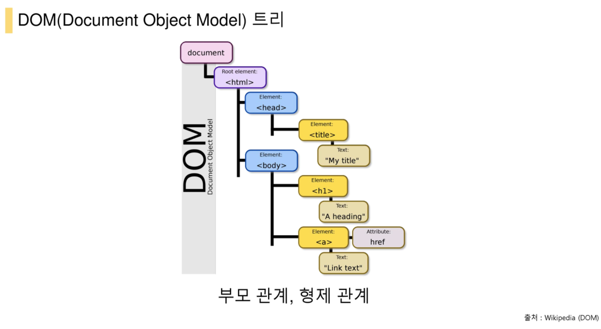
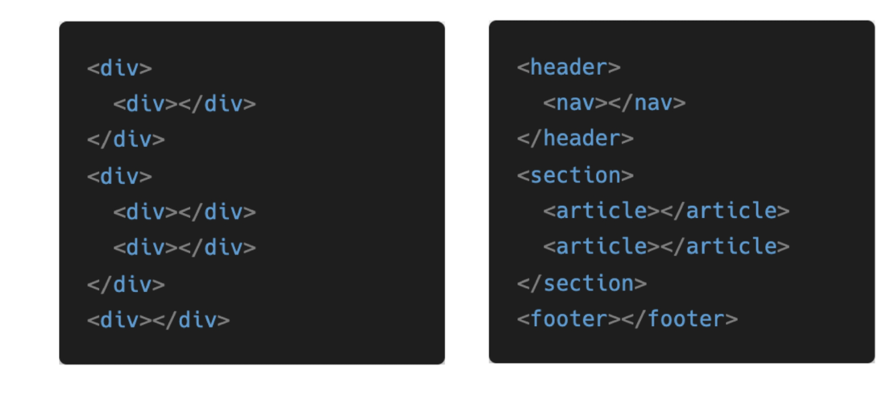
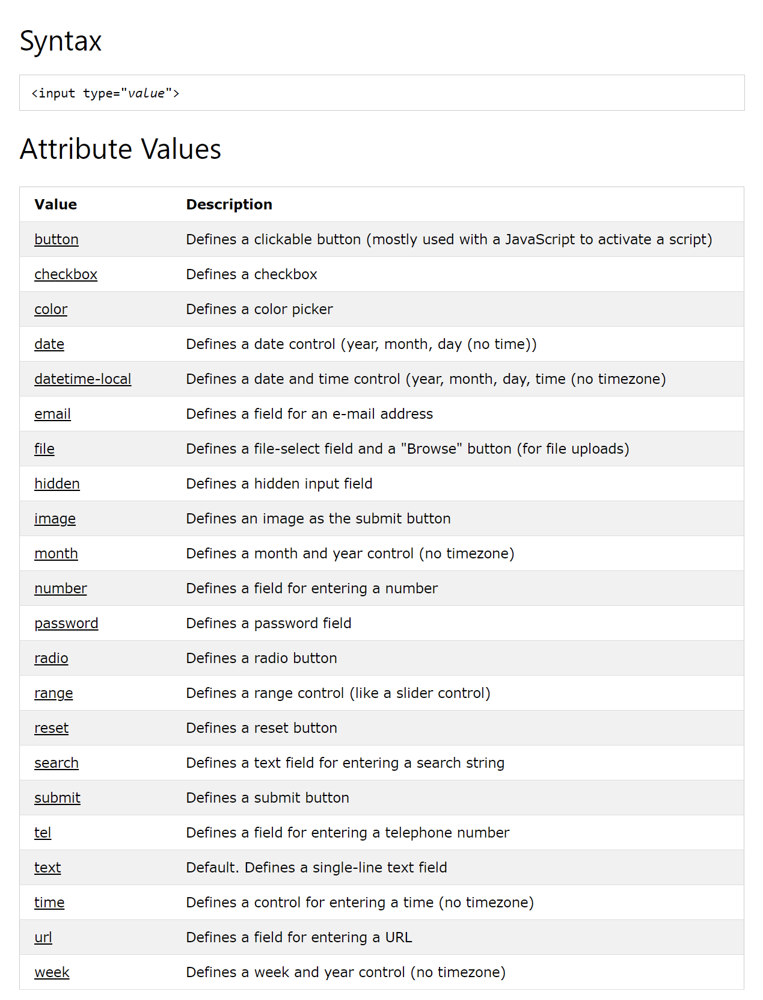
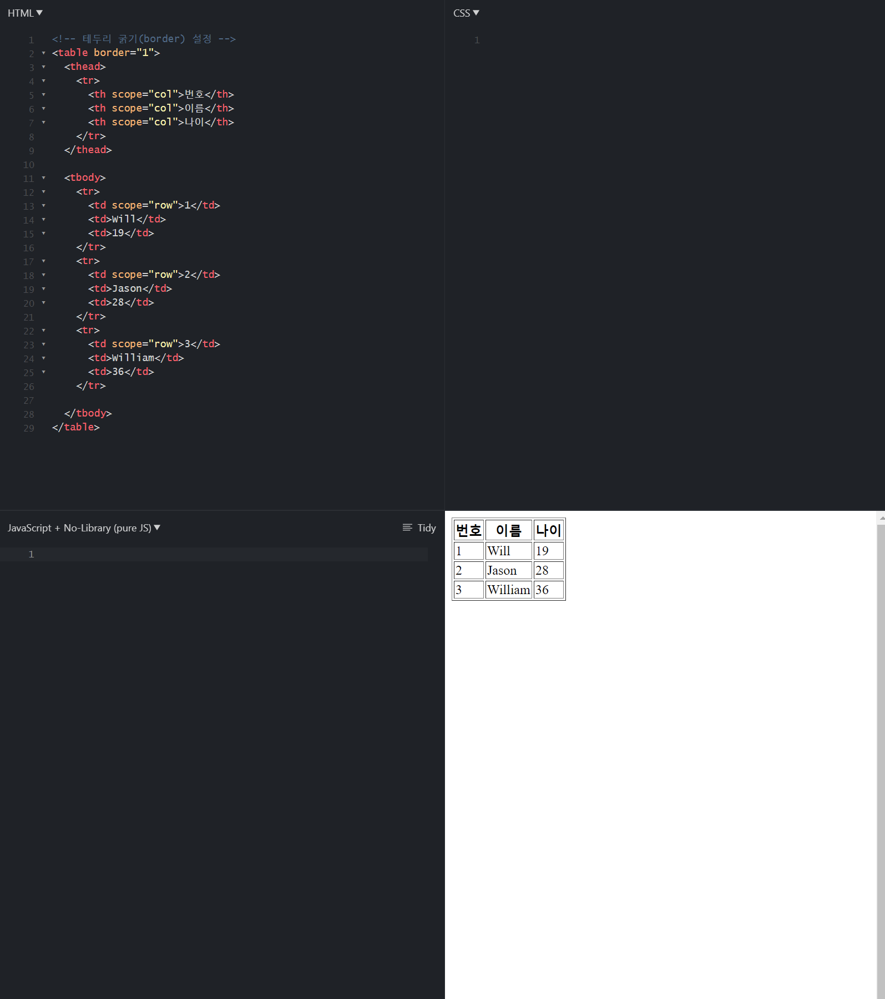
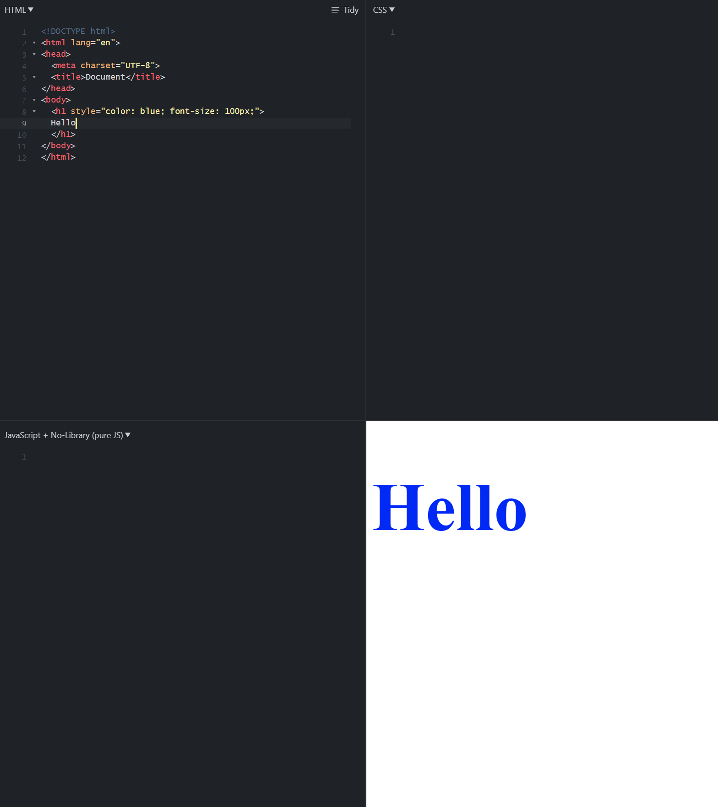
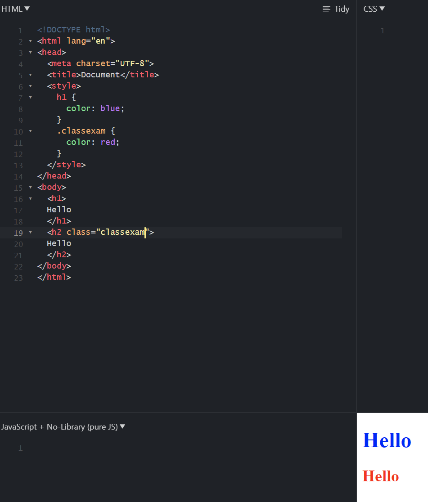
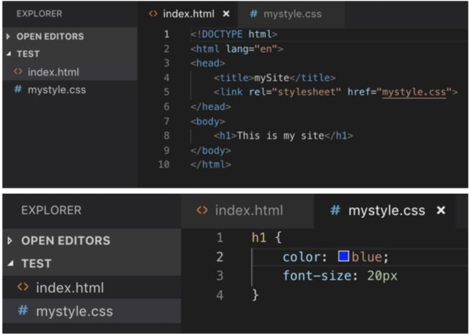
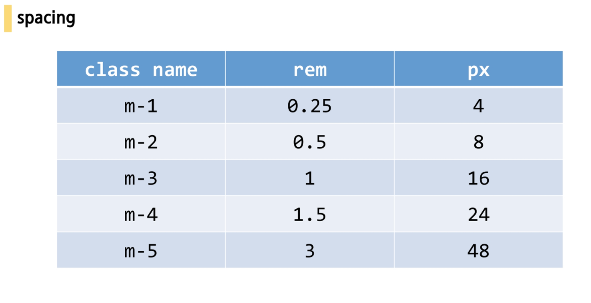
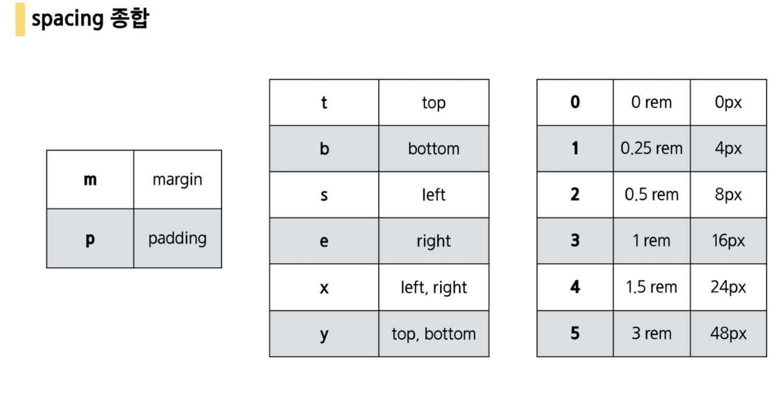

[TOC]


# HTML

> "웹 컨텐츠의 의미와 구조를 정의할 때 사용하는 언어"

## HTML 기초

**Hyper**

- 텍스트 등의 정보가 동일 선상에 있는 것이 아니라 다중으로 연결되어 있는 상태

**Hyper Text**

- 참조(하이퍼링크)를 통해 사용자가 한 문서에서 다른 문서로 즉시 접근 할 수 있는 텍스트(=비선형적 텍스트)
- 하이퍼 텍스트가 쓰인 기술등 중 가장 중요한 2가지 (http, html)

**Markup Language**

- 특정 텍스트에 역할을 부여하는, 따라서 "마크업을 한다" 라고 하는 건 제목이 제목이라하고 본문이 본문이라고 마킹을 하는 것
- ex) h1 tag는 단순히 글자가 커지는 것이 아니라 의미론적으로 그 페이지에서 가장 핵심 주제를 의미하는 것
- `<h1>` 등의  Tag들로 단순 텍스트 정보에 구조와 의미를 부여해 주는 언어.
- 프로그래밍 언어와 달리, 단순하게 데이터 표현만 한다. **반복문 등 존재 X**

<br>

## HTML 기본 구조

> 기본 구조는 이와 같다.

```html
<!DOCTYPE html> # HTML 등장 선언 vscode : !`tab`시 이 모든 것을 자동완성해줌.
#태그도 <> 없이 입력 후 `tab` 하면 자동완성이 가능하다.
<!-- 주석 -->
<html lang="en">
# Dont need to make 2 spaces for had and body.
<head> # 브라우저에 나타나지 않음. CSS 선언 혹은 외부 파일 로딩 등에 사용
  <meta charset="UTF-8"> # 인코딩 언어 설정. UTF-8 기본적인 유니코드 라인업을 사용.
  <meta name="viewport" content="width=device-width, initial-scale=1.0">
  <title>웹페이지 상단 Bar에 나오는 부분</title>
  <style>
    # CSS 요소 선언 + 외부 로딩 파일 지정 등 사용 영역.  
  </style>
</head>
<body> # 브라우저 화면에 나타나는 실제 정보들
  
</body>
</html>

```


### **DOM(Document Object Model)**

- DOM은 문서의 구조화된 표현(structured representation)을 제공하며 프로그래밍 언어가 DOM 구조에 접근할 수 있는 방법을 제공하여 그들이 문서 구조, 스타일, 내용 등을 변경할 수 있게 도움
- DOM은 동일한 문서를 표현하고, 저장하고, 조작하는 방법을 제공(= 문서의 상속구조 표현)
- 웹 페이지의 객체 지향 표현



### **요소 (Element)**

```html
<Tag> Contents </Tag>
```

- Element consists of Tag & Contents

- HTML 요소는 시작 태그와 종료 태그 그리고 태그 사이에 위치한 내용으로 구성
  - 태그(Element, 요소)는 컨텐츠(내용)를 감싸서 그 정보의 성격과 의미를 정의 한다.
- 내용이 없는 태그들
  - br, hr, img, input, link, meta
- 요소는 중첩(nested)될 수 있다.
  - 이러한 중첩들로 하나의 문서를 완성해 나간다.
  - 그리고 항상 열고 닫는 태그 쌍이 잘 맞는지 잘 봐야한다.
  - HTML은 오류를 뿜지 않고 그냥 레이아웃이 깨져버리기 때문에 어떤 면에서는 친절하게 오류 띄워주고 어디 틀렸는지 알려주는 프로그래밍 보다 디버깅이 힘들다.

### **속성 (Attribute)**

- `<a #속성href=""></a>` 
- `style, class` 등등이 모두 속성이다.

- 속성(Attribute)은 태그의 부가적인 정보가 들어온다.
- 요소는 속성을 가질 수 있으며 요소에 추가적 정보(이미지 파일의 경로, 크기 등)를 제공한다. 
- 요소의 시작 태그에 위치해야 하며 **이름**과 **값**의 쌍을 이룬다.
- 태그와 상관없이 사용 가능한 속성들(html global attribute)도 있다.

> 공통 사용 속성
>
> | 속성명   | 기능                                                 | 상세         |
> | -------- | ---------------------------------------------------- | ------------ |
> | id       | 고유의 아이디값을 부여                               | <a id="">    |
> | class    | 기존에 완성되어 있는 클래스 사용시                   | <a class=""> |
> | hidden   | 숨김 기능                                            |              |
> | lang     |                                                      |              |
> | style    | 스타일 지정(폰트 크기, 컨텐츠 크기, 패딩, 마진 등등) |              |
> | tabindex |                                                      |              |
> | title    |                                                      |              |
>
> 

### Open Graph Protocol(OG)

- 페이스북에서 만든 **메타 데이터**를 표현하는 새로운 보편적인 규약
- HTML 문서의 메타 데이터를 통해 문서의 정보를 전달

> (카톡에서 url 보내면 이미지 뜨는것들이 이것)

<br>

## Non-semantic elements

- Tells nothing about its content.
- Tags not to affect style or contents before specifing style as CSS

- css로 스타일을 지정하기 전까진 내용이나 스타일에 영향을 끼치지 않는 태그

| Tag name | role                      | else |
| -------- | ------------------------- | ---- |
| `<div>`  | 의미 없는 Block line 생성 |      |
| `<span>` | 의미 없는 Inline 생성     |      |

> **BLOCK LINE AND INLINE?**
>
> 블럭 라인은, 좌우의 여백이 있어도 다른 요소의 접근을 허용하지 않는 것이다. 혼자 한 줄을 다 차지한다.
>
> but 인라인은 다른 요소와 함께 위치를 차지할 수 있다.

### INLINE을 BLOCK LINE으로 만들고 싶다면?

```html
<div>
  #인라인 요소를 이 안으로 넣으면 하나의 블럭요소로 활용할 수 있다.
</div>
```


## 시맨틱 태그(Semantic Tag)

> 브라우저, 검색엔진, 개발자 모두에게 콘텐츠의 의미를 명확히 설명하는 태그
>
> 기존에는 의미없는 태그 div의 사용을 남발하였으나, 의미를 갖고 있는 시맨틱 태그가 등장한다.



**장점**

1. 읽기 쉬워진다. (개발자)
   - 개발자가 의도한 요소의 의미가 명확히 드러나고 있다.이것은 코드의 가독성을 높이고 유지보수를 쉽게 한다.
2. 접근성이 좋아진다. (검색엔진 및 보조기술 → 시력장애용 스크린리더 → 더 나은 경험 제공)
   - HTML 문서는 html 언어 + 사람이 읽을 수 있는 content의 조합인데, 검색 엔진은 HTML 코드만 잘 읽는다.
   - 그래서 이 검색 엔진이 HTML을 잘 이해하도록 시맨틱 태그 사용이 권장되고, 그러면 검색 엔진도 무슨 내용인지 이해할 수 있게 된다.
   - 이 태그를 잘 사용해둔 웹사이트를 Google에 검색해보면, 사이트 내 섹션들이 잘 나뉘어져서 상세하게 검색이 된다.

**시맨틱 웹**

- 웹에 존재하는 수많은 웹페이지들에 메타데이터를 부여하여, 기존의 단순한 데이터 집합이었던 웹페이지를 '의미'와 '관련성'을 가지는 거대한 데이터베이스로 구축하고자 하는 발상.

### 대표적인 시맨틱 태그

| 태그명      | 역할                                  | 기타 |
| ----------- | ------------------------------------- | ---- |
| `<header>`  |                                       |      |
| `<nav>`     |                                       |      |
| `<aside>`   | 섹션 옆에 메뉴 등 줄때 보통 사용한다. |      |
| `<section>` |                                       |      |
| `<article>` | 섹션 내부 요소.                       |      |
| `<footer>`  | 맨 아래 섹션                          |      |


### 그 외 태그

| 태그명     | 이름                         | 역할                                           | 기타                                      |
| ---------- | ---------------------------- | ---------------------------------------------- | ----------------------------------------- |
| 00         |                              |                                                |                                           |
| `<a>`      | anchor                       | Hyperlink 연결. 로컬 주소도 가능.              | `<a href="url.html">여기를 눌러요!! </a>` |
| `<p>`      | paragraph(문단)              | 하나의 문단 만들 때 사용.블록 태그이다.        | `<p>문단1</p>`                            |
| `<br>`     | break line                   | 강제 개행                                      | `<br>`                                    |
| ``    | image                        |                                                | Inline 태그이다.                          |
| `<hr>`     | horizontal line              | 가로 줄을 추가한다.(CSS)                       | <hr> 가로로 된 구분자를 출력              |
| `<h1>`     | headings                     | 제목 추가.                                     | `<h1>제목</h1>`                           |
| `<ol>`     | Ordered List                 | 순서가 있는 목록. 내부 컨텐츠에 숫자가 붙는다. | `<ol> <li>hi</li> </ol>`                  |
| `<ul>`     | Unordered List               | 순서없는 목록. 숫자대신 점이 찍힘.             | `<ol> <li>hi</li> </ol>`                  |
| `<div>`    |                              | 의미없는 블록요소.                             |                                           |
| `<span>`   |                              | 의미없는 인라인요소.                           |                                           |
|            |                              |                                                |                                           |
| 01         | Elements related to **Text** |                                                |                                           |
| `<b>`      | 굵게(BOLD)                   | 굵게. 왜 굵게 하는지 의미는 없음.              | 사용 기피할것.                            |
| `<strong>` | 굵게 + 의미 부여             | 중요하다는 Point를 주는 의미를 가짐.           | `<strong>a</strong>`                      |
| `<i>`      | 기울여서(Italic)             | 기울여서.                                      | 사용 기피할 것.                           |
| `<em>`     | 기울여서+의미                | 중요하다는 Point를 줌                          |                                           |
|            |                              |                                                |                                           |
|            |                              |                                                |                                           |
|            |                              |                                                |                                           |
| 02         | Elements related to **form** |                                                |                                           |
| `<form>`   |                              | 서버에서 처리될 데이터 제공하는 역할           | input과 보통 묶여 쓰인다.                 |
|            | 2 elements are necessary     | action / method                                |                                           |
| 필수Tag    | `<label>`                    | 서식 입력 요소의 캡션                          | <label>ID:                                |
|            | `<input>`                    | 입력 데이터 필드                               |                                           |
|            | `<name>`                     |                                                |                                           |
|            | `<placeholder>`              | 인풋 입력시 지워지는 연한 글씨                 | `아이디를 입력하세요`                     |
|            | `<required>`                 |                                                |                                           |
|            | `<autofocus>`                | 자동으로 커서 주기.                            |                                           |

**https://www.w3schools.com/tags/att_input_type.asp**



### Table Tag

| 태그명      |이름| 역할 | 기타 |
| ----------- | ---- | ---- | ----------- |
| `<th>`     | Table head | Container 머리글 행 생성(Bold, justify-content:center) ||
| `<tr>`     | Table row | 가로줄 생성(container) ||
| `<td>`     | Table data | 셀 역할(Item) ||
| `<thead>`   |      |      ||
| `<tbody>`   |      |      ||
| `<tfoot>`   |      |      ||
| `<caption>` |      |      ||
| `colspan` | Column span | 열 병합.(가로로 열끼리 병합) |`<td colspan="3">`|
| `rowspan` | Row span | 행 병합(세로로 행끼리 병합) ||
| `scope` |  | 행인지 열인지 지정해줌 |`td scope='"row"'`|
| `colgroup` | Scope 속성 |  ||

- jsfiddle.net 참고 예시



### 유용한 단축키(vscode 기준)

| 단축키          | 설명                                  | 기타      |
| --------------- | ------------------------------------- | --------- |
| Tag명 > Tag명*n | Tag명 내에 Tag명을 n개 만큼 생성한다. | ul > li*3 |
| `>`             | 자식 의미                             | div > div |
| ` `             | 자손 의미(증손주 등등 전부 포함)      | div div   |


## Conventions & Style guide

- HTML 역시 문법적인 구조 , 지켜야 하는 룰이 있다.
- 기본적으로 공백은 없이, 쌍따옴표를 사용한다.

---

## 참고 문헌

> 무언가 검색하고 싶은 경우, 필요한 검색어 + 'mdn'으로 검색해주면 보통 찾을 수 있다.

https://developer.mozilla.org/ko/docs/Learn/HTML/Introduction_to_HTML/Getting_started

https://developer.mozilla.org/ko/docs/Web/HTML/Global_attributes

https://developer.mozilla.org/ko/docs/Glossary/Semantics


# CSS

> 사용자에게 HTML을 표시하는 방법을 지정하는 언어 (좀 더 GUI적인 부분에 가까운 언어)
>
> Font 색 , 사이즈 변경, Padding 등의 사이즈 변경 등은 전부 여기서 하는 것이다.
>
> 기본 구조 = Selector + Declaration{Property + Value}

`h1#Selector(선택자)`

`#Declaration Block{#선언(Declaration) 속성(Property): 값(Value); font-size: 12px;}`

```css
/* CSS 구문 예시*/
p{background: yellowgreen; color: darkgreen;}
h1 { #선언 = 속성 + 값(color: blue;) font-size: 15px;}
div > p{background-color: black;}
div p{background-color: green;}
```


## 선언방식(정의방법)

**인라인(Inline)**

각 Tag 내 Style 직접 사용 (= Inline Style)

```html
<h1 style="color:blue; font=size: 100px;>제목</h1>
           # h1 내에 직접적으로 Style을 선언해주었다.
```



**내부참조(embedding)**

`<head>` Tag 내에 `<style>` 지정 ( = 내부참조 Internal Style Sheet)

```css
<style>
#클래스(.)가 아닌 Tag명eg.<h1>에 직접적으로 Style을 지정하였다.
header{
color : blue;
}
</style>
```

```
   1. 경로를 Tag명으로 직접 줄 때의 **주의사항**
   
   저렇게 css를 작성하면 모든 `<header>`가 동일한 모습이 되어버리는데, 사실 '헤더'라는건 역할이기 때문에, 다양한 위치에 들어갈 수 있고, 각 위치에서 스타일링을 다르게 해야하는 경우도 많습니다.
그래서 보통 'CLASS'로 만들어서 그 클래스를 이용합니다.

```



**외부참조(Link File)**

분리된 `CSS File` 혹은 `<head>`에`Link`를 걸어 외부에서 참조한다.(BOOTSTRAP의 링크활용 등)

- 공통된 Style의 양식을 각 File로 만들어 Load하는 방식



## Global CSS Property Usage

## 선택자(Selectors)

- HTML 문서에서 특정한 요소를 선택하여 Styling 하기 위해서는 반드시 필요한 개념
- 기본 선택자
  - 전체 선택자, 요소 선택자
  - Class 선택자, ID 선택자, 속성 선택자
- 결합자(Combinarors)
  - 자손ㆍ자식 결합자
  - 일반 형제ㆍ인접 형제 결합자
- 의사 클래스/요소
  - 링크, 동적 의사 클래스
  - 구조적 의사 클래스
- 

# BOOTSTRAP

- `justify-content`
- `align-items`
- `flex-direction`
- `order`
- `align-self`
- `flex-wrap`
- `flex-flow`
- `align-content`


**em과 rem의 차이**

- rem은 `html의 root` 기준으로 `16px`
- em은 부모요소를 기준으로 한다.

**Margin Spacing**



- `.mx-auto`
  - 수평 중앙 정렬. auto는 가능한 한 반대쪽으로 밀어버리는 역할을 하는데 양쪽에서 밀어줘서 가운데 정렬이 된다.

