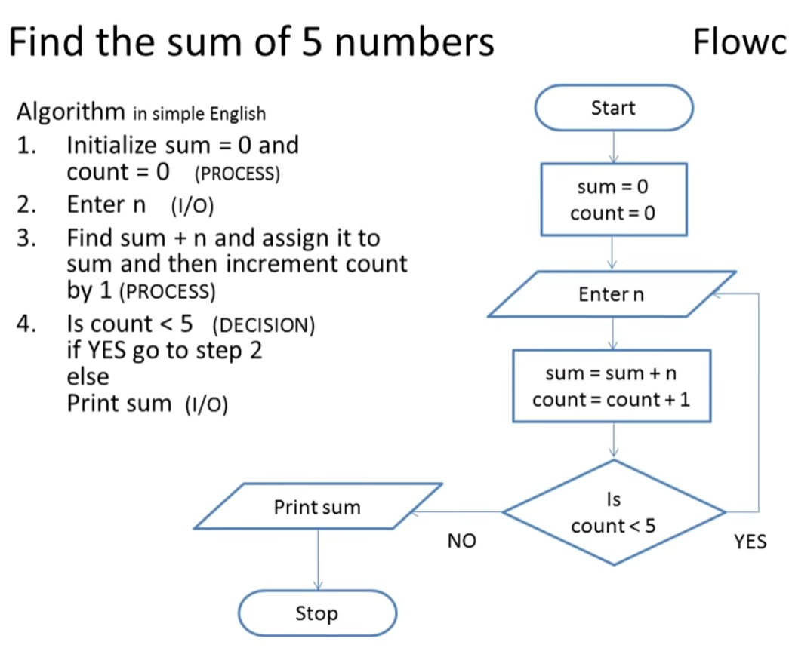
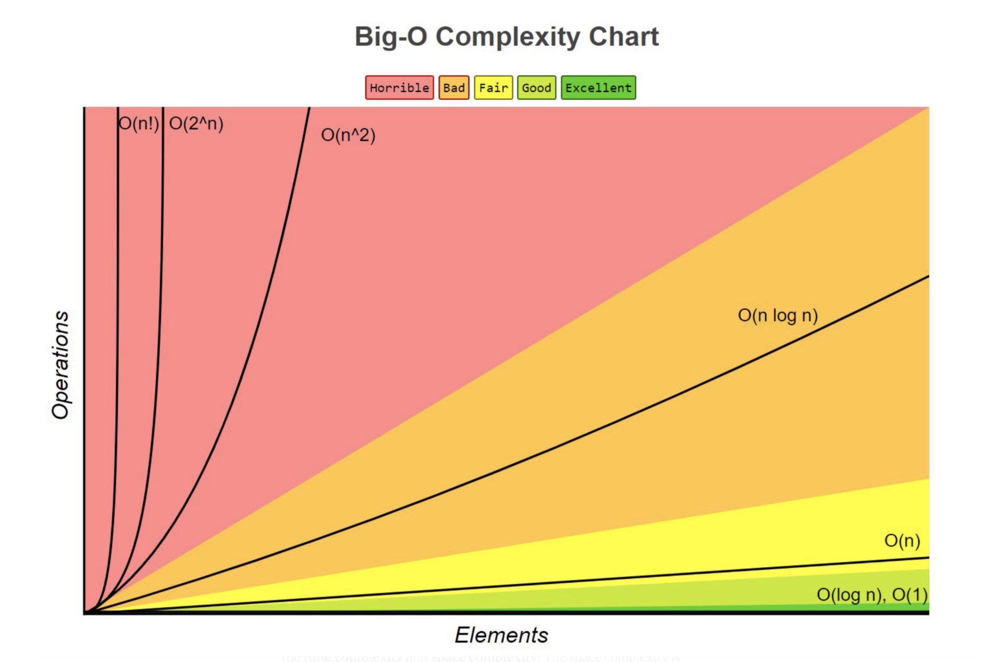

# Algorithm 
- 문제를 해결하기 위한 절차나 방법.
- 컴퓨터가 어떤 일을 수행하기 위한 **단계적** 방법
- 다시 말하면, 어떠한 문제를 해결하기 위한 절차


## 표현방식
- 크게 수도코드(의사코드), 순서도, 자연어, 코드 등이 있다.

**수도코드(의사코드, pseudocode)**

- 코드 형태로 짜되, 자연어를 이용하여 논리를 표현하기 위한 코드

> **슈더코드 예시**


**순서도(Flow Chart)**

> **순서도 예시**



> 출처 : https://www.youtube.com/watch?app=desktop&v=vOEN65nm4YU

## 좋은 알고리즘의 기준

1. 정확성
2. 작업량 : 적은 연산 ***시간복잡도***
3. 메모리 사용량
4. 단순성
5. 최적성


## 시간복잡도(Time Complexity)

- 실행되는 명령문의 개수를 계산

```python
def ClacSum( n ):
    sum <- 0; # 1번
    # for문 전체를 n번
    for i in range(1, n+1): # 1번
        sum <- sum + i; # 1번
    return sum;

# 1 + n*2 = 2n+1 번
```


**Big-Oh Notation 빅-오 표기법**

- 시간 복잡도 함수 중 가장 **큰 영향력**을 주는 n에 대한 항만을 표시
- 최악의 경우를 고려하여 계산해보는 방법
- 계수(Coefficient)는 생략(3n은 n으로)
- 최고차항만 고려(O(3n^2 + 10n + 100) = O(n^2) )

> 예제

```python
# n개의 데이터를 입력받아 저장한 후 #n 각 데이터에 1씩 증가시킨 후 #n 각 데이터를 화면에 출력하는 #n
# 알고리즘의 시간복잡도는 어떻게 될까?
3n = n ,
Answer : O(n)
```

- n^2부터는 시간이 기하급수적으로 늘어난다.




## 배열(Array)

- 파이썬은 List[ ]를 배열처럼 사용한다.

### 선언

- Arr = list()
- Arr = []

### 접근

- Arr[idx]

### 정렬

- 오름차순( Ascending. 작 > 큰)
- 내림차순(Descending)

**대표적인 정렬 방식**

#### 버블 정렬 (Bubble Sort)

> 인접한 두개의 원소를 비교하며 자리를 계속 교환하는 방식
>
> 한 단계가 끝나면 가장 큰 원소가 마지막 자리로 정렬된다.
>
> 거품이 올라오는 것 같아 버블 정렬이라 부른다.

 - Time complexity : O(n^2)

```python
# List 내의 값을 오름차순으로 정렬하는 Bubble Sort 예제
def BubbleSort(a): # List a eg.[1,3,5,2,4]
    for i in range(len(a)-1, 0, -1): # 범위의 끝 위치 for i in range(4,0,-1) 4,3,2,1
        # range는 마지막 숫자 -1이 아닌, 마지막 숫자를 포함하지 않는 것.
        for j in range(0,i):
            if a[j] > a[j+1]:
                a[j], a[j+1] = a[j+1], a[j]
```

```python
arr = [55, 7, 78, 12, 42]  # 정렬 하고자 하는 배열


def BubbleSort(arr):  # 정렬할 List
    for i in range(len(arr) - 1, 0, -1):  # 범위의 끝 위치
        for j in range(0, i):
            print("현재상태",arr)
            if arr[j] > arr[j + 1]:
                arr[j], arr[j + 1] = arr[j + 1], arr[j]
            print("스왑과정",arr)
        print("-----------------------------------")

BubbleSort(arr)

print(arr)
```


#### 카운팅 정렬 (Counting Sort)

> 항목들의 순서를 결정하기 위해 집합에 각 항목이 몇 개씩 있는지 세는 작업을 하여, 선형 시간에 정렬하는 효율적인 알고리즘

- Counting Sort의 원리

```python

```


- **정수 or 정수로 표현할 수 있는 자료**에만 적용가능(각 항목 발생 회수를 Count하기 때문)
- 충분한 공간을 할당하려면, 집합 내 가장 큰 정수(Integer)를 알아야한다.
- [0,1,1억]이런 경우처럼 최대 정수가 너무 큰 경우는 사용하지 않는 편이 좋다.
- Time Complexity : O(n+k) / n =len(list) k = 정수의 최대값 max(integer)

```python
# 원리
[0,4,1,3,1,2,4,1]
# 각 숫자가 몇개씩 있는지 Count
count = [0]*5 # 0~4까지 총 5개므로

[1,4,5,6,8] # 첫 항부터 각 누적합

# 과정
A = [0, 4, 1, 3, 1, 2, 4, 1]  # 정렬 대상 배열
B = [0]*len(A)  # sorted A
C = []  # Counting Array

# 각 원소의 개수
k = 5

C =[0]*k

# C에 0~4별로 몇 개가 있는 지 넣고,
for i in range(len(A)):
    C[A[i]] += 1
# C[0]은 그대로, C[1]은 C[0]+C[1] 이런식으로 누적합을 넣는다.
for i in range(1, len(C)):
    C[i] += C[i-1]

# A의 맨 뒷항부터 돌면서, A[i]의 Value값을 C에서 그 값에 맞는 Index와 대치시켜서(C[A의 Value]로 하여,) C에서 1을 빼준후, 그 Value를 다시 Index로 하여 B[그 Value]에 A[i]의 Value를 넣어준다.
for i in range(len(A)-1, -1, -1):
    C[A[i]] -= 1
    B[C[A[i]]] = A[i]

print(B)

```

- 뒤에서부터 카운팅 하는 이유는 **안정정렬(Stable Sort)**을 위함. 
- eg) 같은 1도 list 내 순서가 있었을텐데 그 순서를 유지해주기 위함이다.

```python
def Counting_Sort(A, B, k):
    # A[] --- 입력 배열(1 to k) = Data
    # B[] --- 정렬된 배열 = result
    # C[] --- Counting Array
    
    # B = [0]*len(A) 여기서 B를 정의하면 B를 return해야 한다.
    C =[0]*k
    
    for i in range(0, len(A)): #Counting
        C[A[i]] += 1
    for i in range(1, len(C)): #원소별 누적합
        C[i] += C[i-1]
    for i in range(len(B)-1, -1, -1): # New Array sorted stable
        B[C[A[i]]-1] = A[i]
        C[A[i]] -= 1
```


- 이런 식으로 정렬하다 보면 A에 있던 순서에 맞게 정렬이 가능하다.


#### 선택 정렬 (Selection Sort)

> 주어진 자료들 중 가장 작은 값의 원소부터 차례대로 선택하여 위치를 교환하는 방식
>
> **Selection Algorithm**을 전체 자료에 적용한 것.

- 정렬 과정
  1. 주어진 List 중 최소값을 찾는다.
  2. 그 값을 List의 맨 앞에 위치한 값과 교환한다.
  3. 맨 처음 위치를 제외한 나머지 List를 대상으로 위의 과정을 반복한다.

```python
arr = [64, 25, 10, 22, 11] # 0 < arr[i] <= 100
min = 100
minIndex = 0 # 이게 아래로 들어가야 맞음. minIndex = i로. 안그러면 
			 # 기존 minIndex값이 유지될 가능성이 존재함
for i in range(len(arr)-1):
    for j in range(len(arr)):
    	if arr[j] < min :
        	min = arr[j]
            minIndex = j
	arr[i], arr[minIndex] = arr[minIndex], arr[i]
```

```python
# 구현 예
def selectionSort(arr):
    for i in range(0, len(arr)-1):
        min = i
        for j in range(i+1, len(arr)):
            if arr[min] > arr[j]:
                min = j
        arr[i], arr[min] = arr[min], arr[i]
```


#### 퀵정렬(Quick Sort)

> 평균 시간복잡도 : O(Nlogn) 퀵정렬 최악의 경우 O(n**2)

- 주어진 배열을 두 개로 분할하고, 각각을 정렬
  - 합병 정렬과 동일한가?
    - 합병정렬은 그냥 두 부분으로 나눔, but 퀵정렬은 분할 시 기준 아이템(pivot item) 중심으로, 이보다 작은 것은 왼편, 큰 것은 오른편에 위치 시킴
    - 각 부분 정렬이 끝난 후, 합병정렬은 "합병"이란 후처리 작업이 필요하나, 퀵정렬은 필요 없음

```python
def quickSort(a, begin, end) :
    if begin < end :
        pivot = partition(a, begin, end)
        quickSort(a, begin, pivot-1)
        quickSort(a, pivot+1, end)
```

```python
# 퀵 정렬 알고리즘
def partition (a, begin, end) :
    pivot = (begin + end) //2
    L = begin
    R = end
    while L < R :
        while(a[L] < a[pivot] and L<R) : L +=1
        while(a[R]>=a[pivot] and L<R) : R-= 1
        if L < R :
            if L == pivot : pivot = R
                a[L], a[R] = a[R], a[L]
    a[pivot], a[R] = a[R], a[pivot]
    return R
```

```python
# 예제 : {69, 10, 30, 2, 16, 8, 31, 22}
```

5. 삽입 정렬 (Insertion Sort)

6. 병합 정렬 (Merge Sort)


## 완전검색(Exhaustive Search)

> 문제의 해법으로 생각할 수 있는 모든 경우를 나열 및 확인하는 기법

- Brute-force 혹은 Generate-and-Test 기법으로도 부른다.
- 모든 경우 테스트 후, 최종 해법을 도출하므로 경우의 수가 작을 때 유용.

## 순열(Permutation)

> 서로 다른 것들 중 몇 개를 뽑아서 한 줄로 나열하는 것

- 시간복잡도(Time Complexity) : n!

- 서로 다른 n개중 r개를 택하는 순열 : nPr
  - 식 :  nPr = n\*(n-1)\*(n-2)\*...\*(n-r+1)
- nPn = n! (Factorial) (중복값도 다 다른 하나로 세기)
  - 식: nPn = n\*(n-1)\*(n-2)\*...\*2\*1( =  n-n+1)

```python
# {1,2,3}을 포함하는 모든 순열을 생성하는 함수
for i1 in range(1, 4): # 순열 len이 3이니까 4로 설정한 것. 하나가 늘면, for문도 하나씩 늘어난다.
    for i2 in range(1, 4):
        if i2 != i1 :
            for i3 in range(1, 4):
                if i3 != i1 and i3 != i2 :
                    print(i1, i2, i3)
```


## 탐욕 알고리즘 (Greedy Algorithm)

> 최적해를 구하는 데 사용하는 근시안적인 방법
>
> 여러 경우 중 하나를 결정해야 할 때, 그 순간 최적이라고 생각한 것을 선택해 나가는 방식으로 해답에 도달.

- 순간순간 선택이 최적이었다고 하더라고, 최종 해답이 최적이라는 보장은 불가능하다.
- 그냥 머릿속으로 되는대로 해나가면 Greedy

1. 해 선택 : 현재 상태에서 부분 문제의 최적 해를 구하고, 이를 부분해 집합(Solution set)에 추가
2. 실행 가능성 검사 : 새로운 부분해 집합이 실행 가능한지 확인. 제약 조건을 위반하지 않는 지도 검사.
3. 해 검사 : 새로운 부분해 집합이 문제의 해가 되는 지를 확인. 아직 전체 문제의 해가 완성되지 않았다면 1)부터 다시 시작.


```python
# 거스름돈 문제
# 거스름돈을 가장 최소한의 수로 주려면?

#1) 단위가 큰 동전으로만 거스름돈을 만들면 동전의 개수가 줄어드므로 일단 이 방법을 선택.
#2) 거스름돈이 액수를 초과하는가 확인. 초과하면 마지막에 추가한 동전을 빼고, 1)로 돌아가
#	현재보다 한 단계 작은 단위의 동전을 추가
#3) 해 검사. 액수가 모자라다면 다시 1)로 돌아가 추가할 동전을 고른다.

#문제 :
1260원을 거슬러주는데, 400원짜리 동전이 존재한다면? 500원부터 진행했기 때문에 최소한으로 지급이 불가.
```


## 2차원 배열

> 1차원 List를 묶어놓은 List

### 선언

- 세로길이(행의 개수), 가로길이(열의 개수)를 필요로 함
- Python에선 데이터 초기화를 통해 변수선언과 초기화가 가능
- **열의 길이**는 각각 달라도 됨

```python
arr = [[0,1,2,3],[4,5,6,7]] # 2행 4열의 2차원 List
0	1	2	3
4	5	6	7

# 2 행렬이용
arr = [[0 for i in range(w)] for j in range(h)]
arr = [[0]*w for j in range(h)]

#3 선언만 n = 행 수
arr = [[] for i in range(n)]

#4 0으로 초기화한 2차원배열 (정사각형 형태)
arr = [[0]*n for i in range(n)]

#5 0으로 초기화했지만 직사각형 형태 2차원배열
arr = [[0 for j in range(2)] for i in range(3)]
arr = [[0]*2 for i in range(3)]
[[0,0],[0,0],[0,0]]

#6 톱니형 리스트
arr = [[0]*i for i in [3,1,3,2,5]]

# CF
arr = [[]]*n
arr = [[0]*n]*n
# 이와 같은 선언은 주소값을 똑같이 참조하여, 다같이 숫자를 입력받게 된다.
```


### 입력(Input)

> 2차원 배열의 input 방법

```python
3 4
1 2 3 4
5 6 7 8
9 1 2 3

# 크게 3가지가 있다.
# N = 행, M = 열

# 1
N, M = map(int,input().split())
arr = []
for i in range(N):
    arr.append(list(map(int,input().split()))
           
for i in arr:
    print(i)
#2
N, M = map(int,input().split())
arr = [0] * N
for i in range(N):
    arr[i] = list(map(int,input().split())
                   
for i in arr:
    print(i)
                  
#3
N, M = map(int, input().split())
                  # 쓰지 않을 변수라 _ 사용
arr = [list(map(int, input().split())) for _ in range(N)]
      [list(input()) for _ in range(N)]
                  # [[map(int, input().split()))] for _ in range(N)]로 할시
                  # 맵 주소값을 리스트에 담아두는 쓴 맛을 볼 수 있으므로 주의
for i in arr:
    print(i)
```


## 순회

> n X m 배열의 n*m 개의 모든 원소를 빠짐없이 조사하는 방법

### 행 우선 순회

```python
# i 행의 좌표
# j 열의 좌표
for i in range(len(Array)): # N, M 알고 있다면 N 
    for j in range(len(Array[i])): # M
        Array[i][j] # 필요한 연산 수행
```

```python
arr = [[1,2,3,4],
       [5,6,7,8],
       [10,11,12,13]
       ]
N = 3  # 행의 길이 len(arr)
M = 4  # 열의 길이 len(arr[i])

for i in range(N):
    for j in range(M):
        print(arr[i][j])
        
# 행 우선 순회를 역순으로(각 행을 우에서 좌 순으로 출력)
for i in range(N):
    for j in range(M-1, -1, -1):
        print(arr[i][j])
```


### 열 우선 순회

> 보통은 열의 길이가 일정한 경우에만 사용
>
> 다른 경우 매번 List의 길이를 구해서 한다.

```python
# i 행의 좌표
# j 열의 좌표
for j in range(len(Array[0])):
    for i in range(len(Array)):
        Array[i][j]  # 필요한 연산 수행
```

```python
N, M
for j in range(M):
    for i in range(N):
        print(arr[i][j])

# 열 거꾸로 출력(각 열을 아래에서 위 순으로 출력)
for j in range(M):
    for i in range(N-1, -1, -1):
        Array[i][j]
```


### 지그재그 순회

> 첫 행은 좌에서 우로, 다음 행은 우에서 좌로, 지그재그로 순회하는 방식

```python
# i 행의 좌표
# j 열의 좌표
for i in range(len(Array)):
    for j in range(len(Array[0])):
        Array[i][j + (m-1-2*j)*(i%2)]
        # 필요한 연산 수행
```

```python
# 대각선으로 순회하는 방법

```

```python
# 가운데에서 바깥으로, 달팽이 모양으로 하는 방법

```


## 델타를 이용한 2차원 배열 탐색

> 2차 배열의 한 좌표에서 4방향의 인접 배열 요소를 탐색하는 방법

```python
# 상하좌우의 탐색
            
arr = [[1,2,3], [4,5,6], [7,8,9]]
# 현재 서있는 위치 좌표
r = 1
c = 1
# 행의 길이
N = 3

#상하좌우 dc, dr(column, row)로도 표현함
dx = [0, 0, -1, 1]
dy = [-1, 1, 0, 0]
# dxy = [[0,-1],[0,1][-1,0],[1,0]]

for i in range(4):
    ny = r + dy[i]
    nx = c + dx[i]
    
    # Python은 리스트 인덱스 -1이면 값을 가져오므로, 이런 위험을 없애기 위해 if문으로 제약조건.
    # 범위를 벗어나면 작업을 건너뛰기.
    if ny < 0 or ny >= N or nx < 0 or nx>= N: continue
    print(arr[ny][nx])
    # 범위 안에 들어오면 작업을 하게 하기.
    # if 0 <=ny<N and 0<=nx<N:
        # print(arr[ny][nx])
```


> 대각선으로 4방향의 인접 배열 요소를 탐색하는 방법

```python

```


### 전치행렬

> 행과 열의 값들을 열과 행의 값으로 전치

```python
1 2 3	  1 4 7
4 5 6 = > 2 5 8
7 8 9	  3 6 9
# i : 행의 좌표, len(arr)
# j : 열의 좌표, len(arr[0])
arr = [[1,2,3], [4,5,6], [7,8,9]] # 3*3 행렬

for i in range(3):
    for j in range(3):
        # 이 조건문이 없으면 두번씩 수행해서, 원래값으로 돌아오므로
        if i < j :
            arr[i][j], arr[j][i] = arr[j][i], arr[i][j]
```

- 전치행렬을 이용하면, 열을 행으로 바꿔, 새로운 리스트로 카피하여 사용이 가능하다!


## 부분집합의 생성

```python
# 공집합을 포함한 부분집합의 개수

N = 3 # 원소의 개수 eg.{1,2,3}
2**N # 공집합을 포함한 부분집합의 수
# 각 원소를 포함하거나, 포함하지 않거나

# 각각 0, 1의 값을 가지는 16개의 부분집합 생성
bit = [0, 0, 0, 0]
for i in range(2) : 
    bit[0] = i  # 0번째 원소
    for j in range(2):
        bit[1] = j  # 1번째 원소
        for k in range(2):
            bit[2] = k  # 2번째 원소
            for l in range(2):
                bit[3] = l  # 3번째 원소
                print(bit)
0 0 0 0 # 0
0 0 0 1 # 1
0 0 1 0 # 2
0 0 1 1 # 3
....
1 1 1 1 # 15

# 이진수와 수의 순서대로 나온다? for문을 한번에...
for i in range(2**n):
    # bit 연산자를 이용할 것. 아래를 참조..
```


## 비트 연산자

- & : bit 단위로 AND 연산을 한다.
  - eg. `print(6 & 11) = 2`

```python
0110
1011
& : 0010 따라서, 2
    
# 이를 통해, 원하는 위치에 비트가 있는지 확인 가능하다
0110 # 수
0100 # 원하는 연산자 위치만 1을 가지는 수
```


- | : bit 단위로 OR 연산을 한다.
- Left Shift 연산자 **<<** : 피연산자의 bit 열을 왼쪽으로 이동시킨다.
- Right Shift 연산자 **>\>** : 피연산자의 bit 열을 오른쪽으로 이동시킨다.


**<< 연산자**

```python
2 << 3
# 2의 bit를 왼쪽으로 3번 이동
value : 0000 0010
result: 0001 0000
```


- **1<< n **: 2**n 즉, 원소가 n개일 경우의 모든 부분 집합의 수를 의미한다.

**& 연산자**

- i & (1<<j) : i의 j번째 bit가 1인지 아닌지를 리턴한다.

### Bit Operation 이용한 부분집합의 생성

```python
# bit 연산자를 이용한 부분집합 생성
for i in range(1<<n):# 1<<ㅜ은 연산해보면 2**n과 같다.
    for j in range(n):
        # 각 bit 자리 수의 true 여부 확인. 
        if i&(1<<j):
            
```

```python
arr = [3, 6, 7, 1, 5, 4]
n = len(arr) # n : 원소의 개수

for i in range(1<<n): # 1<<n : = 2**n.arr의 부분 집합의 개수
    for j in range(n): # 원소의 수만큼 비트를 비교
        if i & (1<<j): # i의 j번째 비트가 1이면 j번째 원소 출력
            print(arr[j], end = ", ")
    print()
print()
```

```python
# 각 부분집합의 합 중 합이 10이 되는 부분 집합의 출력

arr = [1,2,3,4,5,6,7,8,9,10]
n = len(arr)
# 결과를 한번에 담을 List
result = []
for i in range(1<<n):  # 1을 n만큼 왼쪽으로. 즉, 전체 부분집합의 총 개수
    #집합 리스트
    ans = []
    # 합이 10인가 확인하기 위한 임시 변수
    sum_10 = 0
    for j in range(n):
        if i & (1 << j): # 컴퓨터는 2진수로 봄
            sum_10 += arr[j]
            # for j문이 돌면서 ans에 계속 값을 새로 만드는게 아닌, 값을 추가함. 그래서 여러 집합이 나올 수 있음.
            ans += [arr[j]]
            # 무엇이 나오는지 연습 검증
            print(i, j, ans)
            # 이거 해보면 공집합 []도 n만큼 출력되고 있음 i = 0 j = 0~9일때, i& 1<<j 는 i가 0이므로
            # True가 나올 수가 없기 때문에 공집합만 n만큼 출력
            print(ans)
    # 전체 부분집합 출력(공집합 포함)
    print(ans)
    if sum_10 == 10:
        result.append(ans)
print(result)

```


## 검색

> 저장되어 있는 자료 중에서 원하는 항목을 찾는 작업


- 목적하는 탐색 키를 가진 항목을 찾는 것
  - 탐색 키(Search Key) : 자료를 구별하여 인식할 수 있는 키

### 종류

- 순차 검색(Sequential Search)
- 이진 검색(Binary Search)
- 인덱싱(Indexing)


### 순차검색(Sequential Search)

**일렬로 되어 있는 자료를 순서대로 검색하는 방법**

- 가장 간단하고 직관적
- 순차구조로 구현된 자료구조에서 원하는 항목을 찾을 때 유용
- 구현이 쉬우나, 검색 범위가 넓은 경우 수행시간 증가로 비효율적
- **정렬이 되어있는 경우**, **정렬이 되어있지 않은 경우** 2가지가 있다.


**정렬되어 있지 않은 경우**

> 시간복잡도 : O(n)

1. 첫 번째 원소부터 순서대로, 검색 대상과 키값(우리가 찾고싶은 값)이 같은 원소가 있는 지 비교하며 검색

2. 키 값이 동일한 원소를 찾으면, 그 원소의 Index 반환

3. 마지막까지 찾지 못하면 검색을 실패한다.

```python
arr = [4, 9, 11, 23, 2, 19, 70]
#2를 찾는 경우
key = 2
for i in range(len(arr)):
    if arr[i] == key :
        return i
    	break
else:
    print("못찾음.")
```

4. 찾고자 하는 원소의 순서에 따라 비교 횟수가 결정됨
   1. 정렬되지 않은 자료에서의 순차 검색의 평균 비교 회수 = (1/n) * (1+2+3+...+n) = (n+1)/2
   2. 첫 번째 원소를 찾을 때는 1번, 두 번째 원소 찾을 때는 2번 비교

```python
# 구현 예
def sequentialSearch(arr, n ,key): #arr, n = len(arr), key = 찾는값
    i = 0
    while i<n and arr[i]!=key:
        i += 1
    if i<n : return i
    else : return -1
```


**정렬되어 있는 경우**

> 시간복잡도 : O(n)

1. 오름차순으로 정렬되어 있다고 가정
2. 자료를 순차적으로 검색하면서 키 값을 비교, 원소의 값이 검색 대상의 키 값보다 크면 찾는 원소가 없다는 것이므로 더 이상 검색하지 않고 검색을 종료.(오름차순이므로, **원소값이 키값보다 크다면** 존재하지 않음)

```python
data = [2,4,7,9,11,19,23]
key = 11
for i in range(len(data)):
    if arr[i] > key:
        return -1 # 존재하지 않음.
    elif arr[i] == key:
        return i
```

3. 찾고자 하는 원소의 순서에 따라 비교 횟수가 결정됨
   1. 정렬되어 있으므로, 검색 실패를 반환하는 경우 평균 비교 횟수가 반으로 줄어듬

```python
# 구현 예
def sequentialSearch2(arr, n, key):
    i = 0
    while i < n and a[i] < key:
        i += 1
    if i < n and a[i] = key : return i
    else : return -1
```


### 이진검색(Binary Search)

> 시간복잡도(Time Complexity) : O(log n)

**자료 가운데에 있는 항목의 키 값과 비교하여 다음 검색의 위치를 결정하고 검색을 계속 진행하는 방법**

- 목적 키를 찾을 때까지 이진 검색을 순환적으로 반복 수행함으로써 검색 범위를 반으로 줄여가며 보다 효율적으로 검색을 수행
- 따라서, **자료가 정렬된 상태여야 한다.**


#### 검색과정

1. 자료의 중앙에 있는 원소를 고름
2. 중앙 원소의 값과 찾고자 하는 목표값 비교
3. 목표값 < 중앙 원소의 값시, 자료의 왼쪽 반에 대해서 새로 검색.
4. 반대라면 자료의 오른쪽 반에 대해 새로 검색 수행
5. 1~4반복 수행

```python
arr = [2,4,7,9,11,19,23]
n = len(arr)
key = 7 # 찾는 값
if arr[n//2] > key:
    n = n//2
```

```python
# 구현 예
# 검색 범위의 시작점과 종료점을 이용하여 검색 반복 수행
# 자료의 삽입이나 삭제가 발생한 경우, 배열의 상태를 항상 정렬 상태로 유지해야 하는 추가 작업이 필요

def binarySearch(arr, key):
    start = 0
    end = len(a)-1
    while start <= end :
        middle = (start + end)//2
        if arr[middle] == key : # 검색 성공
            return true
       	elif arr[middle] > key :
            end = middle -1
        else: start = middle + 1
    return false # 검색 실패
```

```python
# 재귀 함수를 이용한 구현
def binarySearch2(arr, low, high, key):
    if low > high : # 검색실패
        return False
    else :
        middle = (low + high) // 2
        if key == arr[middle]: # 검색 성공
            return True
        elif key < arr[middle]:
            return binarySearch2(arr, low, middle-1, key)
        elif arr[middle] < key:
            return binarySearch2(arr, middle+1, high, key)
```


### 인덱싱(Indexing)

**DB에서 유래한 용어로, 테이블에 대한 동작 속도를 높여주는 자료 구조**

> MySQL배울 때 배웠었던, Original Index 외에 특정 자료에 부여했던 ID Index 부분 참조할 것.

- DB 이외의 분야에선 Look up Table 등의 용어를 사용하기도 한다.
- 인덱스를 저장하는데 필요한 디스크 공간은 보통 테이블 저장에 필요한 공간보다 작다.
- how?  인덱스는 Key-Field만 갖고 있고, 테이블의 다른 세부 항목은 없기 때문.
- 대량 데이터의 성능 저하 문제 때문에, **배열 인덱스**를 사용하여 정렬한다.


### 셀렉션 알고리즘(Selection Algorithm)

> 시간복잡도 : O(kn)

**저장되어 있는 자료로부터 K번째로 큰 혹은 작은 원소를 찾는 방법**

- 최소값, 최대값 혹은 중간값을 찾는 알고리즘

**선택 과정**

1. 정렬 알고리즘 이용하여 자료 정렬
2. 원하는 순서에 있는 원소 가져오기

```python
# K번째로 작은 원소를 찾는 알고리즘
# 1번부터 k번째까지 작은 원소들을 작아 배열의 앞쪽으로 이동시키고, 배열의 k번째를 반환
# k가 비교적 작을 때 유용 O(kn)의 수행시간을 필요로 함

def select(list, k):
    for i in range(0, k) :
        minIndex = i
        for j in range(i+1, len(list)):
            if list[minIndex] > list[j]:
                minIndex = j
        list[i], list[minIndex] = list[minIndex], list[i]
    return list[k-1]
```


## 문자열(String)

### 문자의 표현

- ASCII (American Standard Code for Information Interchange)가 문자 인코딩의 표준
- 7Bit 인코딩으로 128문자 표현 : 33개의 출력 불가능한 제어 문자 + 공백 비롯한 95개의 출력 가능한 문자

> `ord()` : 해당 문자의 아스키코드값 출력 `chr()` : 해당 아스키코드값의 문자 출력

- 확장아스키는 8bit(=1byte)를 사용하여 추가적인 문자를 표현할 수 있으나, **표준이 아니라 사용이 어려움**

- 유니코드(UTF : Unicode Transformation Format)의 탄생 -> 존재하는 모든 문자를 다 넣기 위해 탄생
  - UTF-8 : Web, Python 3.x~. 8bit~32bit(1~4byte)
  - UTF-16 : Windows, Java. 16~32bit(2~4byte)
  - UTF-32 : Unix. 32~32bit(4byte)


**언어별 문자열 처리**


Java는 길이가 컨트롤 되나, C언어에선 길이 끝을 표현해줘야함


cpy copy cmp compare


- Java(객체지향 언어)에서의 문자열 처리
  - String으로 선언하고, String str = "abc" // String str = new String("abc")
  - 문자열 처리에 필요한 연산을 연사자, 메소드 형태로 제공


### Python

- char Type 없음 (전부 String 타입) > Text Data의 취급방법이 통일되어 있음

- '(홑따옴표)' "(쌍따옴표)" """ or '''(쌍따옴표 혹은 홑따옴표 3개)

- \+ 연결(Concatenation) : 

  - 문자열 + 문자열 : 이어 붙여주는 역할

  - 반복
    - 문자열 * 수 : 수만큼 문자열 반복

**Python의 문자열 처리** 

- Sequence 자료형
- 인덱싱, 슬라이싱 등의 사용 가능
- replace(), split(), isalpha(), find() ...

```python
# 예제
line = "안녕하세요"
line.replace("세","시") # 안녕하시요
line.split("하") #['안녕', '세요']
line.find("녕") # 1 (Index번호나옴. 없으면 -1)
line.index("녕") # 1 (Index 번호. 없으면 Error)
reversed(line) # 요세하녕안
#비밀번호 영어 숫자를 조합해서 작성해야한다.
password = 'abcde'

flag_alpha = False
flag_number = False

for i in password:
    if i.isalpha():
        flag_alpha = True
        
    if i.isdigit():
        flag_number = True
if not flag_alpha:
    print("비밀번호에 알파벳이 사용되지 않았음")
elif not flag_number:
    print("비밀번호에 숫자가 사용되지 않았음")
else:
    print("완벽한 비밀번호이다.")
    
```


- 요소값 변경은 불가능(Immutable)


### 세 언어의 String 처리의 차이점

- C언어는 ASCII
- Java는 유니코드(UTF16, 2byte)로 저장
- Python은 유니코드(UTF8)로 저장


### 문자열 뒤집기

- 두 가지 방법이 있다.
  1. 자기 문자열에서 뒤집는 방법
  2. 새로운 빈 문자열을 만들어 소스의 뒤에서부터 읽어와 작성하는 방법
     - List화 해서 바꾼 후 다시 Str화 한다.

```python
# 예시
str = '안녕하세요'
str[::-1]
# 요세하녕안

reversed(str)
# 요세하녕안

# 빈 문자열 만들기
empty_str = ""
for i in range(len(s)-1,-1,-1):
    empty_str += s[i]
# print(''.join(empty_str))
print(empty_str)

# Swap 방식 1
s_list = list(s)

for i in range(len(s)//2):
    s_list[i] , s_list[len(s)-1-i] = s_list[len(s)-1-i], s_list[i]

s = ""
for i in s_list:
    s += i
print(s)
```


### 문자열 비교

- C : strcmp() 함수
- Java : equals() 메서드. ==는 메모리 참조(주소값)가 같은 지 묻는 것이다.
- Python : `==` 연산자와 `is` 연산자 ( ==는 값 비교, is는 주소값 비교)


### 문자열 숫자를 정수로 변환하기

- C : atoi() 함수 사용. 역함수로는 itoa()
- Java : Parse 메서드. Integer.parseInt(Str) // 역함수는 toString()
- Python :  숫자와 문자변환 함수 제공
  - int("123"), float("3.14"), str(123), repr(123) 
  - repr은 소숫점 등이 생략되지 않고 그대로 문자화되어 반환 // str은 보기 쉽게 출력
  - char형의 경우, `ord()` 와 `chr()` 

```python
# 구현 예
def atoi(num_str): # alphabet to integer
    # 최종 값을 담을 변수
    value = 0
    for i in range(len(num_str)):
        value *= 10  # value = value * 10
        value += ord(num_str[i]) - 48  # ord('0')
        # ord(num_Str[i]) - ord('0')
    return value
        
num_str = "1234"

num_int = atoi(num_str)
print(num_int, type(num_int))
```


## 패턴 매칭

- 고지식한 패턴 검색 알고리즘
- 카프 -라빈 알고리즘
- KMP 알고리즘
- 보이어-무어 알고리즘


### 고지식한 패턴 알고리즘(Brute Force)

> O(mn)

> Time Complexity : O(len(pattern)*len(text))

**본문 문자열을 처음부터 끝까지 차례대로 순회하면서 패턴 내의 문자들을 일일이 비교**

- Text 의 0번 index부터 전부 확인하면서, Pattern과 일치하는 경우를 찾는다.

**찾는 패턴이 시작되는 Index를 구하는 함수**

```python
sample_text = "This is a book ~!" # 전체 Text
sample_p = "is" # 찾을 Pattern
t_len = len(sample_text) # 전체 텍스트의 길이
p_len = len(sample_p) # 찾을 패턴의 길이

# while문 구현
def BruteForce(text, p):
    i = 0 # text의 인덱스
    j = 0 # p의 인덱스
    while i < t_len and j < p_len:
        if text[i] != p[j]:
            i = i - j
            j = -1
        i = i + 1
        j = j + 1
    if j == p_len : return i - p_len # 검색 성공
    else : return -1 # 검색실패
```

```python
# For문 구현
def BruteForce2(t,p):
    N = len(t)
    M = len(p)
    
    for i in range(N-M+1):
        cnt = 0
        for j in range(M):
            if t[i+j] == p[j]:
                cnt += 1
            else:
                break
        if cnt == M:
            return i
    return -1

print(BruteForce2(t, p))
```

```python
# For문 구현 2

def BruteForce3(t,p):
    for i in range(len(t)-len(p)+1):
        
        for j in range(len(p)):
            if p[j] != t[i+j]:
                break
        else: return 1
    return 0
```


### KMP Algorithm

> O(n)

> Time Complexity : O(M+N) # M은 결국 아무리 커져도 N보다는 작아 의미가 적다. N = len(text)

**패턴을 전처리하여 배열 next[len(pattern)]를 구해서 잘못된 시작을 최소화**

- 불일치가 발생한 텍스트 문자열의 앞 부분에 어떤 문자가 있는 지를 미리 알고 있으므로, 불일치한 발생한 앞 
  부분에 대하여 다시 비교하지 않고 매칭을 수행
- 비교하다가 실패하면, 돌아갈 곳을 미리 준비해두는 방식

```python
pattern : a b c d a b c e
text : a b c d a b c d.... 
```


### 보이어-무어 알고리즘

> O(n) ~ O(mn)

> 최악의 경우 Time Complexity :  O(len(pattern)*len(text)) 하지만 보통은 O(len(text))보다 작다.

- 오른쪽부터 왼쪽으로 비교
- **대부분의 상용 소프트웨어에서 채택하고 있는 알고리즘**
- Pattern의 오른쪽 끝에 있는 문자가 Text의 현재 Index문자와 불일치하고 이 문자가 Pattern 내에 존재하지 않는 경우, Pattern 길이만큼 우측이동한다.
  - 일치하는 경우에는, 현재 Index문자와 Pattern의 그 글자를 일치시키고, 또 뒤에서부터 타 글자들이 일치하는 지 검증한다.


### 문자열 암호화

- Caesar cipher(시저 암호)
  - 줄리어스 시저가 사용했다고 하는 암호
  - 평문에서 사용되고 알파벳을 일정한 수만큼 **평행이동** 시킴으로써 암호화를 행한다.
  - eg. e +3(key)시, 암호문에선 g로 표현된다.
  - 전부(25회) 전사해보면 결국 찾을 수 밖에 없다.
- 단일 치환 암호(에니그마 등)
  - 각 알파벳별 대응하는 알파벳을 따로 만들어둔다.
  - 복호화에 필요한 경우의 수 : 26!
- Bit열의 암호화
  - 배타적 논리합(exclusive-or = nor) 연산 사용
  - 두 값이 같으면 0(거짓), 두 값이 다르면 1(참)
  - 값 + 키 = 암호 > 암호+키 = 값이 나와서, 키가 중요하다.


### Run-length encoding Algorithm

**같은 값이 몇 번 반복되는가를 나타냄으로써 압축**

```python
A B B B B B B B B A
A1B8A1

# 하지만..
A B A B A B A B
A1B1A1B1...
# 길이가 더 늘어나는 경우가 있다.
```

이를 막기 위해서...

### 허프만 코딩 알고리즘

## Stack

> 물건을 쌓아올리듯 자료를 쌓아올린 형태의 자료구조

- 스택 자료는 **선형 구조**를 갖는다.
  - 선형구조 : 자료 간의 관계가 1대1
  - 비선형구조 : 자료 간의 관계가 1대N(예 : 트리)
- 스택에 자료를 삽입하거나 꺼내기가 가능
- **LIFO**구조(Last in First out, 후입선출)

### 스택을 프로그램에서 구현하기 위해서 필요한 자료구조와 연산

**자료구조**

- 자료를 선형으로 저장할 저장소 (저장소 자체를 스택이라 부르기도 함)
- 배열, List
- 스택에 마지막 삽입된 원소의 위치를 Top이라 부른다.

**연산**

- 삽입(Push): 저장소에 자료를 저장
- 삭제(pop): 저장소에서 자료를 꺼냄. 역순으로 꺼내짐에 유의
- isEmpty : 스택이 공백인지 아닌지를 확인하는 연산
- peek : 스택의 top에 있는 item(원소)를 반환하는 연산(자료를 꺼내지는 않음!)


### Stack의 Algorithm

**스택의 Push Algorithm**

- Append 메서드를 통해 리스트의 마지막에 데이터를 삽입

```python
# List 이용한 방식
def push(item):
    s.append(item)  # s = stack
# List의 크기가 정해져있을때(배열을 이용했을 때는 top이라는 변수를 이용하여, top을 증가 시키고 넣는다.)
def push2(item):
    if top
```

**스택의 Pop Algorithm**

```python
def pop():
    if len(s) == 0:  # 공백검사. 데이터가 없으면 못꺼내니까
        # underflow
        return
    else:
        return s.pop(-1)  # 마지막꺼 꺼내기
```


### 스택 구현 고려사항

- 1차원 배열을 사용하여 구현할 경우(리스트 크기가 정해져 있으므로), 구현은 용이하지만 스택 크기를 변경하기가 어렵다는 단점
- 스택의 동적 연결리스트를 이용하여 구현하는 방법이 있으나, 현재단계에서는 생략

### 스택 구현 예제

```python
class Stack:
    # 리스트를 이용하여 스택 생성
    def __init__(self):
        self.top = []

    # 스택의 크기를 출력
    def __len__(self):
        return len(self.top)

    # 스택 내부 자료를 string으로 변환하여 반환
    def __str__(self):
        return str(self.top[::1])

    # 스택 초기화
    def clear(self):
        self.top = []

    # PUSH
    def push(self, item):
        self.top.append(item)

    # POP
    def pop(self):
        # if Stack is not empty
        if not self.isEmpty():
            # pop and return
            return self.top.pop(-1)
        else:
            print("Stack underflow")
            exit()

    # 자료가 포함되어 있는지 여부 반환
    def isContain(self, item):
        return item in self.top

    # 스택에서 top의 값을 읽어온다
    def peek(self):
        if not self.isEmpty():
            return self.top[-1]
        else:
            print("underflow")
            exit()

    # 스택이 비어있는지 확인
    def isEmpty(self):
        return len(self.top) == 0

    # 스택 크기 반환
    def size(self):
        return len(self.top)

    # iterator를 이용하여 스택 출력
    def __iter__(self):
        return _StackIterator(self.top)


# Iterator
class _StackIterator:
    def __init__(self, theList):
        self._items = theList
        self._curItem = 0

    def __iter__(self):
        return self

    def __next__(self):
        if self._curItem < len(self._items):
            item = self._items[self._curItem]
            self._curItem += 1
            return item
        else:
            raise StopIteration

a = Stack()
print(a.__len__())
```

```python
# Top을 이용한 스택예제
class Stack:
    def __init__(self):
        self.stack = []
        self.top = -1

    def push(self, n):
        self.top += 1
        return self.stack.append(n)

    def pop(self):
        if self.top > -1:
            self.top -= 1
            return self.stack.pop()
        else:
            return "underflow"

    def peek(self):
        if self.top > -1:
            return self.stack[len(self.stack)-1]
        else:
            return -1

    def top(self):
        return self.top()
```

```python
# 최고 크기를 따로 주는 Stack 예제
class Stack:
    def __init__(self, num):
        self.arr = []
        self.max_stack_size = num

    def top(self):
        if self.arr:
            return len(self.arr)-1

    def size(self, n):
        self.max_stack_size = n

    def isEmpty(self):
        if self.arr:
            return False
        else:
            return True

    def pop(self):
        if self.arr:
            return self.arr.pop(-1)
        else:
            print("underflow")

    def peek(self):
        return self.arr[len(self.arr)-1]

    def push(self, items):
        if self.max_stack_size <= len(self.arr):
            return "Stack is full"
        else:
            return self.arr.append(items)
```


### 스택의 응용

#### **괄호검사**

- 종류 : 대괄호 [] / 중괄호 {} / 소괄호 ()
- 조건
  - 왼쪽 괄호, 오른쪽 괄호 개수가 같아야 한다.
  - 왼쪽 괄호가 오른쪽 괄호가 먼저 나와야 한다.
  - 괄호 사이에는 포함 관계만 존재한다.

**스택을 이용한 괄호 검사**

```python
if ( ( i == 0) && (  j == 0) :
   stack
   (
     ( (
            (
                  ((
                          ( # 따라서 1번 위배
```

**괄호를 조사하는 Algorithm 개요**

- 문자열에 있는 괄호를 차례대로 조사, 왼쪽 괄호를 만나면 스택에 삽입, 오른쪽 괄호를 만나면 스택에서 top괄호를 삭제
- 이 때, Stack이 비어 있으면 조건 1 또는 조건 2에 위배되고, **괄호의 짝이 맞지 않으면** 조건 3에 위배된다.
- 마지막 괄호까지 조사하고도 스택에 괄호가 남아있으면 조건 1에 위배된다.

```python
# 괄호를 조사하는 Algorithm 예제
```


#### **Function call**

**!!함수는 실행하다 중간에 다른 함수가 실행되면 일시정지하고, 다른 함수를 먼저 수행함!!**

**그리고 이어서 자신을 시행함. 그래서 후입선출 구조가 된다.**

- 프로그램에서 함수 호출과 복귀에 따른 수행 순서를 관리
  - 가장 마지막에 호출된 함수가 가장 먼저 실행을 완료하고 복귀하는 **후입선출** 구조
  - 함수 호출 발생시, 함수 수행에 필요한 지역변수, 매개변수 및 수행 후 복귀할 주소 드으이 정보를 스택 프레임(Stack Frame)에 저장하여 시스템 스택에 삽입
  - 함수의 실행이 끝나면 시스템 스택의 top원소(Stack frame)을 삭제(pop)하면서 프레임에 저장되어 있던 복귀 주소를 확인하고 복귀
  - 함수 호출과 복귀에 따라 이 과정을 반복하여 전체 프로그램 수행이 종료시, 시스템 스택은 공백스택이 됨.

#### 재귀호출

- 자기 자신을 호출하여 순환 수행되느 것
- 재귀호출 사용시, 일반적인 호출방식보다 프로그램 크기를 줄이고, 간단하게 작성이 가능하다.

```python
# Factorial
n! = n * (n-1)!
	(n-1)! = (n-1) * (n-2)!
    
def factorial(n):
    if n == 1:
        return 1
    return n*(factorial(n-1))
```

```python
# 피보나치 수열 0 1 1 2 3 5 8 .... 엄청나게 비효율적 
# 중복호출 문제
def fibo(n):
    if n < 2:
        return n
    else:
        return fibo(n-1) + fibo(n-2)
```


#### Memoization

> 이전에 계산한 값을 메모리에 저장해서 매번 다시 계산하지 않도록 하여 실행속도를 빠르게 하는 기술

- 동적 계획법(DP)의 핵심이 되는 기술
- To put in memory 라는 의미, memorandum에서 파생(라틴어, '기억되어야 할 것')

```python
# 피보나치 수열
# memo를 위한 배열 할당 후, 모두 0으로 초기화
# memo[0]을 0으로 memo[1]은 1로 초기화

def fibo(n):
    global memo
    if n >=2 and len(memo) <= n:
        memo.append(fibo(n-1) + fibo(n-2))
    return memo[n]

memo = [0, 1]
##########################
# 임의로 memo사이즈 주고 하기
memo2 =[-1]*21
memo2[0] = 0
memo2[1] = 1

def fibo2(n):
    if memo2[n] == -1:
        memo2[n] = fibo2(n-1) +fibo2(n-2)
        
    return memo2[n]
```


### DP(Dynamic Programming)

> 그리디 알고리즘과 같이 최적화 문제를 해결하는 Algorithm

- 입력 크기가 작은 부분 문제들을 먼저 해결후, 그 해들을 이요하여 보다 큰 크기의 부분 문제들을 해결하여, 최종적으로 원래 주어진 입력의 문제를 해결하는 Algorithm.

- 피보나치 수 DP 적용
  - 피보나치 수는 부분 문제의 답으로부터 본 문제의 답을 얻을 수 있으므로 최적 부분 구조로 이루어져 있다.
  - Fibonacci(n) 함수는 Fibonnacci(n-1) + Fibonacci(n-2)의 합
  - .... Fibonacci(n)은  Fibonnacci(n-1) + Fibonacci(n-2) + ...+ Fibonacci(0)의 부분집합으로 나뉨

```python
def fibo2(n):
    f = [0, 1]
    for i in range(2, n + 1):
        f.append(f[i-1] + f[i-2])
    return f[n]
```

#### DP의 구현방식

- recursive(재귀) 방식 : fib1()
- iterative(반복) 방식 : fib2()
- 재귀적 구조보단 반복적 구조로 DP를 구현한 것이 성능 면에서 효율적
- 재귀적 구조는 내부에 시스템 호출 스택을 사용하는 Overhead가 발생하기 때문


### DPS(깊이우선탐색)

- 비선형구조인 그래프 구조는 그래프로 표현된 모든 자료를 빠짐없이 검색하는 것이 중요함.
- 두 가지 방법
  - 깊이 우선 탐색(Depth First Search, DFS)
  - 너비 우선 탐색(Breadth First Search, BFS)
- 시작 정점의 한 방향으로 갈 수 있는 경로가 있는 곳까지 깊이 탐색해 가다가 더 이상 갈 곳이 없으면, 가장 마지막에 만났던 갈림길 간선이 있는 정점으로 돌아가서 다른 방향의 정점으로 탐색을 계속 반복하여 결국 모든 정점을 순회하는 방법
- 가장 마지막에 만났던 갈림길의 정점으로 되돌아가서 다시 깊이우선탐색을 반복해야 하므로 후입선출 구조의 스택 사용


#### 구현 방법

1. 시작 정점 v를 결정하여 방문
2. 정점 v에 인접한 정점 중에서
   1. 방문하지 않은 정점 w가 있으면, 정점 v를 Stack에 Push, 정점 w 방문. 그리고 w를 v로 하여 다시 반복
   2. 방문하지 않은 정점이 없으면, 탐색의 방향을 바꾸기 위해서 스택을 pop 후, 받은 가장 마지막 방문 정점을 v로 하여 다시 2.를 반복


```python
visited[], stack[] 초기화
DFS(v):
    v 방문;
    visited[v] # true;
    do{
        if: # v의 인접 정점 중 방문안한 w찾기
        push(v)
        while(w){
            w 방문;
            visited[w] # true
            push(w)
            v # w로 바뀜
            v의 인접 정점 중 방문 안한 w 찾기
        }
        v #pop(stack)
    }
```

```python
A~G까지 방문한다면,
visited = ["F"]*7
# 방문한곳은 T
visited[0] = "T"
stack.push("A")
```

**DFS 알고리즘 - 재귀(recursive)**

```python
# DFS_Recursive(G, V): # v 현재 정점 G 그래프
visited[v] # True // v 방문 설정
for each all w in adjacency(G, v) # w는 방문 가능한 곳 체크
if visited[w] != TRUE
DFS_Recursive(G, w)
```

```python
# dfs 함수 정점과 간선 2차원리스트 graph, 현재 위치 n, 방문한 곳 TF배열 visited
def dfs(graph, n, visited):
    visited[n] = True
    print(n, end=" ")

    # graph[n]의 요소를 돌며
    for i in graph[n]:
        # 방문한 곳이 아니라면
        if not visited[i]:
            # 함수를 실행, 이 함수는 종료되지 않고 기다리고 있다가 다른 함수가 종료되면 또 실행된다.
            # Return문은 기존 함수가 정지되므로, 돌아갈 곳이 없어지면 진행이 불가능하다.
            dfs(graph, i, visited)

# 정점수, 간선수
N, M = map(int, input().split())
arr = [[] for _ in range(N+1)]

for i in range(M):
    j, k = map(int, input().split())
    arr[j].append(k)
    arr[k].append(j)

visited = [False]*(N+1)

dfs(arr, 1, visited)

```


**DFS Algorithm - 반복(Iterative). Stack활용**

```python
STACK s # v 현 위치 # s 스택 # w 방문 가능한 위치
visited[]
DFS(v):
    push(s, v)  # 스택에 v넣어라
    WHILE NOT isEmpty(s)
    v # pop(s)
    IF NOT visited[v]
    	visit(v) # 방문하지 않았으면 F -> T로
        For each w in adjacency(v) # 인접
        	IF NOT visited[w]
            	push(s, w)
    
```

#### Graph Input받기

**인접(Adjacency)**

- 두 개의 정점에 간선이 존재(연결됨)하면 서로 인접해 있다고 한다.
- 완전 그래프에 속한 임의의 두 정점들은 모두 인접해 있다.(서로 전부 연결되어 있다는 것)

1. 인접행렬방식(Adjacent matrix)

   - N*N 크기의 2차원 배열을 이용
   - 행, 열 번호는 그래프 정점에 대응
   - 두 정점이 인접시 1, 그렇지 않으면 0으로 표현+

   - 주어진 정점의 좌표를 다 1로, 그 외에는 전부 0이다. eg. 1,2가 주어지면 1행2열 2행 1열칸 두군데 다 1로
   - **무향그래프(=방향없음. 서로 연결됨)의 경우 인접행렬 사용시 쉽게 양쪽에 1을 줄 수 있다.**

   **단점**

   - 정점은 아주 많고, 간선은 아주 적다면 불필요한 0이 많아 메모리 소모가 크다.

   ```python
   
   ```

2. 인접List방식(Adjacent List)
   - 2차원 배열로 주어짐. 각 2차원배열에 자기 index에서 갈 수 있는 노드 번호를 저장
   - 각 정점마다 해당 정점으로 나가는 간선의 정보를 저장
   - 갈 수 있는 방향이 정해져 있는 경우 더 유용하다.

   **단점**

   - 아래 표에서, 1과 2과 연결되어있는지 보려면, arr[1]의 모든 항목을 돌면서 확인해야한다.
   - 인접행렬을 이용했다면, 그 칸이 1인지 0인지만 확인하면 되었는데, 이런 경우 단점이 된다.

```python
1 -> 2,3,4 
2 -> 1,3 
3 -> 1,2,4 
4 -> 1, 3

arr[1][0]=2 arr[1][1] = 3 arr[1][2] = 4
```


## 계산기

- 문자열로 된 계산식이 주어질 때, 스택을 이용하여 이 계산식의 값을 계산 가능

1. 중위 표기법의 수식을 후위 표기법으로 변경
2. 후위 표기법의 수식을 스택을 이용하여 계산

```python
# 중위표기법(infix notation)
# 연산자를 피연산자의 가운데 표기하는 방법
A+B
# 후위표기법(postfix notation)
# 연산자를 피연산자 뒤에 표기하는 방법
AB+
```


### 중위표기식의 후위표기식 변환 방법

**Step 1**

1. 각 연산자의 우선순위에 따라, 괄호를 사용하여 다시 표현
2. 각 연산자를 그에 대응하는 오른쪽 괄호의 뒤로 이동
3. 괄호 제거

```python
예) A*B-C/D
1단계 : ( (A*B) - (C/D) )
2단계 : ( (A B)* (C D)/ )-
3단계 : AB*CD/-
```


**Stack을 이용한, 중위 표기법에서 후위 표기법으로의 변환 알고리즘**

1. 입력 받은 중위 표기식에서 토큰을 읽는다.
2. 토큰이 피연산자이면 토큰을 출력한다.
3. 토큰이 연산자(괄호포함)일 때, 이 토큰이 스택의 Top에 저장되어 있는 연산자보다 우선순위가 높으면 스택에 push, 그렇지 않다면 스택 top의 연산자의 우선순위가 토큰의 우선순위보다 작을 때까지 스택에서 pop 후(우선순위가 같아도 pop)(pop한 것은 출력), 토큰의 연산자를 push한다. 만약 top에 연산자가 없으면 push한다.
4. 토큰이 오른쪽 괄호 ")"이면 스택 top에 왼쪽 괄호 "("가 올 때까지 스택에 pop 연산을 수행하고 pop한 연산자를 출력한다. 왼쪽 괄호를 만나면 pop만 하고 출력하지는 않는다.
5. 중위표기식에 더 읽을 것이 없다면 중지하고, 더 읽을 것이 있따면 1부터 다시 반복
6. 스택에 남아있는 연산자를 모두 pop하여 출력한다.

**예제**

- icp(in-coming priority) : 바깥에서의 우선순위(외부에서 처음 진입시)
- isp(in-stack priority): 스택 내 우선순위(외부에서 진입하는 애와 비교하는 Top의 위치일때)
- if (icp > isp) push() else pop()

**스택 밖의 왼쪽 괄호는 우선 순위가 가장 높으며, 스택 안의 왼쪽 괄호는 우선 순위가 가장 낮다.**

| 토큰  | isp(스택 내에서의 우선순위)        | icp(인커밍 진입시 우선순위)            |
| ----- | ---------------------------------- | -------------------------------------- |
|       | icp보다 낮으면 나가지 않아도 된다. | isp보다 우선순위 높으면 그냥 들어간다. |
|       | 동순위의 경우 빼고 들어가야한다.   |                                        |
| )     | -                                  | -                                      |
| * , / | 1                                  | 1                                      |
| +, -  | 2                                  | 2                                      |
| (     | 3                                  | 0(프리패스. 무조건 일단 들어감)        |

```python
# 구현 예제. # ()가 없어도 제대로 작동한다.
class Stack:
    def __init__(self):
        self.stack = []
        self.top = -1

    def push(self, n):
        self.top += 1
        return self.stack.append(n)

    def pop(self):
        if self.top > -1:
            self.top -= 1
            return self.stack.pop()
        else:
            return "underflow"

    def peek(self):
        if self.top > -1:
            return self.stack[len(self.stack)-1]
        else:
            return -1

    def top(self):
        return self.top()


T = 10
for tc in range(1, T+1):
    N = int(input())
    m = list(input())
    # 연산자 담을 스택
    s = Stack()
    # 결과담을 것
    result = []
    token = ["(", "*", "/", "+", "-", ")"]
    
    # 밖에서 처음 들어갈 때, 우선순위 0: ( 1: *, /  2: +, - # 사칙연산은 동순위 만나면 그 친구를 뺴주고 본인이 들어가야함. 따라서 왼 괄호는 무조건 들어간다.
    # 안에서 나와야 하는 우선순위 1: *, / 2: +,- 3: ( // 동순위 만나면 괄호는 그대로, 사칙연산은 나와야만 한다.
    # 안에서 (는 )만이 빼줄 수 있다.

    for i in range(len(m)):
        # 숫자면 일단 result에 그냥 넣기
        if not m[i] in token:
            result.append(m[i])
        # 아니라면
        else:
            if m[i] == "(":  # 왼괄호는 그냥 들어감. 들어갈땐 1순위
                s.push(m[i])
            elif m[i] == "*" or m[i] == "/":
                # 스택 길이만큼 찾아보면서
                for j in range(len(s.stack)):
                    # 내가 처음이거나, ( + - 라면 그냥 들어간다. for문 종료 위한 break
                    if s.top == -1 or s.peek() == token[0] or s.peek() == token[3] or s.peek() == token[4]:
                        # for문을 종료하자
                        break
                    else:  # * / 일 경우는 s.pop()을 result에 넣고, 계속 순환.
                        result.append(s.pop())
                # 현재 것 넣어주기
                s.push(m[i])
            elif m[i] == "+" or m[i] == "-":
                for k in range(len(s.stack)):
                    # 내가 처음이거나, "("가 peek라면 역시 그냥 들어간다.
                    if s.top == -1 or s.peek() == token[0]:
                        break
                    else:
                        result.append(s.pop())
                # 입장
                s.push(m[i])
            else:  # )
                for l in range(len(s.stack)):
                    if s.peek() != token[0]:
                        result.append(s.pop())
                    else:  # ( 만나면
                        s.pop()
                        break

    # for문을 다 돌고, ()를 사용하지 않고 연산한 경우에는, Stack에 미처 나오지 못한 사칙연산이 있을 수 있음.
    if s.stack:  # 스택이 아직 남아있다면,
        # 돌면서 result에 붙이기
        while s.stack:
            result.append(s.pop())

    # 이제 나온 result 계산
    # 최종 연산 결과를 담을 스택엔 피연산자만 들어간다.
    s2 = Stack()
    # 위에서 구한 후위표기식의 결과를 돌면서
    for i in range(len(result)):
        # 피연산자는 그냥 넣고
        if not result[i] in token:
            s2.push(result[i])
        # 연산자라면 피연산자 2개를 꺼내와서, 연산자가 무엇인지 for문을 돌며 찾아서
        # 그 연산자로 계산을 실행하고, 다시 그 결과값을 stack에 push한다.
        else:
            b = int(s2.pop())
            a = int(s2.pop())
            # eval()을 쓰면 이 과정은 필요없긴 하다. 어찌됐건,
            # 계산 후 계산결과를 다시 stack에 push()한다. 연산을 지속하기 때문
            for k in token:
                if token[1] == result[i]:
                    s2.push(a*b)
                    break
                if token[2] == result[i]:
                    s2.push(a/b)
                    break
                if token[3] == result[i]:
                    s2.push(a+b)
                    break
                if token[4] == result[i]:
                    s2.push(a-b)
                    break
        # eval 사용시 if문 필요없음

    print("#{} {}".format(tc, s2.stack[0]))
```

```python
# 구현 예제 input, output
101
9+5*2+1+3*3*7*6*9*1*7+1+8*6+6*1*1*5*2*4*7+4*3*8*2*6+7*8*4*5+3+7+2+6+5+1+7+6+7*3*6+2+6+6*2+4+2*2+4*9*3
79
4+4*3*4*9+2+7*4*7+7*7*9*5*2+8*8+2*6*7*3*7*9*3*4+8+8*9+3+9+6+9+4*1+6*3+5+1+7+5*1
113
2+3+9*9+8+2*1+3*2*3*1+3*3+1+2+3*6*2*7*4+9+1+4+6+9*9*5+7+8+6+3+9*2+1+7+4+3+9*3*1+4*4+4*3*1+9*3+9*5*1*7*8+2+8+8*7+9
89
4*9+1+1*8+8*9*7+1*4*5*2*5+8*3*5+5+2*4+2+8+6*2*2+9+3*1*2+2*5+9*2*3*9+6+7*9+9*4+7+6+6*6+3+8
77
5+4+9+9*9*2+6*6*5+9+3*5+5*7*8*3*7*1*9*9+8+3+8*9*6+2*9*3+6*5+6*7*2+5+5*3+4*6+7
119
5+7+1+6+3+6*7+7+5*5*3*5*6*9+5*9*5*9+8+8+5*1*6*2+3+2+8+6+2+2*3*4+5*8*3*6*2*9+1*7*7*4*2+2*5+6+7+2*7*4+9*6*4*3*1*3*5+3*7+8
115
8*6+3*9*8*7*6*3+5*7*6*6+3*5+2*4*9*3+5+2+1*4*1*7+6*8+9+3+2+8*3+8*2+6*9+2*2*7+8*1*2+9*3+1+5*5*8+4*1*2*4*2*6*3*8*8+4+1
91
5*8*4+5*7+9*2+6+5*7+1*7*9+8+6*1*2+7+5*9*6*3+4*8*9*6*1*3+7*1+2+5+1*4*9+6*4+7*1*2*4*2+3+3*4+9
107
7*1+7+5+3*7*1*7+8*3*8+7+3*2*6*2+3+6*4+3+8+9*4+1+5*7*8+9+1+2+5+6*7+4*5*2+4+8*4+7+9*1*3*1+1*2*8+3+2+9*1*5*9+7
109
1+1+7+3*2+1+3*7*8+9*6+1+8*3*7+8*5*7*7+4*3*7*4+7+3+2*2+7+8*8*6+6*6*7+7*1*5*7+3+1*5+1*8*4+9+6+7*5+3+1*8*8*9+4+7

#1 28134
#2 195767
#3 4293
#4 1592
#5 477326
#6 45647
#7 102951
#8 6548
#9 1394
#10 4285
```


```python
s = (6 + 5*(2-8)/2)
stack = []
for i in s:
    if icp > isp:
        stack.push(i)
    elif i == int:
        # 피 연산자 바로 출력
    if isp(stack.peek()) < isp(i):
        stack.push(i)
    
```

**Step2**

**후위 표기법의 수식을 스택을 이용하여 계산**

1. 피연산자를 만나면 Stack에 Push
2. 연산자를 만나면 필요한 만큼의 피연산자를 스택에서 pop하여 연산(나중에 들어간 값이 좌항임을 잊지 말 것), 그 후 연산결과를 다시 스택에 Push.
3. 수식이 끝나면, 마지막으로 스택을 pop하여 출력

## 백트래킹(Backtracking)

> 해를 찾는 도중에 '막히면'(즉, 해가 아니면) 되돌아가서 다시 해를 찾아 가는 기법이다.

- 백트래킹 기법은 최적화(Optimization) 문제와 결정(Desicion) 문제를 해결할 수 있다.
- 결정 문제 : 문제의 조건을 만족하는 해가 존재하는 지의 여부를 'YES' 또는 'NO'가 답하는 문제
  - 미로 찾기
  - n-Queen 문제
  - Map Coloring
  - 부분 집합의 합(Subset Sum) 문제 등

### 미로찾기

- 입구와 출구가 주어진 미로에서 입구부터 출구까지의 경로를 찾늠 누제
- 이동할 수 있는 방향은 4방향으로 제한

**미로찾기 알고리즘**

- Recursive, Stack 다 이용 가능

1. **현재 위치(좌표)와 이동할 방향**을 Stack에 저장
2. 시계방향(상우하좌) 돌면서 이동 가능한 곳으로 이동
3. 더 이상 이동이 불가능하면 Stack 값을 불러와 돌아가기
4. 다시 경로를 찾는다.


### Backtracking과 깊이우선탐색(DFs)의 차이

- 어떤 노드에서 출발하는 경로가 해결책으로 이어질 것 같지 않으면 더 이상 그 경로를 따라가지 않음으로써 시도의 횟수를 줄임.(Prunning 가지치기)
- DFS가 모든 경로를 추적하는데 비해 백트랙킹은 불필요한 경로를 조기에 차단
- DFS를 가하기에는 경우의 수가 너무 많음. 즉, N!가지의 경우의 수를 가진 문제에 DFS를 가하면 당연히 처리 불가능한 문제.
- 백트랙킹 알고리즘을 적용하면 일반적으로 경우의 수가 줄지만 이 역시 최악의 경우, 여전히 지수함수 시간(Exponential Time)을 요하므로 처리 불가능


### 백트랙킹 기법

- 어떤 노드의 유망성을 점검 후, 유망(promising)하지 않다고 결정되면 그 노드의 부모로 되돌아가(Backtracking) 다음 자식 노드로 감

- 어떤 노드를 방문하였을 때, 그 노드를 포함한 경로가 해답이 될 수 없으면 그 노드는 유망하지 않다고 하며, 반대로 해답의 가능성이 있으면 유망하다고 한다.

- 가지치기(Pruning): 유망하지 않은 노드가 포함되는 경로는 더 이상 고려하지 않는다.

  **방법**

  - 상태 공간 트리의 깊이 우선 검색을 실시
  - 각 노드가 유망한지를 점검
  - 만일 그 노드가 유망하지 않으면, 그 노드의 부모 노드로 돌아가서 검색을 계속


### 일반 백트래킹 알고리즘


### 부분집합 구하기

- 어떤 집합의 공집합과 자기자신을 포함한 모든 부분집합을 **Powerset** 이라고 하며, 구하고자 하는 어떤 집합의 원소 개수가 N일 경우 부분집합의 개수는 2**N이 나온다.
  - 백트래킹 접근 방법을 이용
  - n개의 원소가 들어있는 집합의 부분집합 2**n개를 만들때는, True 또는 False값을 가지는 ㅎ아목들로 구성된 n개의 배열을 만드는 방법을 이용
  - 여기서 배열의 i번째 항목은 i번째의 원솩 부분집의 값인지 아닌지를 나타내는 값이다.

**각 원소가 부분집합에 퐇마되어있는지를 loop 이용하여 호가인하고 부분집합을 생성하는 방법**

```python
bit = [0, 0, 0, 0]
for i in range(2):
    bit[0] = i
    for j in range(2):
        bit[1] = j
        for k in ragne(2):
            bit[2] = k
            for l in range(2):
                bit[3] = l
                print(bit)
```

```python
# Powerset 구하는 백트래킹 알고리즘
# 수도코드
def backtrack(a, k, input):
    global MAXCANDIDATES
    c = [0] * MAXCANDIDATES
    
    if k == input :
        process_solution(a, k)  # 답이면 원하는 작업을 한다.
    else:
        k += 1
        ncandidates = construct_candidates(a, k, input, c)
        for i in range(ncandidates):
            a[k] = c[i]
            backtrack(a, k, input)
            
def construct_candidates(a, k, input, c):
    c[0] = True
    c[1] = False
    
MAXCANDIDATES = 100
NMAX = 100
a = [0] * NMAX
backtrack(a, 0, 3)
```

```python
# 예
N = 3 # N개의 자료를 뽑고싶다. Input

arr = [1, 2, 3] # 우리가 활용할 데이터
sel = [0] * N # a list(내가 해당 원소를 뽑았는지 체크)

def powerset(idx):
    if idx == N:
        # print(*sel)
        print(sel, ":", end = " ")
        for i in range(N):
            if sel[i]:
                print(arr[i], end = ' ')
        print()
        
        # return # 밑에 else쓰면 return 필요없음.
    # idx 자리의 원소를 안뽑고 간다.
    else:
    	sel[idx] = 0  
    	powerset(idx+1)  # 함수는 Return X시 후입선출. 계속 실행 일시 정지 상태로 대기
    	# idx 자리를 뽑고 가는 경우
    	sel[idx] = 1  # True
    	powerset(idx+1)  # 위에서 idx=3이었던거 수행후, idx = 2 였던 것이 이리로 내려옴.
        
        # for i in range(2):
            # sel[idx] = i
            # powerset(idx+1)

powerset(0)
```

```python
전체집합의 길이 = 3 # N개의 자료를 뽑고싶다. Input

전체집합 = [1, 2, 3] # 우리가 활용할 데이터
부분집합 = [0] * 전체집합의 길이

def powerset(전체집합의 인덱스번호):
    if 전체집합의 인덱스번호 == 전체집합의길이:
        print(*부분집합)
        # return # 밑에 else쓰면 return 필요없음.
    # idx 자리의 원소를 안뽑고 간다.
    else:
    	부분집합[전체집합의 인덱스번호] = 0  
    	powerset(전체집합의 인덱스번호+1)  # 함수는 Return X시 후입선출. 계속 실행 일시 정지 상태로 대기
        # 각 #은 현재 인덱스 위치다. 0 1 2 3번쨰 인덱스로 가면 더이상돌수없으니 위에서 출력함
        # 돌면서 모든 것을 1 0으로 나누면서 계속 내려가기
        # 000
        
        ## 000
        ### 000 출력 [] 공집합
        ### 001 출력 [3]
        
        ## 010
        ### 011 출력 [2,3]
        ### 010 출력 [2]
        
    	# idx 자리를 뽑고 가는 경우
    	부분집합[전체집합의 인덱스번호] = 1  # True
    	powerset(전체집합의 인덱스번호+1)  # 위에서 idx=3이었던거 수행후, idx = 2 였던 것이 이리로 내려옴.
        # 100
        
        ## 110
        ### 111 출력 [1,2,3]
        ### 110 출력 [1,2]
        
        ## 100
        ### 101 출력 [1,3]
        ### 100 출력 [1]
        
        # for i in range(2):
            # sel[idx] = i
            # powerset(idx+1)

powerset(0)
```


## 순열(Permitation)

> 순열은 집합 내에서 **만들 수 있는 순서**의 집합. [1, 2] [2,1]도 다른 집합으로 인정된다.
>
> 계산식 : nPr = n\*n(n-1)....*(n-r+1). 2개에서 2개 뽑는 법은 , 2P2 = 2곱하기(2-2+1)

**단순하게 순열을 생성하는 방법**

- 동일한 숫자가 포함되지 않았을 때, 각 자리 수 별로 loop를 이용해 아래와 같이 구현할 수 있다.

```python
for i1 in range(1, 4):
    for j in range(1, 4):
        if j != i:
            for k in range(1, 4):
                if k != i and k != j:
                    print(i,j,k)
```

**순열_재귀**

```python
# 예제
arr = [1, 2, 3]
N = 3  # len(arr)
sel = [0]*N  # 결과들이 저장될 리스트
check = [0]*N  # 해당 원소를 이미 사용했는지 안했는지에 대한 체크

def perm(idx):
    # 다 뽑아서 정리했다면. 몇 개를 뽑아 만들고 싶은가의 기준. 3P2개라면 N-1
    if idx == N:
        else:
            for i in range(N):
                if check[i] == 0:
                    sel[idx] = arr[i]  # 값을 써라
                    check[i] = 1  # 사용을 했다는 표시
                    perm(idx+1)
                    check[i] = 0  # 다음 반복문을 위한 원상복구
        
perm(0)

# arr이 원소 4개일떄, 4P3을 한다면
for문은 N까지, if idx == N-1
혹은 for을 len(arr)로?
```


**순열_비트**

```python
# 집합
arr = [1, 2, 3]
# len(arr)
N = 3

sel = [0]*N  # 뽑앗나 안뽑았나 확인

# 자리 컨트롤 idx, check라는 변수 // check 10진수 정수
def perm(idx, check):
    if idx == N:
        print(sel)
        return
    
    for i in range(N):
    	if check & (1<<i): continue  # 이미 값이 있으면 돌아가
            
        sel[idx] = arr[i]
        perm(idx+1, check|(1<<i))  # 원상복귀 과정이 필요 X. 알아서 체크하므로
        # check|(1<<j) == 1이라면, 이미 했다는 것

perm(0, 0)
```


**순열_스왑**

```python
arr = [1, 2, 3]

N = len(arr)

def perm(idx):
    if idx == N:
        return print(arr)
    else:
        for i in range(idx, N):
            arr[idx], arr[i] = arr[i], arr[idx]
            perm(idx+1)
            arr[idx], arr[i] = arr[i], arr[idx]

perm(0)
```


## 분할 정복 알고리즘

> Time Complexity : O(n)

**유래**

- 나폴레옹이 사용한 전략
- 연합군의 중앙부로 쳐들어가 연합군을 둘로 나눔
- 둘로 나누고 하나씩 격파함


**설계 전략**

- 분할(Divide) : 해결할 문제를 여러 개의 작은 부분으로 나눈다.
- 정복(Conquer) : 나눈 작은 문제를 각각 해결한다.
- 통합(Combine) : (필요하다면) 해결된 해답을 모은다.


### **분할 정복 기반의 알고리즘**

> O(log n (log2n임))

```python
def Power(Base, Exponent):
    if Exponent == 0 or Base == 0:
        return 1
    
    if Exponent % 2 == 0 :
        NewBase = Power(Base, Exponent/2)
        return NewBase * NewBase
    else:
        NewBase = Power(Base, (Exponent-1)/2)
        return (NewBase * NewBase) * Base
```


### 두 가지를 활용해본 거듭제곱

```python
# 반복문을 이용한 선형시간 O(n)

def Iterative_Power(x, n):
    result = 1
    
    for i in range(1, n+1):
        result *= x
        
    return result

# 분할 정복을 이용한 거듭제곱 O(logN) 2진수 로그임 당연히
# 훨씬 빠르다

def Recursive_Power(x, n):
    if n == 1: return x
    if n&2 == 0 :
        y = Recursive_Power(x, n//2)
        return y*y
   	else:
        y = Recursive_Power(x, (n-1)//2)
        return y*y*x
```

