# Django

> 파이썬을 기반으로 하는 Web Framework(Server 관리를 담당한다.)

- 동적 웹 페이지(Dynamic web page)나, Web application, Web service 등의 개발 보조용으로 만들어지는 어플리케이션 프레임워크의 일종
- **웹 페이지 개발 과정 중 겪는 어려움을 줄이는 것**이 주 목적, 기본 웹 페이지 개발 기능을 담고 있다.
- 기본적인 구조나 필요한 코드들을 제공
- Node.js가 개인 카페를 창업하는 거라면, Django는 프랜차이즈 카페 창업이라 볼 수 있다.
- 주요 기업 : Spotify, Instagram, Dropbox, Delivery Hero...

**MTV 패턴**

- Model, Template, View. 각각 데이터베이스 관리, 레이아웃(화면, 사용자인터페이스), 중심컨트롤러(심장)을 담당

- 일반적으로 소프트웨어는 MVC패턴(Model, View, Controller)이나, 장고는 MTV 패턴을 채택했다.
-  장고에선 V가 중심 컨트롤러(심장)역할을 하고, Template이 Layout을 구성한다. 


**시작 전 설정**

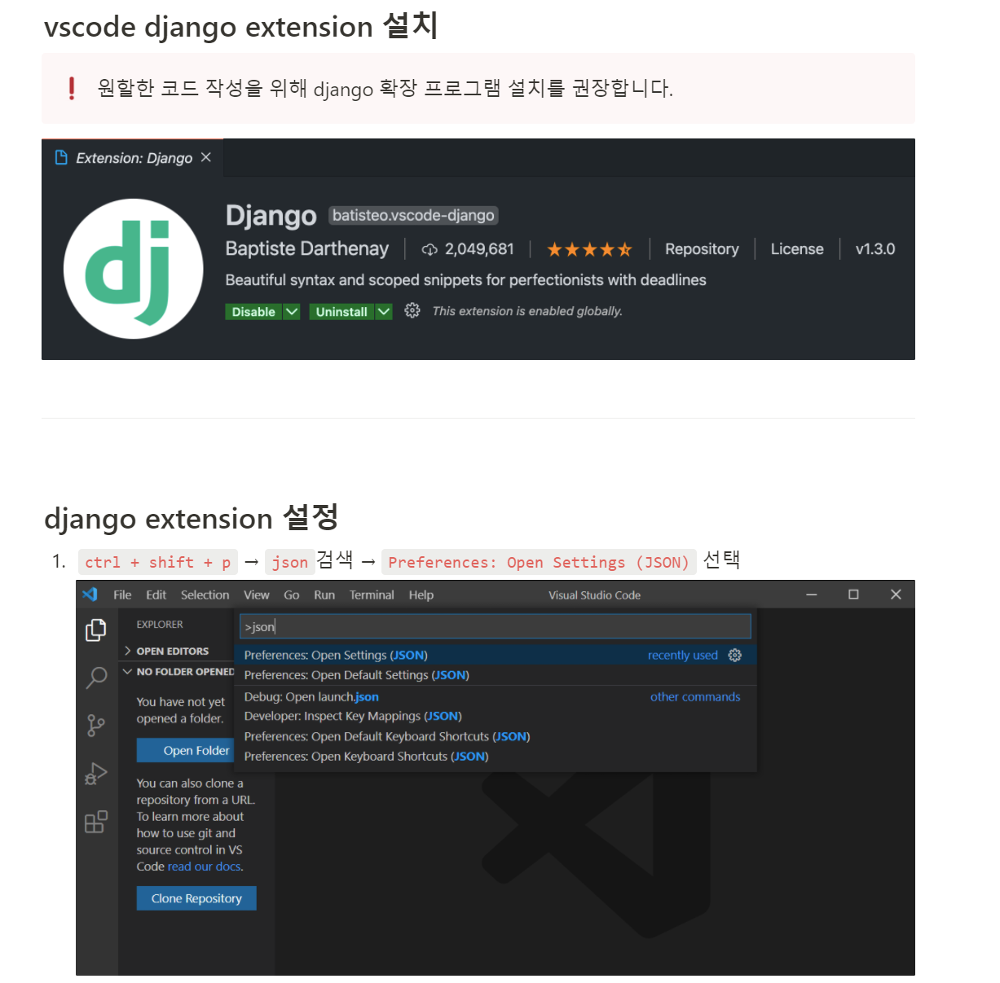

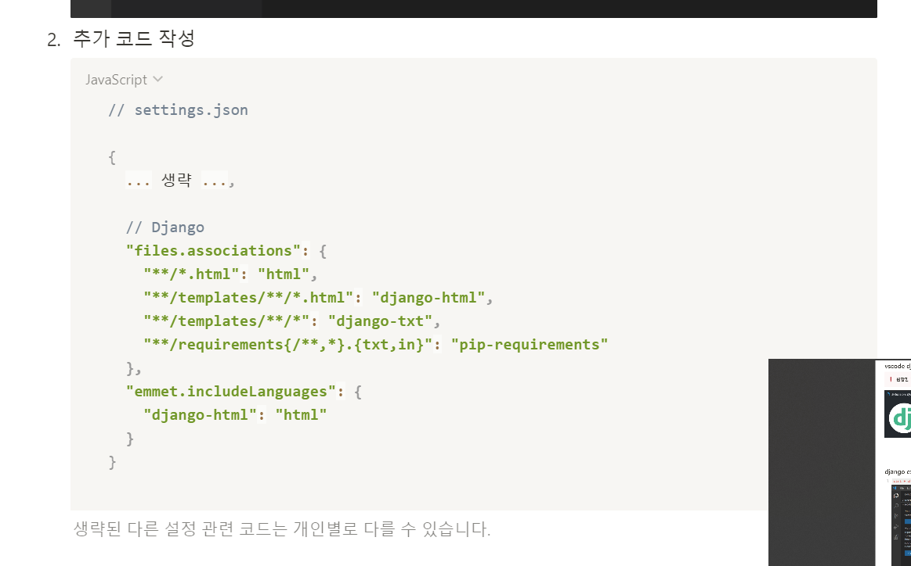

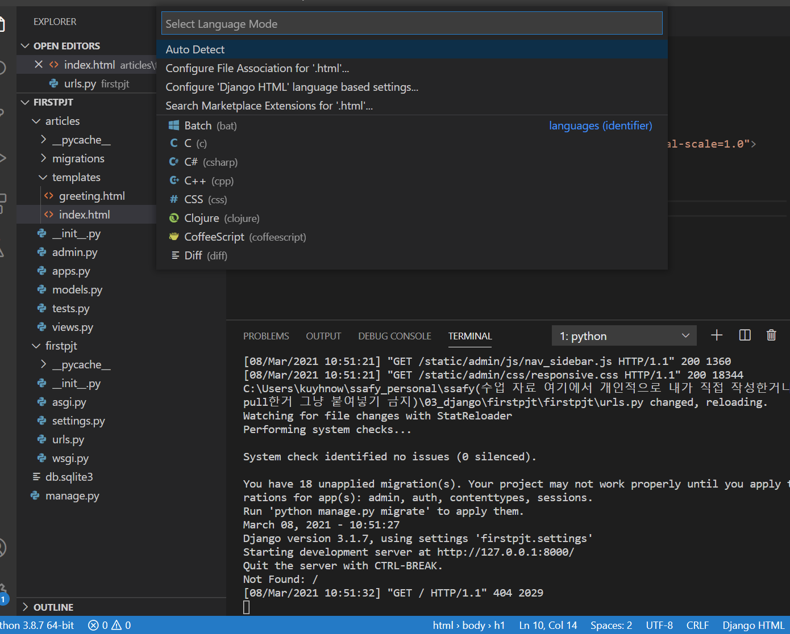


**작동 방식**

1. HTTP Request
2. URLS(urls.py)로 요청을 받아 방향을 잡음.
3. View(views.py)로 URL 전달
4. Model(models.py) <> View URL에서 요구받은 데이터를 read/write data
5. Template(<filename>.html) -> View로 전달 및 하나의 완성된 문서 작성.
6. HTTP response(HTML)


## 장고 프로젝트 만드는 순서

1. 빈폴더(프로젝트 Root) 만들기
   1. gitignore 생성
   2. git init으로 REPO초기화
   3. README.md 생성
   4. 원격저장소 생성 후 연결
   5. add => commit => push
2. 해당 폴더 이동후 `venv/`(가상독립환경)만든다. python -m venv venv
3. 가상 독립환경을 활성화(activate)
4. pip install django를 통해서 필요한 패키지들을 설치한다.
5. `$ django-admin startproject <project name> .` 명령어를 통해 프로젝트 초기화
6. 프로젝트 진행

## 프로젝트 열기

반드시 프로젝트 루트 폴더에서 열기. venv 자동인식을 못함 VScode가


## 프로젝트 독립환경 설정

1. ctrl shift p
2. `>python: select interpreter` 입력
3. 자동완성 안되면 Path찾아서 설정하기
4. 좌하단 Python 3.8.7 64bit('venv') 확인


## **프로젝트 개시**

**One Project, One Virtual Environment**: 하나의 Project가 하나의 가상 환경을 역할한다.

1PJT == 1Venv(가상환경) == 1Git Repo


**가상환경 파이썬을 생성하고 싶다면**

> why? global에 설치된 pip와 다르게, 각 가상환경에 맞는 pip만 쓰게 하려고(각자 필요한 패키지만 사용위해.)

**GITHUB 사용 시에는, VENV 폴더를 전체를 IGNORE 해야함에 유의**

**아래 작업은 실행시 매번 해야한다. + 폴더위치 변경이나 폴더명 변경시, venv지우고 다시 해야함.**

- **프로젝트 폴더 내**에서 `python -m venv '원하는 가상 파이썬 폴더명'`을 입력한다. #보통 venv로 통일
- 하지만 `which python` 해도 여전히 python은 global Python 경로가 지정된다.
- `source venv/Scripts/activate` 입력
- (폴더명) 출력이 되면 성공. 앞으로 위 프로젝트는 venv 파이썬을 자기 파이썬으로 사용한다.
- pip list 검색시, 모든 pip는 초기화되어, pip, setuptools만이 존재한다.

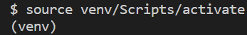

- `pip install django`. 아래가 Django시 설치해야 하는 Pacakge & Version

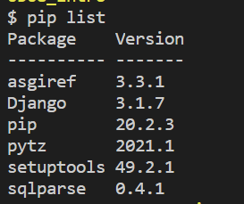

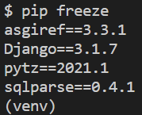

**requirements.txt로 쓰는 것이 약속한 Rule**. 즉, `pip freeze requirements.txt`

- `pip freeze > 만든txt명.txt` 시, 현재 설치된 pip목록이 전부 txt에 복사 및 업로드 된다.
- freeze는 버젼을 동결시키는 명령어
- `pip install -r 만든txt명.txt` 로, 전부 설치 가능


####################################################################

- `deactivate` 입력시 비활성화 가능.
- 프로젝트 폴더 내에(venv폴더가 있는 경로와 같은 경로) `.gitignore` 생성
- `.gitignore` 상단에 `/폴더명(위에 그대로 했다면 venv/이 되겠죠?)`입력. venv 하위는 다 무시된다.
- `gitignore.io` 사이트에서 `django, vscode, python, venv` 추가 후 붙여넣기


1. 원하는 폴더에서 Git bash 실행
2. `django-admin startproject <원하는 프로젝트명>` 입력 **파이썬 컨벤션에 따라 숫자로 시작 불가**
3. `django-admin startproject <원하는프로젝트명> .` 으로 하면, 하위 경로가 하나 줄어든다.
4. Django의 모든 명령어는 위처럼 3등분됨을 유의한다.
5. 이 과정에서 서버는 이미 구동되어 있다.
6. 해당 폴더에서(`manage.py` 확인) `python manage.py runserver 원하는포트번호(default 8000)` 입력시, 서버 Open

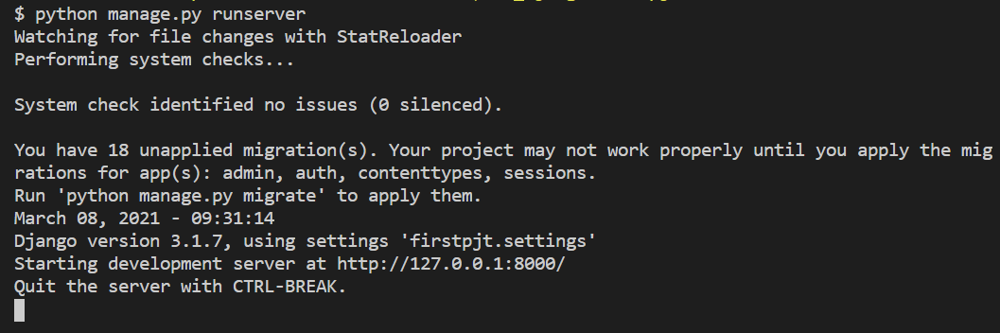

6. 주소를 `Ctrl + Click`으로 눌러보면,

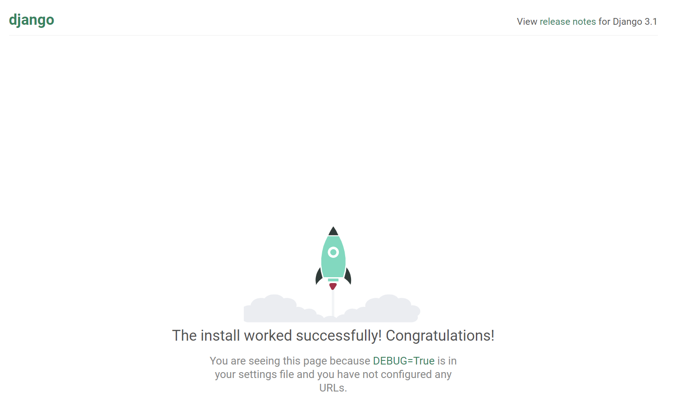

7. 위 사이트가 등장한다.

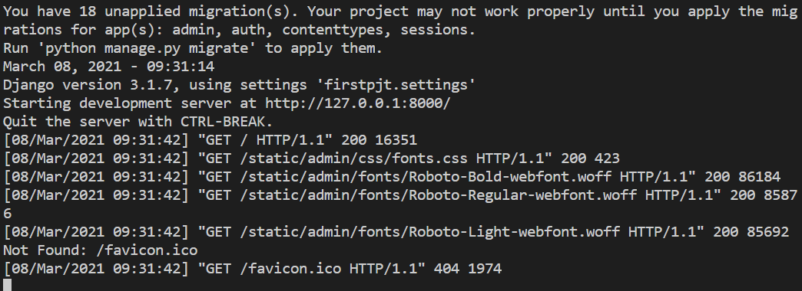

8. 실행시 위처럼 Upload가 되며, 종료시엔 `Ctrl + C`로 종료한다.
9. 서버 생성시, 항상 위 과정을 거친 후 사용한다.

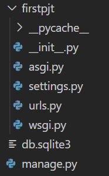

- init은 폴더를 패키지로 인식하도록 한다.
- asgi, wsgi는 비동기 웹과 연동시 사용
- **Urls**는 위에서 나왔던, 요청을 받아 알맞은 View(Appropriate View)로 전달하는 곳.
- settings는 각종 설정이 가능하다. 여기서 시간이나, 언어 등도 설정이 가능하다.

```python
# Internationalization
LANGUAGE_CODE = 'ko-kr'
TIME_ZONE = 'Asia/Seoul' # (기존은 UTC)
```


## 앱 생성

1. `python manage.py startapp <원하는앱명>`으로 생성한다.
2. <원하는앱명> 폴더가 생성된다.
   1. __init__.py는 폴더를 하나의 패키지로 접근할 수 있도록, 패키지의 공간을 만들어주는 역할.
   2. **admin.py** 관리자 사이트를 커스텀
   3. apps.py는 손대지 말것
   4. **models.py** **MTV 패턴**의 M을 담당
   5. tests.py는 테스트 코드 작성용
   6. **views.py**는 패턴의 V를 담당(중간관리자)
   7. T는 Django가 자동적으로 만들어주지 않아서, 직접 만들 것임.

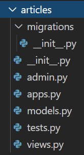


**주의점**

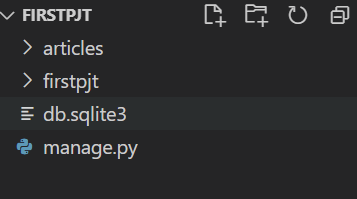

1. 장고는 프로젝트와 앱이 동일 경로에 생성이 된다.

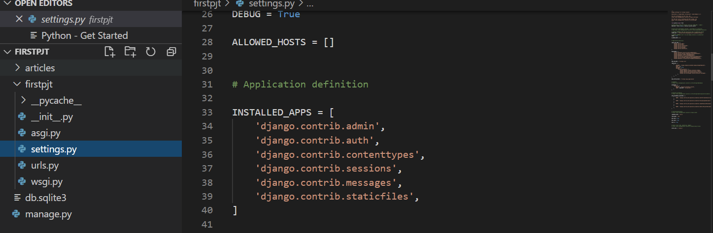

2. 그래서 장고에 앱 등록을 직접 해줘야 하는데,
3. Project 폴더 내의 `Settings.py`에서, INSTALLED_APPS 항목에 '앱이름'을 작성해준다.

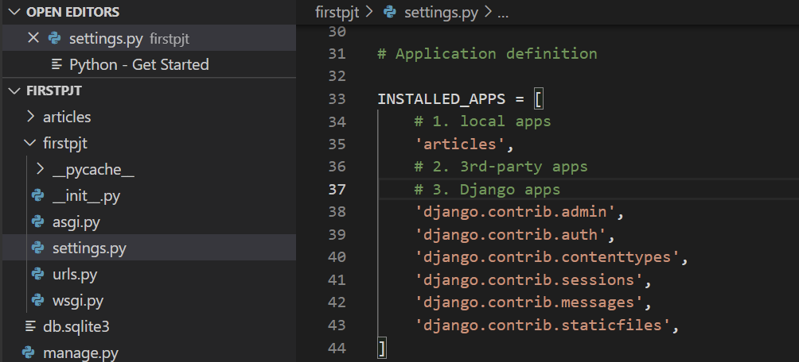

4. 순서가 정해져있어서, 내가 작성한 apps는 항상 맨위에 작성해주는 것이 충돌 가능성을 낮춘다.


## 사이트 주소 설정

> 작성순서 : [0] settings.py에 app등록
>
> [1] Url에 Path 작성
>
> [2] Views.py에 request 함수 작성[return render() 필수 유의]
>
> [3] apps명>templates>html 작성

1. `Urls.py` 에서 작성
2. 가보면, path('admin/')이 기본적으로 존재하는데, 내 Url에서 `/admin` 입력시, Django가 기본 제공하는 admin 화면이 확인 가능하다.

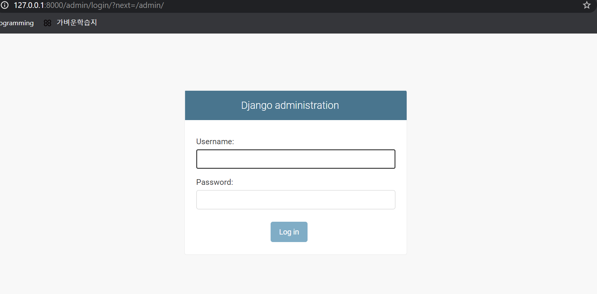

3. urlpatterns에 주소를 작성하며, 장고는 항상 Path에 엔드슬래시가 필수이다.

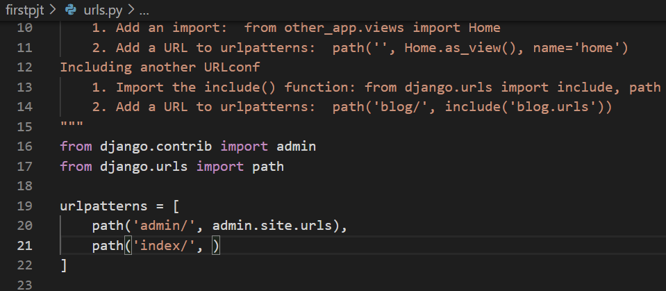

```python
urlpatterns = [
    path('admin/', admin.site.urls), # 엔드슬래시 필수
    path('index/', )
    path('메인페이지로 들어오고자 하는 Url주소', '호출할 적절한 View 함수')
]
```

4. __View함수는 Project에 있지 않고, 각 App에 존재함에 유의한다.__

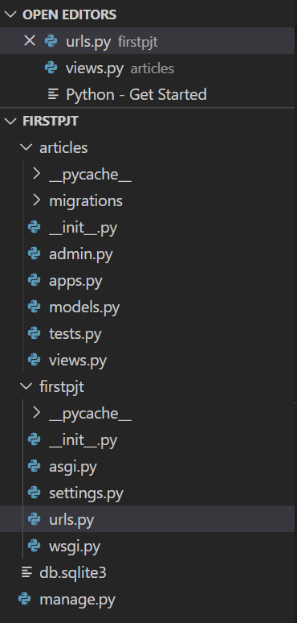

5. Views에 함수를 작성시, 반드시 첫번째 인자는 "**request"**임에 유의한다.

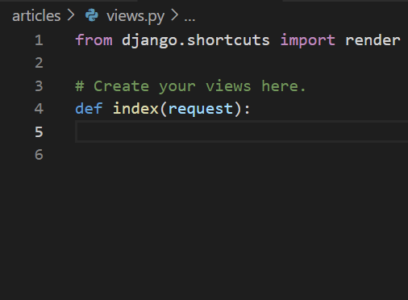

6. 첫 Return값도 위처럼, return render(request, '템플릿 경로')로 작성한다.

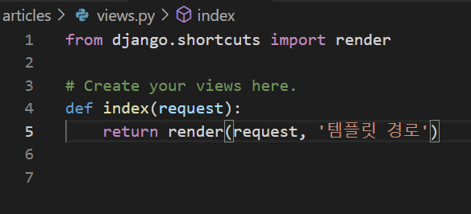

7. **Template을 작성**한다.(원하는 App내에 Template 폴더 생성후, 함수명.html 파일을 작성한다.)

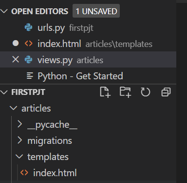

8. App내 views파일에 경로 지정후,

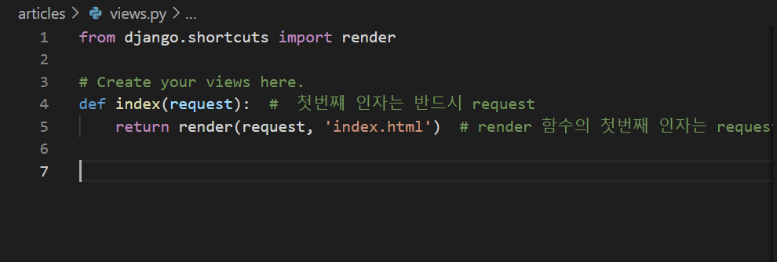

9. Urls 에 **패키지** 추가[from 패키지명 import py명] 후, 경로를 입력해준다. **트레일링 콤마**도 필수로

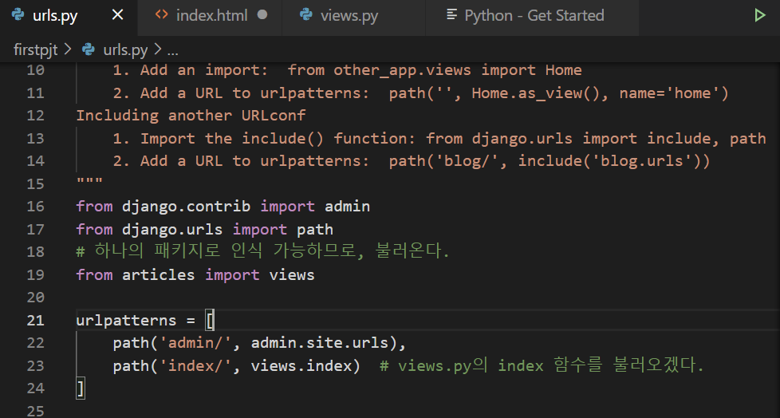

10. 이 모든 것은 저장시 실시간으로 업로드된다.

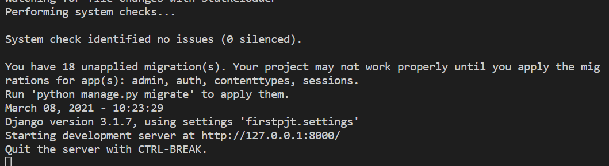

11. Index 함수를 아래와 같이 작성 후에, 사이트로 이동해보면, ( ! + Tab시 기본 doctype  자동 완성)

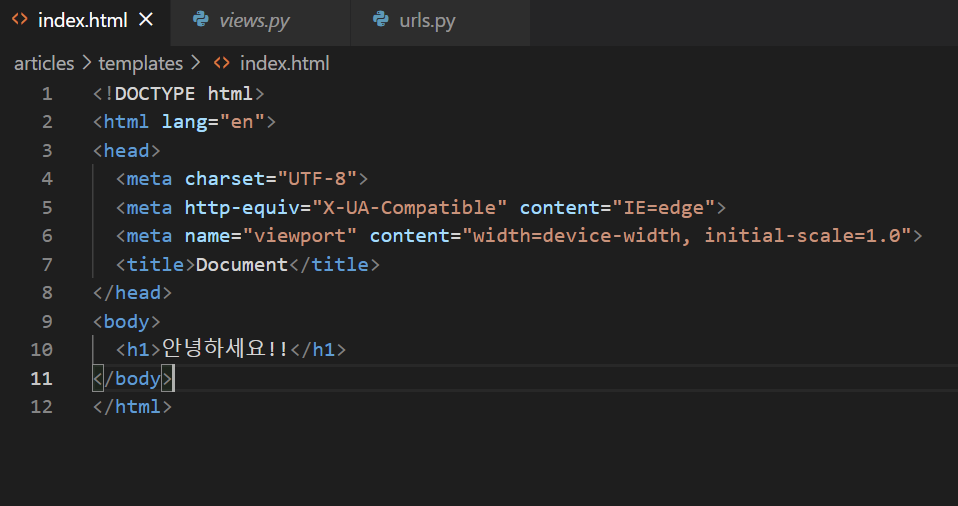

12. 이와같은 페이지를 볼 수 있다.

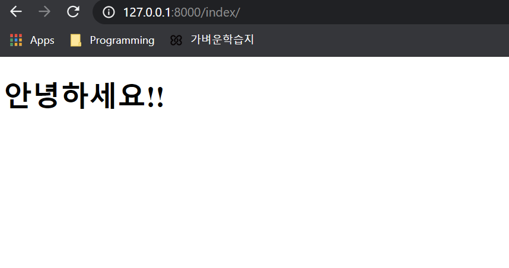

**참고사항**

새 URL 작성후엔 로켓 화면은 404Error로 출력되게 된다.

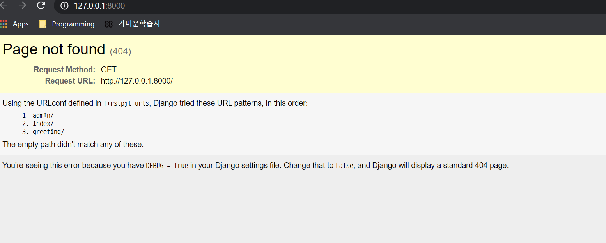

# Template

## Django Template

> 가공된 데이터를 받아 잘 표현하는 것이 목표. HTML을 더 강렬하게 표현해주기 위해 사용

- 데이터 표현을 제어하는 도구이자 표현에 관련된 로직
- 사용자 인터페이스를 구성하게 될 Layout을 작성한다.

### Variable, Filters, Tags, Comments

### Variable(변수)

- {{ variable }}
- render()를 사용하여 views.py에서 정의한 변수를 template 파일로 넘겨 사용하는 것


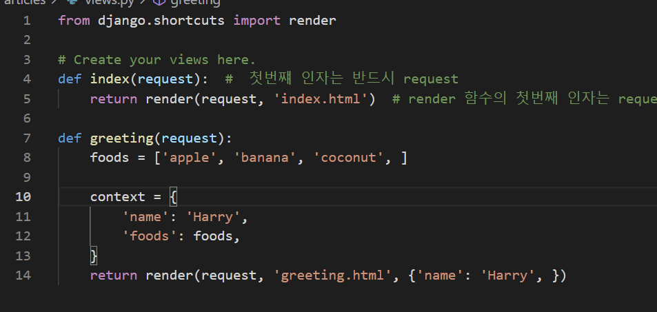

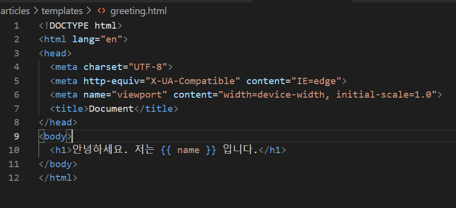


2.

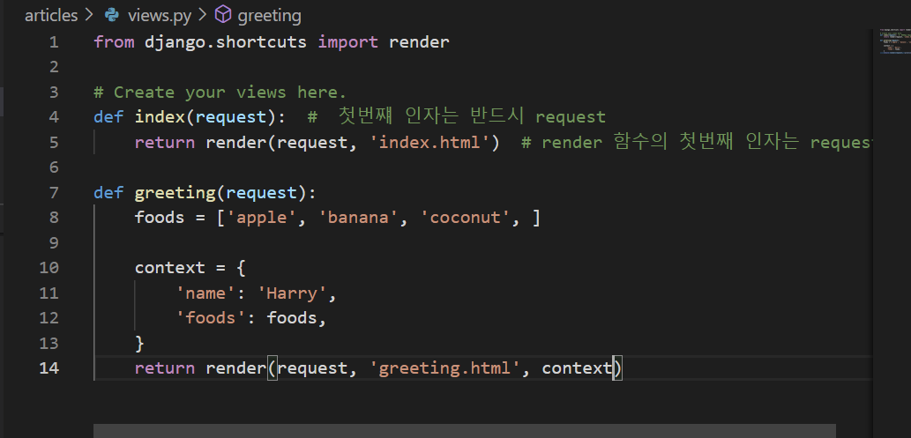

키, 밸류값은 되도록 이름을 통일할것

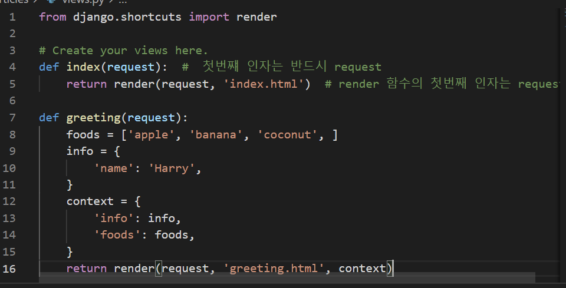

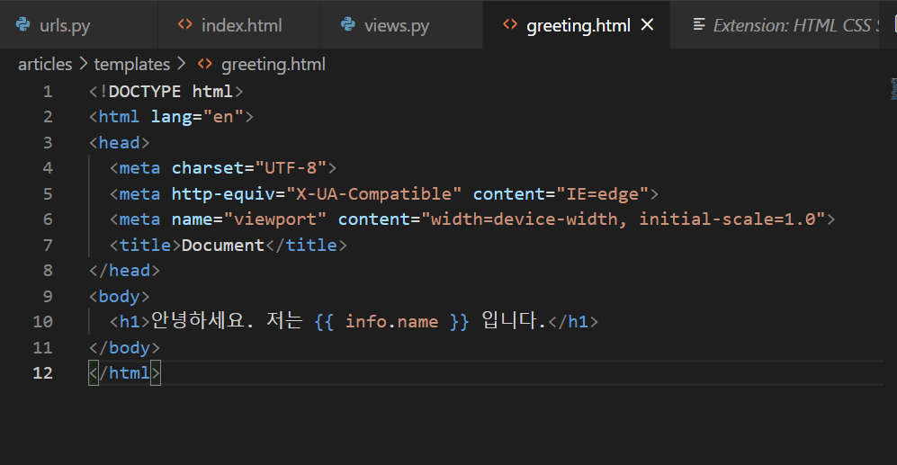


### Template Inheritance

- 템플릿 상속은 코드의 재사용성에 초점
- 상속시, **사이트의 모든 공통 요소 포함** + **하위 템플릿이 재정의(Override)하는


**Tags**

`` & ``

**extends**

- 자식(하위)템플릿이 부모 템플릿 확장함을 알림
- 반드시 **템플릿 최상단**에 작성

**block**

- 하위 템플릿에서 재지정(Override)할 수 있는 블록을 정의
- 부모 py에 위치할 공간에 block 작성 후, 그 이후에 자식에 태그를 작성한다.
- 하위 템플릿이 채울 수 있는 공간을 제공


Project 폴더내에 templates 폴더 생성

Settings.py - Templates - APP_DIRS = TRUE는 앱에 있는 템플릿경로는 기본적으로 활성화 되어 있음. but 프로젝트 파일내 경로는 직접 활성화 해야함. DIRS : []에 직접 작성할 수 있다. [BASE_DIR / '~경로명~' / 'templates'] 

마스터 폴더에 둬도 되고, 프로젝트 폴더 안에 둬도 된다. python pathlib 검색후 참조. 이 과정이 없으면 에러 남

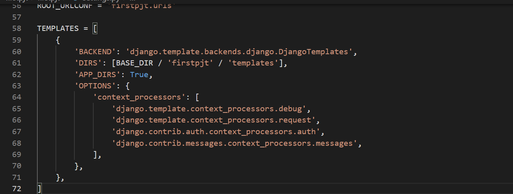


#### 기본적인 작성순서 예시

```python
# 1. Project 폴더 내 urls.py에 path 작성
# 2. App 폴더 내 views.py에 def 함수 작성
# 검색창 페이지 예시
def throw(request):
    return render(request, 'throw.html')
def catch(request):
    message = request.GET.get('message')
    context = {
        'message' : message,
    }
    return render(request, 'catch.html', context)  # 요청받으면, catch.html 실행, context전달
```


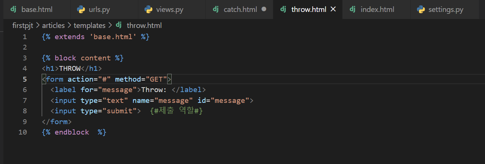

### WHY?

**Django의 설계 철학**

- "표현과 로직(View)을 분리"
  - Template System은 표현을 제어하는 도구이자 표현에 관련된 로직일 뿐.
  - 이 기본을 넘어서면 안된다.
- "중복을 배제"
  - 대다수 동적 웹사이트는 공통 header, footer, navbar 같은 공통 디자인을 가짐
  - 이러한 요소를 분리하여 중복 코드를 없앰


## 기본 컨벤션(Style Guide)

- App 이름은 **복수형**
- App **반드시** 생성(startapp) 후 등록
- {{ 내용 }} 내용 좌우로 한칸씩 띄어쓰기


## HTML FORM

- 

### HTML input element

- 사용자로부터 데이터를 입력 받기 위해 사용

- 핵심 속성

  - name

  - 중복 가능, 양식 제출시 name이라는 이름에 설정된 값을 넘겨서 값을 가져올 수 있음

  - 주요 용도는 GET/POST 방식으로 서버에 전달하는 파라미터(Name은 key, Value는 vale)로 

    **?key=value&key=value** 형태로 전달


###  HTTP

> HyperText Transfer Protocol

- 웹에서 이뤄지는 모든 데이터 교환의 기초
- 주어진 리소스가 수행할 원하는 작업을 나타내는 Request Methods를 정의
- HTTP request method 종류
  - GET, POST, PUT, DELETE...
  - GET : 정보 요구(검색 등). 정보를 수정하지는 않는다.
  - PUT : 수정
  - DELETE : 삭제

**GET**

- 서버로부터 정보 조회하는 데 사용
- 데이터를 가져올 때만 사용
- body가 아닌, Query String Parameters를 통해 전송
  - body에 들어가면, URL에 검색어가 들어가지 않음. 즉, 입력어가 URL에 출력됨
- 


## URL

> Fowarding. 들어온 요청을 단순히 Views로 보내는 역할

- Dispatcher(발송자, 운항 관리자)로서의 URL
- 웹 어플리케이션은 URL을 통한 클라이언트의 요청에서부터 시작됨

**App URL mapping**

- App의 View 함수가 많아지면서, 사용하는 path() 또한 많아지고, app 또한 더 작성되기 때문에 프로젝트의 urls.py에서 모두 관리하는 것은 코드 유지보수에 좋지 않음
- 각 app에 urls.py를 작성
- 중간관리자를 배치한다고 생각하면 된다.(URL부서 - 각 APP별 URL팀을 배치한다고 생각하면 편함)

### **Variable Routing**

- URL 자체를 동적으로 사용하여, 주소를 동적으로 변경시키는 방법
- Default 값 : str

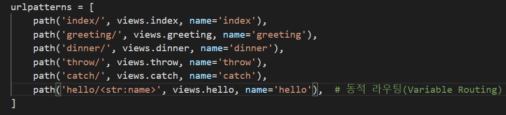

- <str>의 경우는 생략가능하나, <int>는 생략불가능

**활용예제**

**practice0309 APP의 내역**

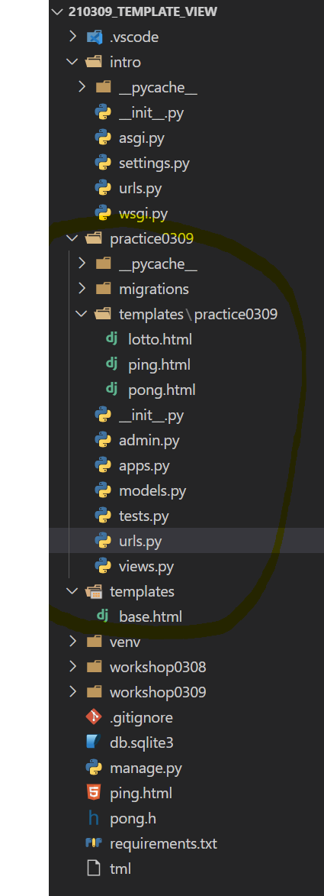

**practice0309/urls.py**

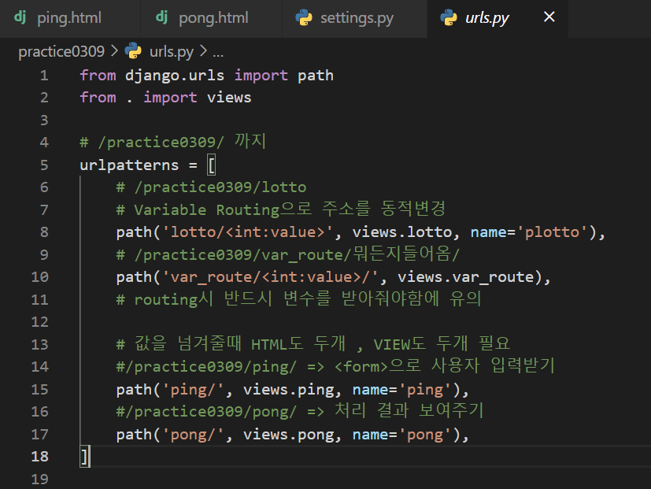

**practice0309/views.py 내의 var_route 함수**

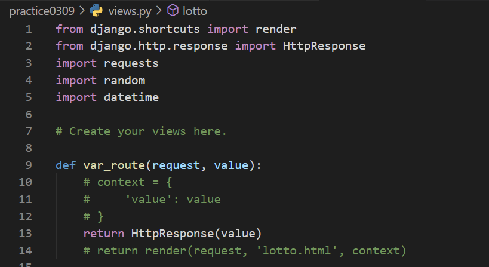

**결과 출력 예시**

> 임의의 숫자 110 입력시, 110이 출력되었다. 주소에도 110 잘 나온다.

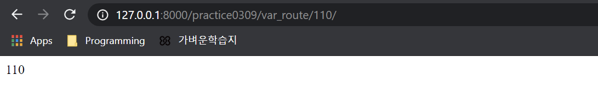


**Naming Space**

- 링크에 URL을 직접 작성하는 것이 아닌, path()함수의 name인자를 정의해 사용
- Django Template Tag 중 하나인 URL태그를 사용해서 path() 함수에 작성한 Name을 사용할 수 있음

- 위 이미지의 path 중 `name = 'index'` 등이 내가 임의로 정해준 이름이다.

```python
# urls.py 내 작성 내용
# urlpatterns는 url이 없어도 urls.py 내에 반드시 작성되어 있어야 한다.
from django.urls import path
from . import views  # 앱 내 urls.py 생성했다면 필수
urlpatterns =[
    path('index/', views.index, name='index')  # 내가 줄 URL명, views에서 index함수 호출, 주소명할당
]

################### 이하 index.html ###################
# <a>태그에 따로 주소를 길게 쓰지 않아도, 편하게 url태그로 연결이 가능
  {# Block 템플릿의 경로 작성#}


  <h1>안녕하세요!! 여기가 메인 페이지입니다.</h1>
  <a href="">greeting</a>  {# url 'path에정해진이름' 알아서 주소값을 찾아준다#}
  <a href="/dinner/">dinner</a>
  <a href="">throw<throw/a>

```


**Project 폴더의 urls.py**

> include라는 것을 따로 import 해줬다. URL 책임을 하위 URL에 할당해주기 위해서

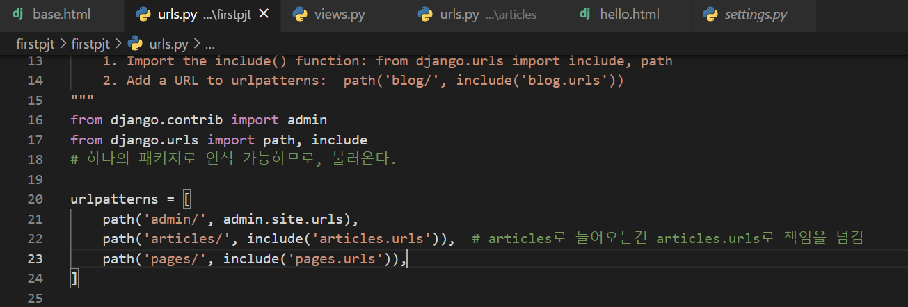

- 그렇다면, articels.urls는 어떻게 되어있을까?

> 자기와 연관된 path를 전부 담고 있으며, URL Name을 정의해주었다.

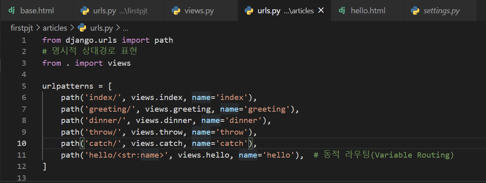

- 그렇다면, 마지막 pages는 어떨까?

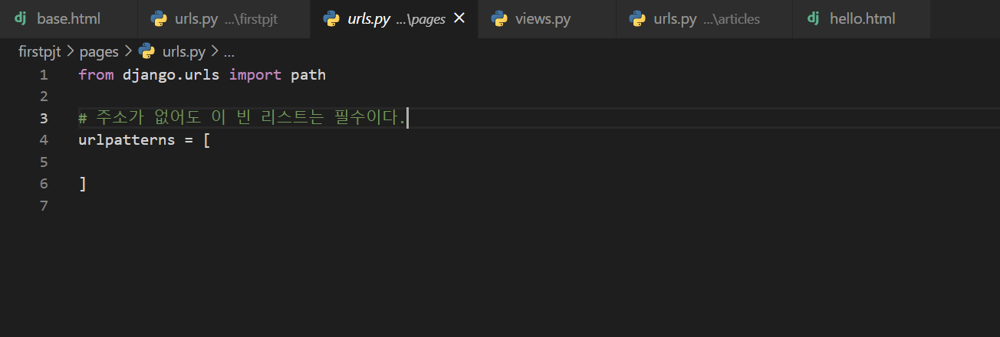


## Views

**URL**이 보내온 Request를 받아 response(응답)을 반환함.(return HTML)

####################################################################

vscode & git bash

컨트롤 알트 화살표 여러줄 동시 입력

프로젝트 지우기 rm -rf 프로젝트 폴더명

프로젝트 폴더 프로젝트 폴더 - 프로젝트 폴더가 아닌 이자리에 직접하고 싶을떄

`django-admin startproject intro .`

앱도 rm -rm 앱폴더명도 이렇게 지우기


프로젝트 폴더는 settings.py를 들고 있음

settings에

\# Installed_apps에 앱 적는 것이 가장 먼저 해야할 것

59LIne의 DIRS(TEMPLATES에 DIR관리)


트레일링 컴마 필수 


요청들어온다(-> url)

요청 포워딩(url -> view)

요청 해결한다(view + html)

return 한다(html)


url은 요청을 받아주고

template 외형 및 보여질 내용을 짜주며

view는 이 모든 구조를 해결해준다.


SETTINGS

INSTALLED_APPS 1 2 3 순위

TEMPLATES 프로젝트 폴더에 만들면 TEMPLATES DIRS에 BASE_DIR / 프로젝트 폴더명 / templates?


\# DOMAIN/lotto/

path('lotto/', views.lotto) # URL명, 로또 함수불러올곳, name="" 임의의 이름설정

ctrl + p vscode에서 파일 바로 열기


\# 요청을 파일로 보내준다, 넘겨줄 데이터가 3번쨰 무조건 dict형태로

def lotto(request):

  lotto:sorted(random.sample(range(1, 46), 6))

  return render(request, 'lotto.html')

{{}}에 data. 필요없으며, (넘어왔으므로)

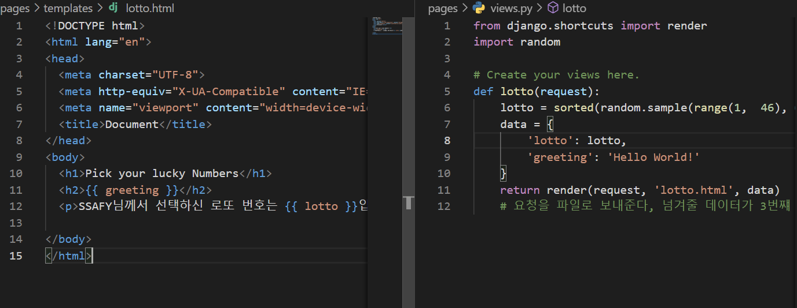

##################################################################


## 오늘 배운거

장고는 html 이름이 같은경우 settings에서 INSTALLED_APPS에 기재된 순서를 보고 그걸 불러와서 제대로 호출이 안된다.

그래서 template/app이름명폴더 하나 더 만들고/ 그밑에 html을 넣어 해결한다.

+ 대신 차지 못하므로 경로도 써준다.

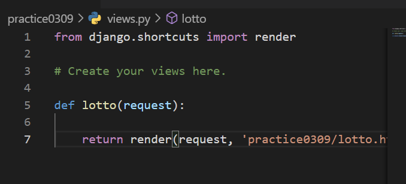

intcomma?

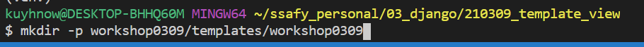


## BASE_DIR

> Project Root directory와 Apps Directory를 담을, 최상단 폴더

- 원하는 위치에 원하는 이름으로 **Folder 생성**
  - 하위에 venv(virtual environment), Project와 Apps를 담게 될 폴더이다.

- 폴더 내 **.gitignore**생성
  - 첫 줄에 `venv/` 입력하여 예외처리
  - `Django, Python, vscode, venv` 예외처리문구 추가
- **pip freeze > requirement.txt** 실행


## Project Directory

> Project Root 생성
>
> 핵심요소 : STARTPROJECT, SETTINGS.PY[ INSTALLED_APPS, TEMPLATES ], URLS.PY, TEMPLATES DIR

- `django-admin startproject <원하는 프로젝트명>` 입력

  - `django-admin startproject <원하는프로젝트명> .` : 하위경로 하나 줄이기
  - BASE_DIR - project - project(Root) / BASE_DIR - project(Root) 이처럼 동일 폴더 하나를 줄여줌.
  - **파이썬 컨벤션에 따라 숫자로 시작 불가**

- **settings.py**

  - **INSTALLED_APPS** = [

    #My App #생성한 앱 여기 추가

    #Third party App

    #Built-in App

    ]

  - **TEMPLATES** 내 **DIRS**에 [BASE_DIR / 'templates' , ] 혹은 [BASE_DIR / 'PROJECT DIR NAME' / 'templates']로 **base.html** 저장해 줄 TEMPLATES 생성

  - **LANGUAGE_CODE = 'ko-kr ' / TIME_ZONE = 'Asia/Seoul' 등도 가능**

  - TIME_ZONE의 경우, LOCAL 시간을 적용하려면 **USE_TZ = False**로 해주어야한다.

- **urls.py**

  - 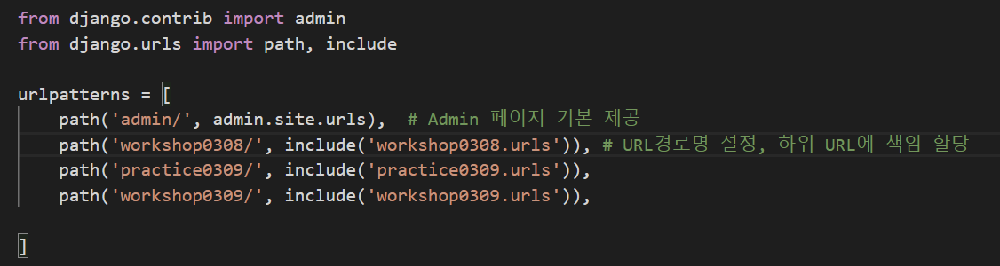
  - 각 App에 urls.py 생성 후 사용한다면, import **include**하고 <Apps명.urls>로 Apps urls에 연결한다.
  - 설정의 이유는, 각 app의 urls를 각각 관리하면 관리가 더 수월하기 때문.

- **templates** Directory

  - **Project Root Directory** 혹은, **BASE_DIR Directory**[ Project Root Folder와 같은 위치 ]에 templates 폴더 생성.
  -  BOOTSTRAP 주소 등을 매번 입력하는 불편함을 없애고, SITE 내에서 공유하는 같은 양식을 쉽게 사용하기 위함
  - **TEMPLATES**의 **extends & block** 참조
  - 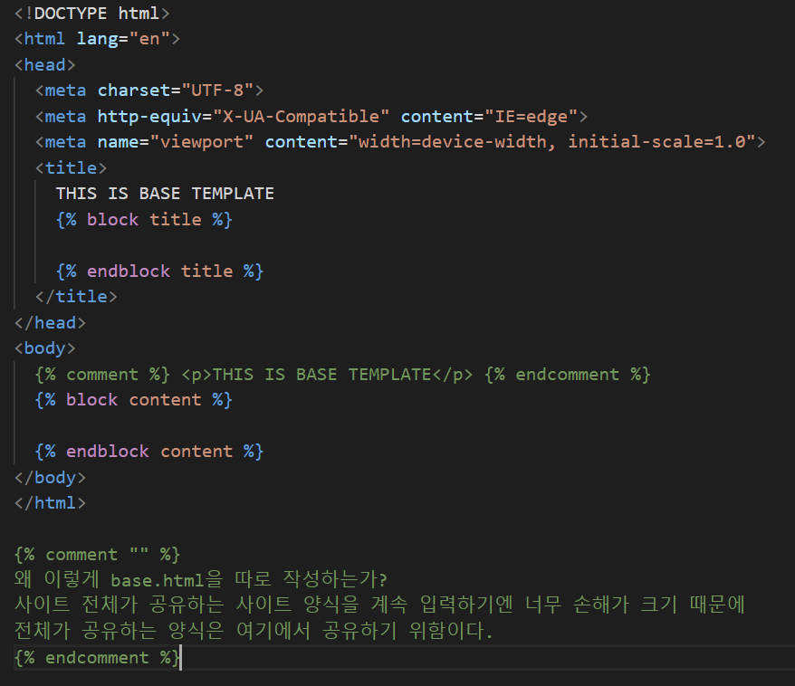


## App Directory [URLS.PY / VIEWS.PY /]

> Project의 하위 개념으로, 각각 고유 기능을 가진 Page를 관리
>
> INSTALLED_APPS, Path, Variable Routing, URLPATTERNS, NAME

- `python manage.py startapp <원하는 App Directory 명>`으로 App 생성
- **BASE_DIR**
  - **settings.py**에 App 추가
- **PROJECT DIRECTORY**
  - **urls.py **에 **Path()** 추가

- **urls.py** 생성

  - 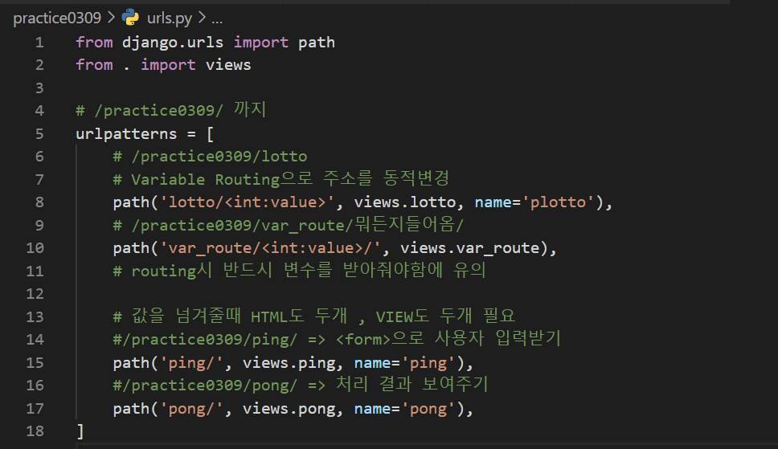
  - import **path & views** 
  - **urlpatterns** must be declared even **there is no path**
  - **path**(URL명 지정[ **views 함수명과 통일 추천** ], views.함수명[ views.py는 제어 담당 ], Path 이름 지정)
  - **name='x'**의 지정 : 에 사용 + **App명 변경**, **path가 과도히 길어진 경우**등에 편리함 위함
  - **\<int:value>** : Variable Routing 참조

- **Views.py** 수정
  - import **render** Check
  - **URL명**과 동일한 함수 정의
  - 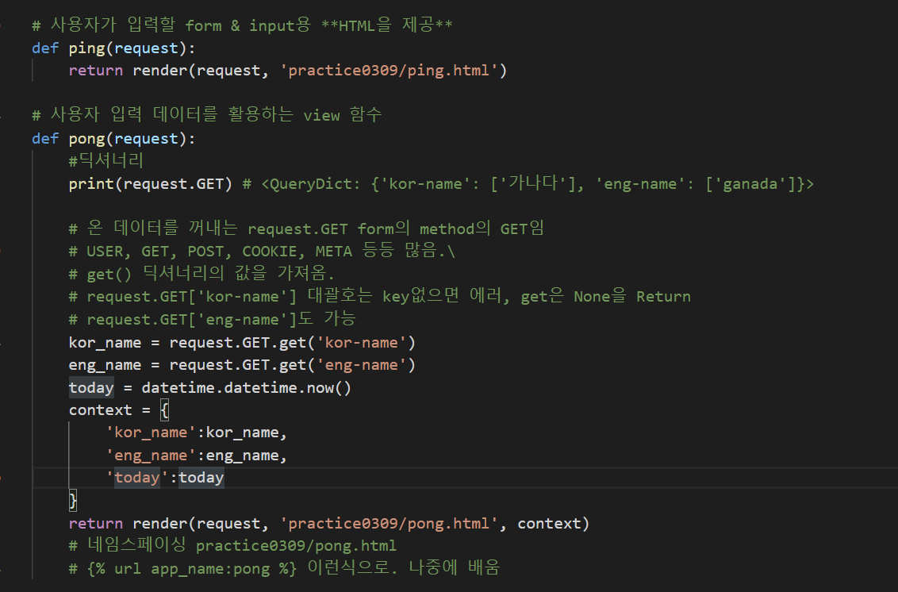
  - 


# 정리할 거 순서

project

apps

settings.py

urls.py

views.py

templates

공용 템플릿 생성

템플릿 밑에 apps이름을?

context


## 로또 프로그램 예제

- 폴더 구조
- 


# MODEL

## Django Model

**필수사항** : **vscode SQLite 설치** / **pip install django django_extensions ipython** / 

​				  **INSTALLED_Apps 3rd party에 django_extensions 추가**

### MODEL

> 웹 어플리케이션의 데이터를 구조화하고 조작하기 위한 도구 즉, DB 조작 도구

```python
from django.db import models

# Create your models here.
class Article(models.Model):  # 첫글자 대문자, Model 불러오며 단수형작성
    # models 상속 받아 설계도 작성
    # title, content = Column(모델 필드)
    # charfield = 길이에 제한이 있는 TextField
    title = models.models.CharField(max_length=10) # Column = 필드명, 모델필드생성
    content = models.TextField()
```


- 단일한 데이터에 대한 정보를 가짐
  - 사용자가 저장하는 데이터들의 필수적인 필드들과 동작들을 포함
- 저장된 DB의 구조(Layout)
- Django : Model을 통해 데이터 접속, 관리
- 각각의 Model, 하나의 DB Table에 Mapping

**MODEL != DB 그렇다면 DB는?**

### DATABASE

- 데이터베이스(DB)
  - 체계화된 데이터의 모임
- **쿼리(Query)**
  - 데이터를 조회하기 위한 명령어
  - 조건에 맞는 데이터를 추출, 조작하는 명령어


**DB 기본구조**

- 스키마(Schema)

  - 데이터베이스에서 자료의 구조, 표현방법, 관계 등을 정의한 구조 (Structure)

  - DB의 구조와 제약 조건에 관해 전반적인 명세를 기술한 것이다.

    - |스키마예제| column | datatype |
      | ------ | -------- | ------ |
      | 스키마 예제이다. | id |INT|
    |  | age |INT|
      |  | phone |TEXT|
      |  | email |TEXT|
    
    - 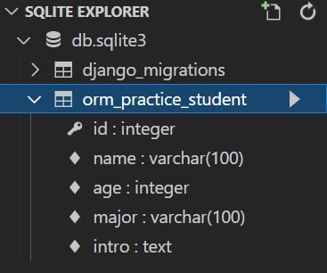

- 테이블(Table)

  - 열과 행의 모델을 사용해 조직된 데이터 요소들의 집합(실제 데이터)
  
  - SQL에서는 테이블을 **관계**라고도 부른다.
  
  - Column : **필드(Field)** / 속성 등으로 칭함
  
    - 각 열에는 고유한 데이터 형식이 지정된다.
  
  - Row : **레코드(Record)** / 튜플 등으로 칭함
  
    - 테이블의 데이터는 행에 저장. 하나의 자료가 새로 추가될때, 행이 한줄 추가된다.
  
  - PK(Primary Key): 기본키. 각 행(레코드)의 고유값으로 Primary Key라고 불린다.
  
  - | id(PK) | name | age  | phone         | email          |
    | ------ | ---- | ---- | ------------- | -------------- |
    | 1      | hong | 42   | 010-1234-5678 | hong@gmail.com |

### Model.py

> App 폴더 내에 존재하는, DB 관리 전용 Python파일

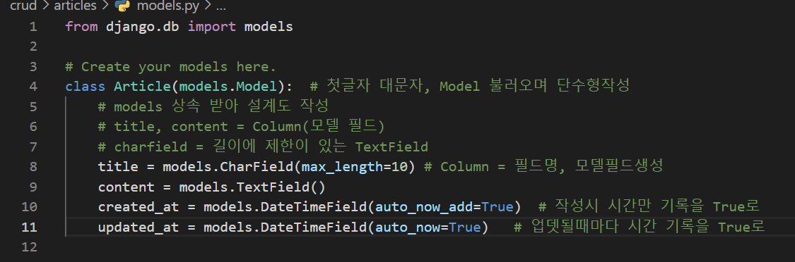

**Class**

- 각 DB를 담당. models의 Model Class를 상속받아 사용
- Class내 객체들은 각각 **Column**이며, 반드시 **Field값**을 하나 상속 받아야 한다.

## ORM

> Object-Relational-Mapping. DB를 객체(Object)로 조작하기 위해 ORM 사용

- 객체 지향 프로그래밍 언어 사용, **호환되지 않은 유형의 시스템간(Eg. Django-SQL) 데이터를 변환**하는 프로그래밍 기술.
- **가상 객체 데이터베이스**를 만들어 사용
- 사용하던 OOP를 통해, (Python) 다른 시스템의 언어를 조작(SQL). 이 사이에서 객체(Python)와 관계(DB)를 매핑(Django)하는 기술


**장/단점**

- 장점
  - SQL 몰라도 DB 조작이 가능
  - SQL의 절차적 접근이 아닌 객체 지향적 접근으로 높은 생산성
- 단점
  - ORM만으로 완전한 서비스 구현이 어려움
- **현대 웹프레임워크 요점은 웹개발의 속도를 높이는 것(생산성)**


## Migrations

> Django가 Model에 생긴 변화(필드 추가, 모델 삭제 등)을 반영하는 방법
>
> 각각 하나하나의 설계도는 Migration이라 칭함

- Migration 실행 및 DB 스키마를 다루기 위한 몇가지 명령어가 존재
  - **makemigrations** #아주중요
    - **Model을 변경한 것**에 기반한 새로운 마이그레이션(like 설계도)를 만들 때 사용
    - 만든 **Class** 설계도를, **ORM이 해석할 수 있도록 만들어주는** 과정이다.
    - `python manage.py makemigrations`
    - 실행시, migrations한 각 App의 migrations 폴더에 **initial.py**라는 파일이 생긴다.
    - 이 파일은 **설계도**, **Git Version 관리처럼** 코드 수정이 유용하도록 하는 것이다.
    - **initial.py** : **ID** 생성, 그 외 항목은 내가 Model Class에 만든 Column으로 생성됨.
  - **migrate** #아주중요 
    - `python manage.py migrate`
    - makemigrations로 만들어진 설계도(Migration)을, DB에 반영하기 위해 사용
    - 설계도를 실제 DB에 반영하는 과정
    - 모델에서의 변경 사항들과 DB의 스키마가 동기화를 이룸(MODEL과 SQL이 같아지는 순간)
    - 이전까지 비어있던 DB, 동기화 통해서 **자료가 실제 삽입되는 과정**
    - migrate후, **db.sqlite3** 우클릭 - Open database로 SQL 목록 확인이 가능하다. 
    - 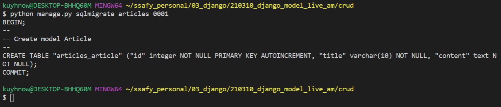
    - 위처럼 해석하여, DB로 보내겠다는 의미이다.
  - sqlmigrate
    - `python manage.py sqlmigrate <앱명 번호>` *articles 0001 0001_initial.py 확인*
    - 마이그레이션에 대한 SQL 구문을 보기 위해 사용
    - 마이그레이션이 SQL문으로 어떻게 해석되어서 동작할 지 미리 확인 가능
  - showmigrations
    - `python manage.py showmigrations`
    - 프로젝트 전체의 마이그레이션 상태를 확인하기 위해 사용
    - 마이그레이션 파일들이 **migrate 됐는지 안됐는지 여부**를 확인할 수 있음
    - 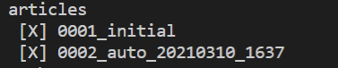
    - 위 사진은, migration **되었다**는 의미이다.(Checked)

### Field 추가 후 Migration 방법

1. 수정하려는 Class에 Column(Field) 추가 작성
2. **makemigrations** 실시
   1. 수정 후, **migrates** 먼저 실시하면 반응 **X Why?** **Migrate 할 것이 없기 때문**이다. 
3. 2가지 질문이 출력된다.(**기존 데이터엔 자료가 없는 Column이 생기기 때문에 뭐 적을지 묻는다.**)
   1. 1) 기본값을 줄 것인가, 아니면 2) 취소하고 내가 직접 default 값을 입력
   2. 1) 선택시 시간 관련 Column 추가했으면, timezone.now 이용하여 현재 시간을 입력해준다고 묻는다.
4. **migrate** 실시


## MODEL - DB생성 순서***

1. **App - models.py**
   - model 변경사항 발생
2. **python manage.py makemigrations**
   - migrations 파일 생성
3. **python manage.py migrate**
   - DB 적용

# DATABASE API

> DATABASE APPLICATION 간의 의사소통, 상호작용

- **DB와 Server, DB와 프로그래밍 언어 간의 소통**을 원활하게 돕는다.

**DB API**

> Python으로 DATA를 제어하기 위해 사용

- **DB를 조작하기 위한 도구**
- Django가 기본적으로 ORM을 제공함에 따른 것으로 DB를 편하게 조작할 수 있도록 돕는다.
- Model을 만들면, Django는 **database-abstract API**를 자동생성하여, DB를 제어할 수 있게 한다.
- **database-access API**라고 불리기도 한다.


## DB API 구문 - Making Queries

> <MODEL CLASS 명> / <MANAGER> / <QuerySet API>의 구조

- **Article.objects.all()**의 구조를 가진다.

**Class Name**

- 내가 모델에 정의한 Class Namde이다.

**Manager**

- 모델을 만들면 **DB API**에서 **자동으로 생성**
- Django가 DB를 조작하려면 Method가 필요한데, Method 사용을 위해 중간에 제공되는 Interface 역할

- 기본적으로 모든 django Model Class에 objects라는 Manager를 추가
- **DB 조작 위한 명령어(Method())들을 담고 있다.**
- **의미부여할 필요없고, 그냥 무조건 필요함을 기억해둘 것**

**QuerySet API**

- Method / 목적 : **CRUD**
- DB로부터 받은 객체 목록 / **\*List처럼 조작 가능\***
- **객체는 0개~ 여러 개일 수 있음**(DATA가 없을 수도 있고, 있을 수도 있고, 중복이 많을 수도 있으므로)
- DB로부터 조회, 필터, 정렬 등을 수행할 수 있음
- **자료를 QuerySet으로 반환**한다.
- **Django Queryset API** :  https://docs.djangoproject.com/en/3.1/ref/models/querysets/#queryset-api-reference

- 크게 2가지가 존재한다.
  - **QuerySet**을 반환하는 Method / **filter()**
  - QuerySet을 반환하지 않고 **단일객체**를 반환하는 Method /**get()**

## Shell & Shell_plus

> Console, Terminal. 사람이 이해하기 쉬운 언어(자연어)를 입력하면 해석하여 Kernel에 전달해주는 Program

- Python Shell은 Django의 기능을 다 담지 못하여 (Article.objects.all() 등처럼 파이썬 문법에 어긋나는 방식)

  **Django는 기본 내장 Shell**을 제공하고 있다. But, 기능이 부족하여 좀 더 편한 환경을 위해

  **django_extensions(확장 프로그램, 라이브러리)**의 **shell_plus**을 이용한다.

- shell_plus는 shell에서 사용할만한 것들을 자동적으로 **import**

0. `pip install ipython`  / **파이썬 기본shell보다 더 많은 기능을 제공하는 shell**

1. `pip install django-extensions`
2. Django **INSTALLED_APPS**에 **3rd Party** 위치에 **'django_extensions'** 추가
3. `python manage.py shell_plus`
4. 아무 App이름이나 입력해보기. `package명.models.App명(articles.models.Article)`이 출력될 것.
5. 종료시 `exit`


## CRUD

> Create(생성), Read(읽기), Update(갱신), Delete(삭제)를 묶어서 일컫는 말

- 대부분의 컴퓨터 Software가 가지는 기본적인 데이터 처리 기능
- **DB조작의 목적**이며, **QuerySet Api**의 목적

### Create(생성)

# Virtual Environment (가상환경)

> 파이썬 인터프리터, 라이브러리 및 스크립트가 "시스템 파이썬"에 설치된 모든 라이브러리와 격리되어있는 파이썬 환경

- 각 가상환경은 **고유한 파이썬 환경**을 가지며, 독립적으로 설치된 패키지 집합을 가짐

**대표적인 가상환경 지원 시스템**

- venv, virtualenv, conda, pyenv
- 파이썬 3.3부터 **venv가 기본 모듈**로 내장
- **파이썬 버젼과 라이브러리**를 각 환경에 맞게 사용 가능 

**WHY?**

- pip로 설치한 패키지들은 **Lib/site-packages**에 저장되는데,  **모든** 파이썬 스크립트에서 사용가능
- 그런데 여러 프로젝트를 진행하게 되면, **다른 버전의 라이브러리**가 필요할 수도 있으나 파이썬에선 한 라이브러리에 대해 하나의 버전만 설치가 가능
- 각 라이브러리나 모듈은 서로에 대한 의존성(dependency)도 다르기 때문에 알 수 없는 충돌이 발생하거나 다른 여러 문제를 일으킬 수 있게 된다.


# 2시 수업 자료

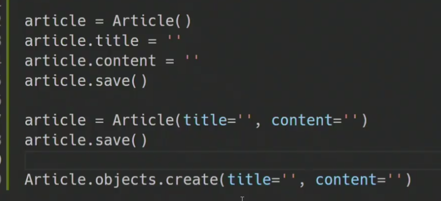


- ADMIN관련
- 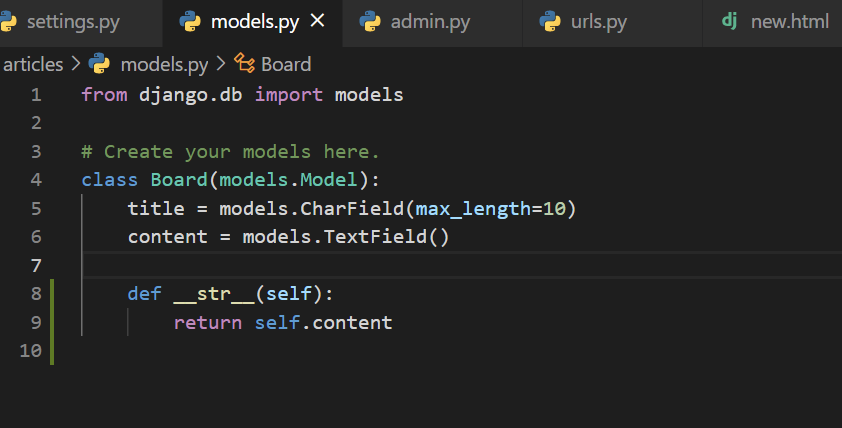
- 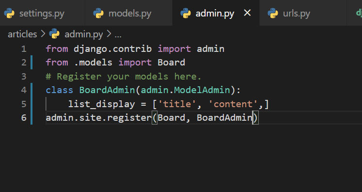
- 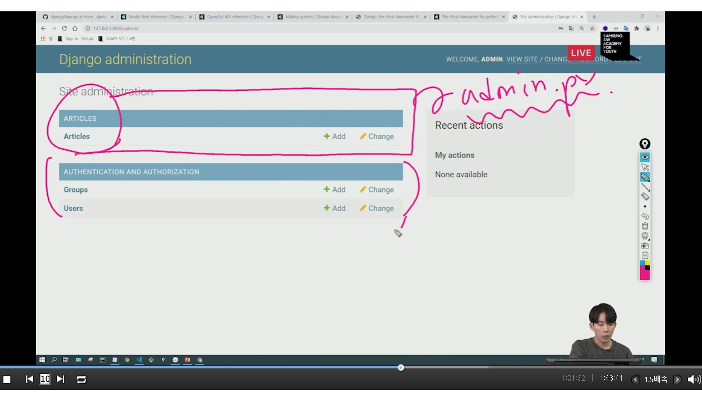


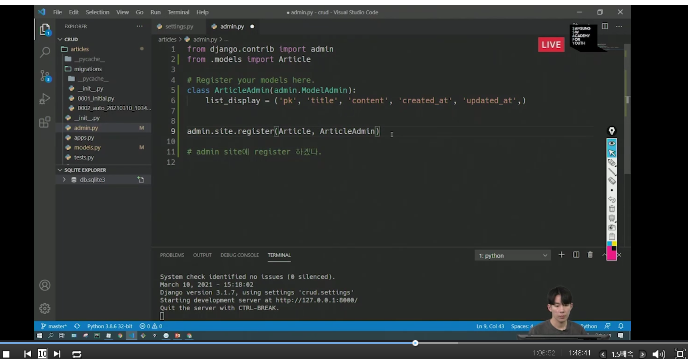

튜플 리스트 둘다 가능

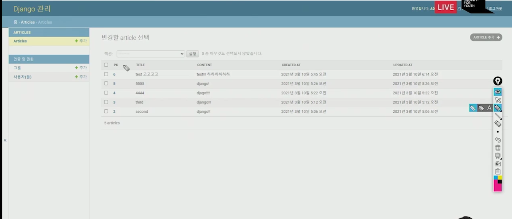


맨아래는 save까지 한번에 하는 방법

pm자료에 Admin 설정방법 기록되어 있음.


GIT BASH 관련

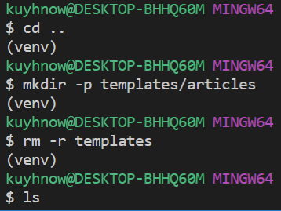


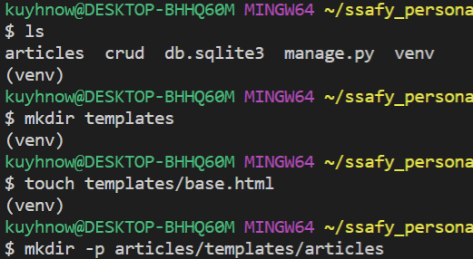

- `cd -` : 뒤로가기(이전에 있던 루트로)


# 0317


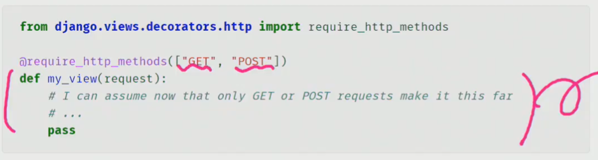

GET과 POST 둘중 하나만 허용하겠다.