# PJT03

- 오늘은 시간 내에 전부 마무리를 하지 못하였다.
- 남은 부분은 수업 종료 후 진행할 예정이다

- Modal
  - https://getbootstrap.com/docs/5.0/forms/overview


## 1

```html
  <nav class="navbar navbar-expand-md navbar-dark bg-dark fixed-top" id="myNav">
    <div class="container-fluid">
        <a href="file:///C:/Users/kuyhnow/ssafy_test/ssafy_projects/pjt03/02_home.html">
          
        </a>
        <button class="navbar-toggler" type="button" data-bs-toggle="collapse" data-bs-target="#navbar" aria-controls="navbar" aria-expanded="false" aria-label="Toggle navigation">
          <span class="navbar-toggler-icon"></span>
        </button>
        <div class="collapse navbar-collapse justify-content-end me-3" id="navbar">
          <ul class="navbar-nav">
            <li class="nav-item"><a class="nav-link active text-white text-decoration-none" aria-corrent="page" href="file:///C:/Users/kuyhnow/ssafy_test/ssafy_projects/pjt03/02_home.html">Home</a></li>
            <li class="nav-item"><a class="nav-link text-white text-decoration-none" href="file:///C:/Users/kuyhnow/ssafy_test/ssafy_projects/pjt03/03_community.html">Community</a></li>
            <li class="nav-item"><a class="nav-link text-white text-decoration-none" data-bs-toggle="modal" href="#LoginModal">Login</a></li>
          </ul>
        </div>
    </div>
  </nav>
```

- 위 코드에서 축소 후 햄버거 버튼을 누르면 아무것도 나오지 않아서 진짜 고생했는데, 
- 알고보니 div에 컬러를 안줘서 컨텐츠가 안보인 거였다...........

```html
  <!-- 01_nav_footer.html -->
  <nav class="navbar navbar-expand-md navbar-dark bg-dark fixed-top">
    <!-- 여기 bg -->
    <div class="container-fluid bg-dark">
        <a class="navbar-brand" href="file:///C:/Users/kuyhnow/ssafy_test/ssafy_projects/pjt03/02_home.html">
          
        </a>
        <button class="navbar-toggler" type="button" data-bs-toggle="collapse" data-bs-target="#navbar" aria-controls="navbar" aria-expanded="false" aria-label="Toggle navigation">
          <span class="navbar-toggler-icon"></span>
        </button>
        <!-- 여기 bg -->
        <div class="collapse navbar-collapse justify-content-end me-3 bg-dark"  id="navbar">
          <ul class="navbar-nav">
            <li class="nav-item"><a class="nav-link active text-white text-decoration-none" aria-corrent="page" href="file:///C:/Users/kuyhnow/ssafy_test/ssafy_projects/pjt03/02_home.html">Home</a></li>
            <li class="nav-item"><a class="nav-link text-white text-decoration-none" href="file:///C:/Users/kuyhnow/ssafy_test/ssafy_projects/pjt03/03_community.html">Community</a></li>
            <li class="nav-item"><a class="nav-link text-white text-decoration-none" data-bs-toggle="modal" href="#LoginModal">Login</a></li>
          </ul>
        </div>
    </div>
  </nav>
  <!-- Modal -->
  <div class="modal fade" id="LoginModal" tabindex="-1" aria-labelledby="exampleModalLabel" aria-hidden="true">
    <div class="modal-dialog">
      <div class="modal-content">
        <div class="modal-header">
          <h5 class="modal-title" id="exampleModalLabel">Login</h5>
          <button type="button" class="btn-close" data-bs-dismiss="modal" aria-label="Close"></button>
        </div>
        <div class="modal-body">
          <form>
            <!-- 마진으로 아래와의 간격을 -->
            <div class="mb-3">
              <!-- 클래스를 form-label로 줘도 인라인 블럭처럼 작동 + 위아래 마진도 들어가줌. -->
              <label class="form-label" for="ids">Username</label>
              <input class="form-control" style="" type="text" name="" id="ids"></input>
            </div>
            <div class="mb-3">
              <label class="form-label" for="pwd">Password</label>
              <input class="form-control" style="" type="password" name="" id="pwd"></input>
            </div>
            <!-- Check box -->
            <div class="mb-3 form-check">
              <input type="checkbox" class="form-check-input" id="check">
              <label class="form-check-label" for="check">Check me out</label>
            </div>
          </form>
        </div>
        <div class="modal-footer">
          <button type="button" class="btn btn-secondary" data-bs-dismiss="modal">Close</button>
          <button type="button" class="btn btn-primary">Submit</button>
        </div>
      </div>
    </div>
  </div>

  <footer>
    <p class="fixed-bottom p-2 bg-white text-black text-center">Web Bootstrap project by WON HYEOK JUNG</p>
  </footer>
```


## 2

- carousel로 이미지를 넣되, carousel-control-prev-icon까지 넣어서 이미지를 직접 넘길 수도 있게 하였다.

```html
 <header>
    <div id="carouselExampleControls" class="carousel slide" data-bs-ride="carousel">
      <div class="carousel-inner">
        <div class="carousel-item active">
          
        </div>
        <div class="carousel-item">
          
        </div>
        <div class="carousel-item">
          
        </div>
      </div>
      <a class="carousel-control-prev" href="#carouselExampleControls" role="button" data-bs-slide="prev">
        <span class="carousel-control-prev-icon" aria-hidden="true"></span>
        <span class="visually-hidden">Previous</span>
      </a>
      <a class="carousel-control-next" href="#carouselExampleControls" role="button" data-bs-slide="next">
        <span class="carousel-control-next-icon" aria-hidden="true"></span>
        <span class="visually-hidden">Next</span>
      </a>
    </div>
  </header>
```

- Article의 구성

```html
<h1 class="text-center font-monospace my-5">Boxoffice</h1>

  <section class="container">
    <div class="row justify-content-center">
      <article class="card m-2 col-12 col-sm-auto">
        
        <h3 class="ps-5 pt-2 font-monospace">Movie title</h3>
        <p class="px-5 text-start font-monospace">This is a longer card with supporting text below as...</p>
      </article>
```

- 박스오피스는 가장 큰 주제이니 heading1을 주었다.
- section을 컨테이너로 하고
- div를 하나 새로 잡아 row로 해주고
- article들을 그 밑에 넣어주었다.

- 카드에 넣고, Margin을 넣어 조금 이쁘게 다듬어 주고, <p> 태그에 들어간 글자는 좌측에 패딩을 5주고, 위에도 패딩을 2 줘서 들여쓰기와 카드와의 간격도 조금 벌려주었다. monospace 폰트를 적용하였다.


## 3

- 처음에는 일단 Community의 좌측 리스트 그룹을 이렇게 구성하였다.

#

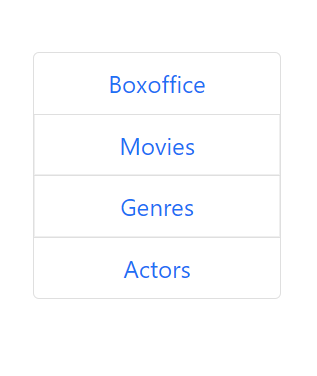

- 예제에선 글자들을 좌측에 정렬해두었으나, 가운데 있는 것이 더 예쁘다고 판단 `text-center`를 각`<li>` 에 주었다.

#

```html
   # DIV가 컨테이너 였으나,
	<div class="container">
      <aside class="row">
        <ul class="list-group col-12 col-lg-2">
          <li class="list-group-item text-center"><a class="text-decoration-none text-center" href="#">Boxoffice</a></li>
          <li class="list-group-item text-center"><a class="text-decoration-none " href="#">Movies</a></li>
          <li class="list-group-item text-center"><a class="text-decoration-none " href="#">Genres</a></li>
          <li class="list-group-item text-center"><a class="text-decoration-none " href="#">Actors</a></li>
        </ul>
      </aside>
    </div>
```

- 임의의 div를 추가해, container를 만들고 col 구조를 이용하도록 구성하였다. 하지만 Table과는 따로 노는 문제가 발생하였다. **Container와 Row**과 따로 잡혀있었기 때문이라고 판단하였다.
- 그래서 만든 해결방법이,

```html
<div class="main container"> # 메인클래스 div를 컨테이너로
    <h1 class="text-center font-monospace py-5 fw-bold" style="font-size: 60px;">Community</h1>
    <!-- Sidebar -->
    <div class="row"> # 그리고 기존 div는 row가 되었다.
      <aside class="col-2 col-lg-2">
        <ul class="list-group">
          <li class="list-group-item text-center"><a class="text-decoration-none text-center" href="#">Boxoffice</a></li>
          <li class="list-group-item text-center"><a class="text-decoration-none " href="#">Movies</a></li>
          <li class="list-group-item text-center"><a class="text-decoration-none " href="#">Genres</a></li>
          <li class="list-group-item text-center"><a class="text-decoration-none " href="#">Actors</a></li>
        </ul>
      </aside>

    <!-- Board -->
      <section class="col-10">
        <table class="table table-striped">
          <thead>
            <tr class="table-dark">
              <th class ="d-none d-lg-table-cell" scope="col">글제목</th>
              <th class ="d-none d-lg-table-cell" scope="col">영화제목</th>
              <th class ="d-none d-lg-table-cell" scope="col">사용자</th>
              <th class ="d-none d-lg-table-cell" scope="col">id</th>
              <th class ="d-none d-lg-table-cell" scope="col">작성시간</th>
            </tr>
          </thead>

        </table>
    </div>
```

- Section태그와 aside태그를 각각 div row 내의 col로 구성해주었다.

#

- 목차가 사라지는 것은, `display-none과 large크기 이상시에만 d-lg-table-cell`로 테이블 셀로 불러오도록 하였다.

```html
    <section class="container">
      <div class="row table-responsive-md">
        <table class="table table-striped">
          <thead>
            <tr>
              <th class ="d-none d-lg-table-cell" scope="col">글제목</th>
              <th class ="d-none d-lg-table-cell" scope="col">영화제목</th>
              <th class ="d-none d-lg-table-cell" scope="col">사용자</th>
              <th class ="d-none d-lg-table-cell" scope="col">id</th>
              <th class ="d-none d-lg-table-cell" scope="col">작성시간</th>
            </tr>
          </thead>

        </table>
      </div>
```


#

- 테이블 형태를 완성했는데, 출력이 이상하게 되는 부분이 있었다.

```html
<table class="table table-striped">
          <thead>
            <tr class="table-dark">
              <th class ="d-none d-lg-table-cell" scope="col">글제목</th>
              <th class ="d-none d-lg-table-cell" scope="col">영화제목</th>
              <th class ="d-none d-lg-table-cell" scope="col">사용자 ID</th>
              <th class ="d-none d-lg-table-cell" scope="col">작성시간</th>
            </tr>
          </thead>
          <tbody>
            <tr>
                # scope가 아닌 class로 작성했다....
              <th class="row">Great Movie Title</th>
              <!-- class active 넣으면 강조. -->
              <td>Movie Test</td>
              <td>User</td>
              <td>5 minutes ago</td>
            </tr>
            <tr>
              <th class="row">Great Movie Title</th>
              <!-- class active 넣으면 강조. -->
              <td>Movie Test</td>
              <td>User</td>
              <td>5 minutes ago</td>
            </tr>
            <tr>
              <th class="row">Great Movie Title</th>
              <!-- class active 넣으면 강조. -->
              <td>Movie Test</td>
              <td>User</td>
              <td>5 minutes ago</td>
            </tr>
          </tbody>

        </table>
```

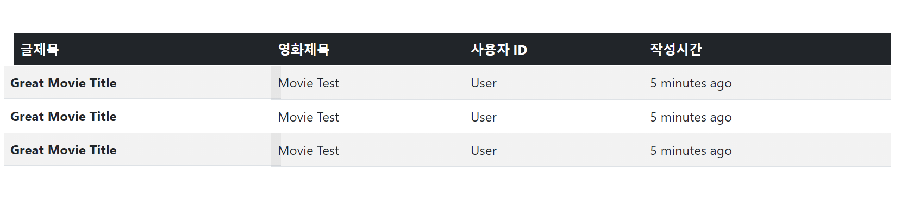

- 이유는 `scope를 class`로 기재하는 실수를 했기 때문이었다.


#

- Table을 이용하며 여러가지 재밌는 Display contents를 찾았다.

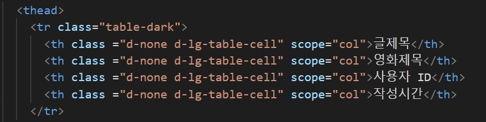

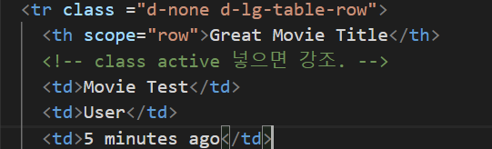

- Css파일이나 link 주소를 열어서, `display:table`을 검색해보면 `table-row, table-cell, table` 컨텐츠를 찾을 수 있다. 이를 통해서, `table row`만 가릴수도 있고(tr) `table cell`만 가릴 수도 있으며, table 자체를 가릴 수도 있음을 알았다.
- 이걸 알고 나니 훨씬 깔끔해진 코드를 볼 수 있었다.

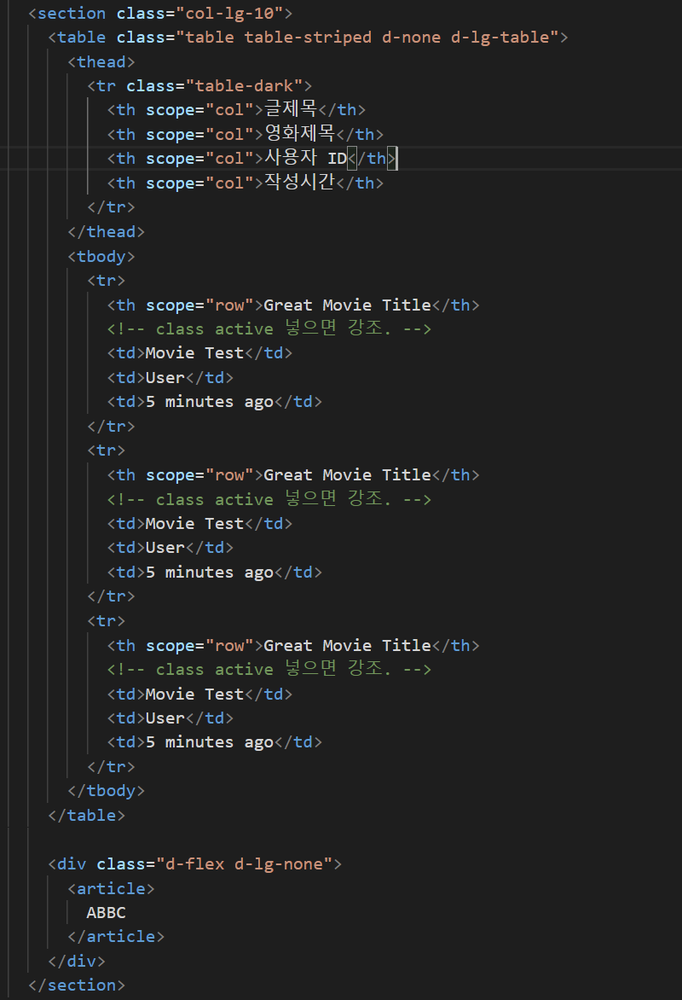

- Table 에 `d-none d-lg-table` 만 주면 전체를 숨길 수 있어, 따로 전부 코드를 주는 불편함을 감수하지 않아도 되었다.


- 이미지를 보면 테이블 밑에 `게시판 탐색기`가 있다. 그래서 Section에 넣어주는 방식을 사용하였다.

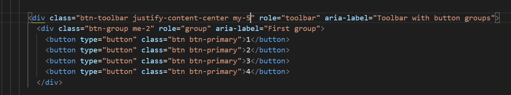

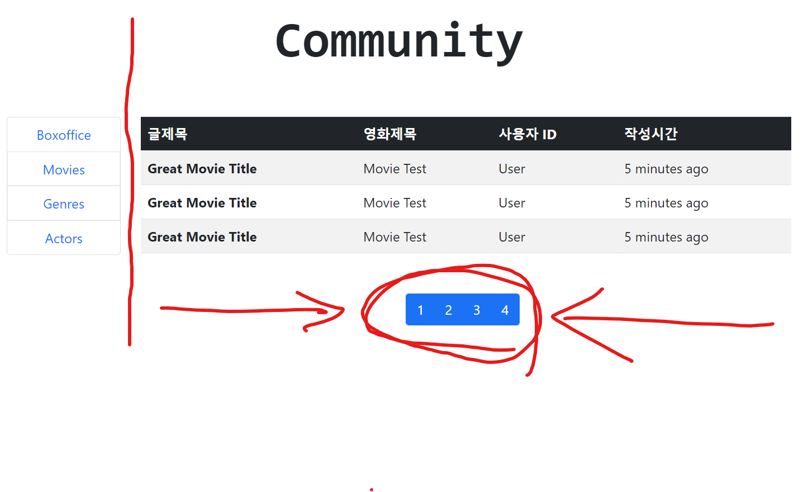

- 최종적인 버튼의 구성은 이렇게 했다.

```html
        <div class="btn-toolbar justify-content-center my-5" role="toolbar" aria-label="Toolbar with button groups">
          <div class="btn-group me-2" role="group" aria-label="First group">
            <button type="button" class="btn btn-outline-success text-dark">previous</button>
            <button type="button" class="btn btn-outline-success text-dark">1</button>
            <button type="button" class="btn btn-outline-success text-dark">2</button>
            <button type="button" class="btn btn-outline-success text-dark">3</button>
            <button type="button" class="btn btn-outline-success text-dark">next</button>
          </div>
```

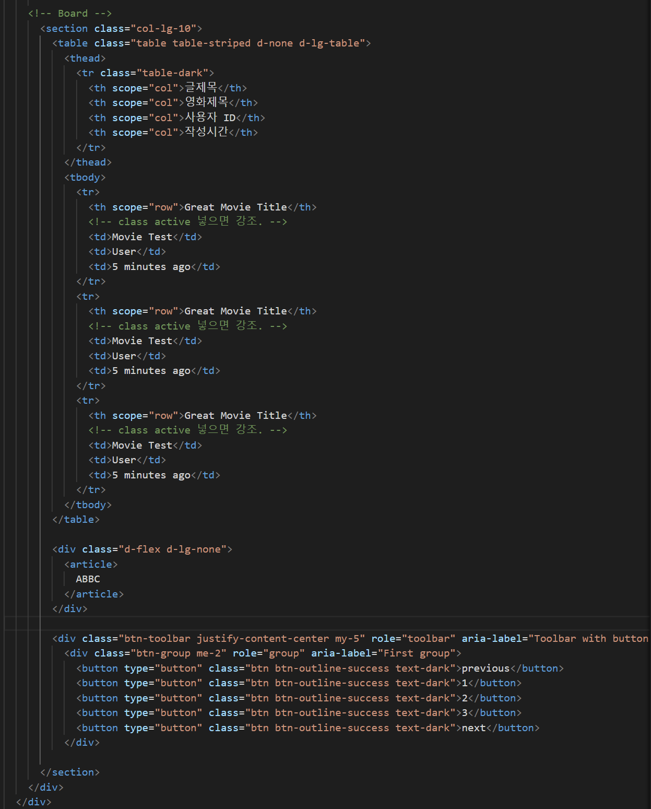

- my-5로 수직 마진을 주어 위아래 간격을 주었고, justify-content-center로 수평 중앙 정렬을 해주었다.

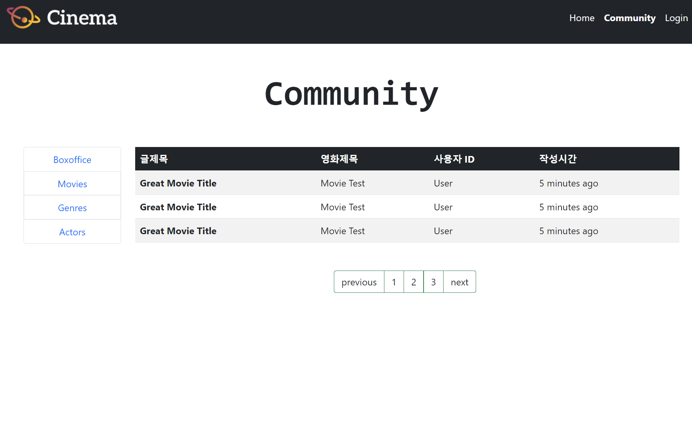

- Bootstrap을 사용했지만 내가 했단게 믿기질 않는다. ㅋㅋㅋ


#

위에 버튼 그룹으로 구성했었는데, 하다보니 pagination이 있는걸 이제 알아서

pagination으로 다시 수정하였다... 

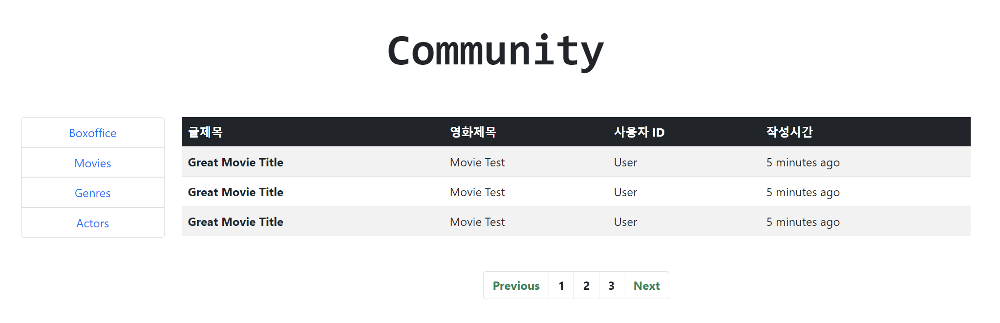

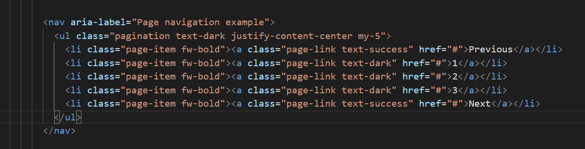

- 코드는 전반적으로 비슷하지만, Border색을 따로 지정하지 않아도 테두리에 색깔을 지정해주어 편리하였다.


#

마지막 부분이다.

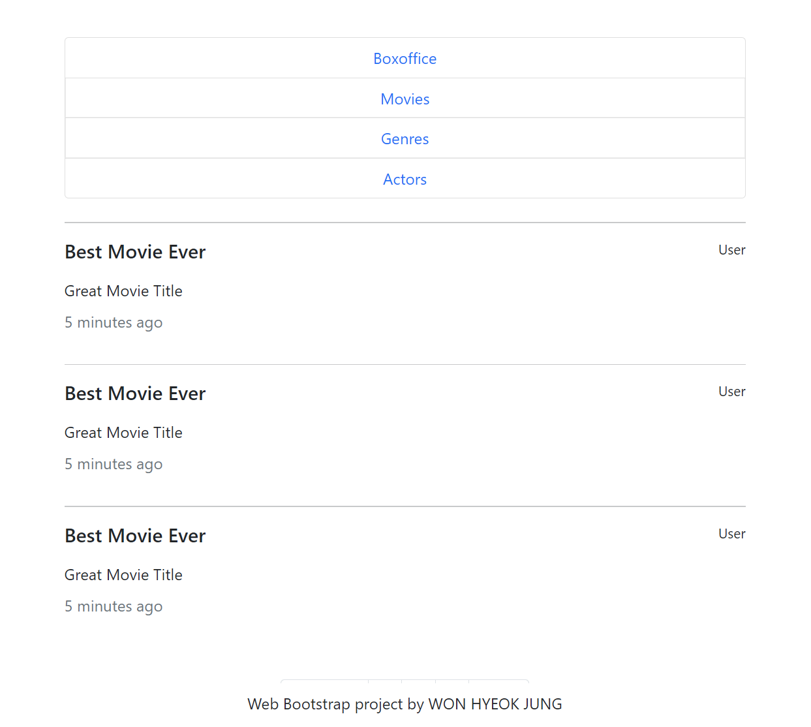


- 사이즈가 작아지면, 위처럼 메뉴 스타일이 바뀌어야 했는데,
- 내 생각엔 사이즈가 작아지면 게시판 형태를 위처럼 바꾸는 형식도 분명 존재할 것이라 생각했는데 찾아내지 못했다. 그래서 일단 그냥 직접 만들어 넣었다...

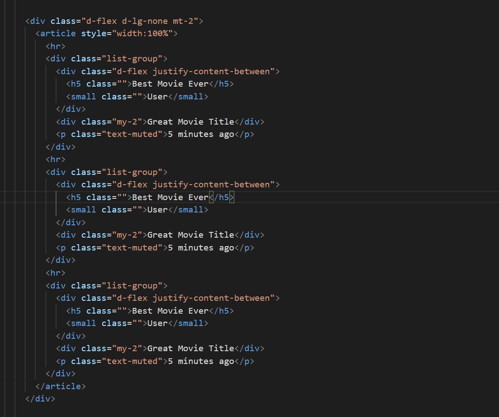


## 소감

- CSS로 웹페이지를 구현하는 것을 해볼 수 있어 굉장히 좋았고, BOOTSTRAP을 이용해서 구현할 수 있어 더욱 쉽게 할 수 있어 즐거운 경험을 할 수 있었다.
- Error 발생이 없어서, 어떤 부분이 잘못되었는지 수정하는데 조금 더 애를 먹었다. 숙련도에 따라 스킬 차이가 쉽게 벌어질 수 있은 언어라고 느껴졌다. 담당 교수신 유태영 교수님께서 CSS 스킬이 좋은 사람이 왜 취업시장에서 유리한 지 강조하신 이유를 조금은 알 수 있었다.