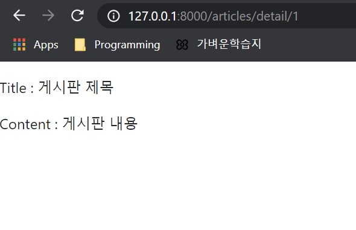
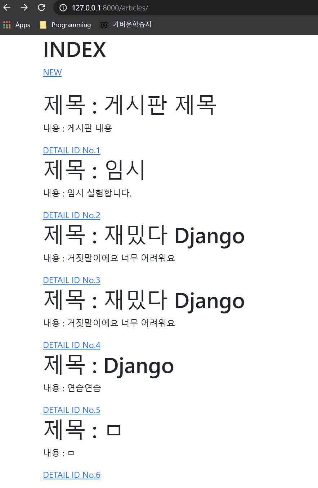
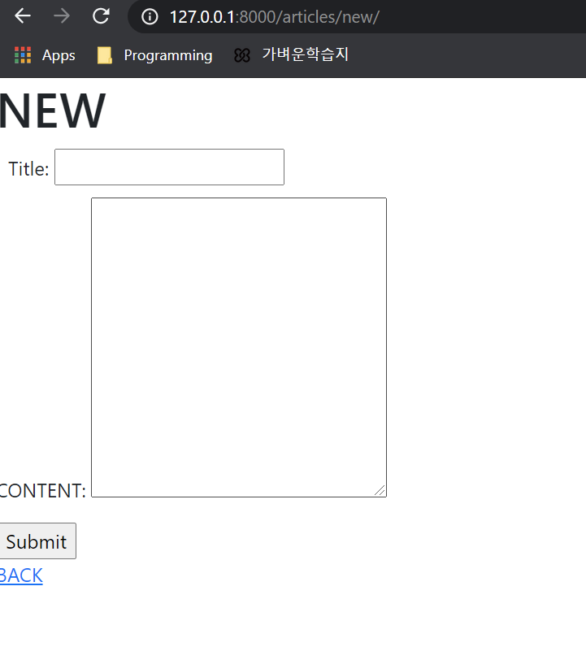
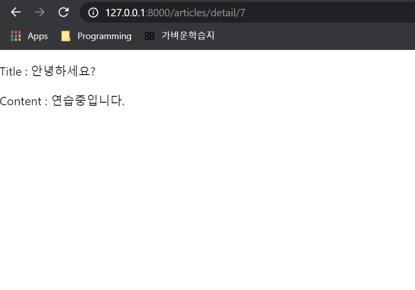

# 결과물

## Detail Page





## Main Page





## Create Page




## Detail Page




# Code

## Articles/Views.py

```python
from django.shortcuts import render, redirect
from .models import Board
# Create your views here.

def index(request):
    boards = Board.objects.all()
    context = {
        'boards' : boards
    }
    return render(request, 'articles/index.html', context)


def detail(request, pk):
    board = Board.objects.get(pk=pk)
    context = {
        'board': board,
    }
    return render(request, 'articles/detail.html', context)

def new(request):
    return render(request, 'articles/new.html')

def create(request):
    board = Board()
    board.title = request.GET.get('title')
    board.content = request.GET.get('content')
    board.save()
    return redirect('detail', pk=board.pk)  # detail은 주소 사이에 추가될 값 articles/detail/pk가 여기선 주소


```


## 각 html

### index.html

```html


INDEX


  <div class="container">
    <h1>INDEX</h1>
    <a href="">NEW</a>
  <br>
  <br>
    
      <h1>제목 : {{ board.title }}</h1>
      <p>내용 : {{ board.content }}</p>
      <a href="">DETAIL ID No.{{ board.id }}</a>
    
  </div>


```


### new.html

```html


NEW


  <h1>NEW</h1>
  <form action="" method="GET">
    <div style="margin: 10px">
      <label for="title">Title:</label>
      <input type="text" name="title" id="title">
    </div>
    <div style="margin-bottom: 15px">
      <label for="content">CONTENT:</label>
      <textarea name="content" id="content" cols="30" rows="10"></textarea>
    </div>
    <input type="submit">
  </form>
  <a href="">BACK</a>  {#url에는 name값 입력#}


```


### detail.html

```html


DETAILS


  <p>
    <h3></h3>Title : {{ board.title }}
  </p>
  <p>
    Content : {{ board.content }}
  </p>

```

