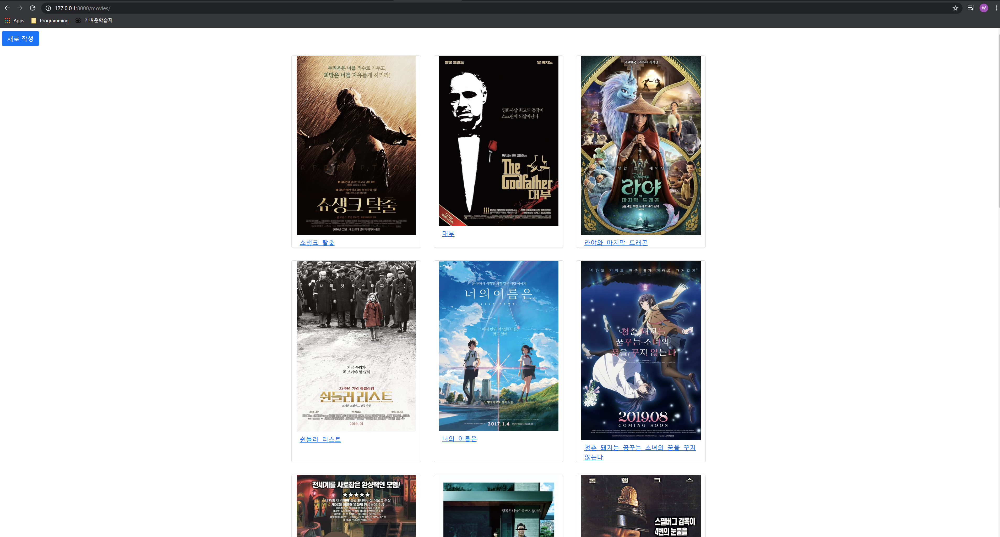
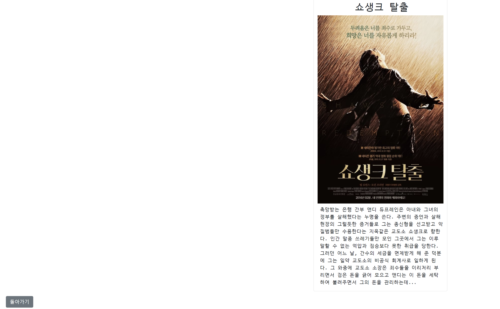
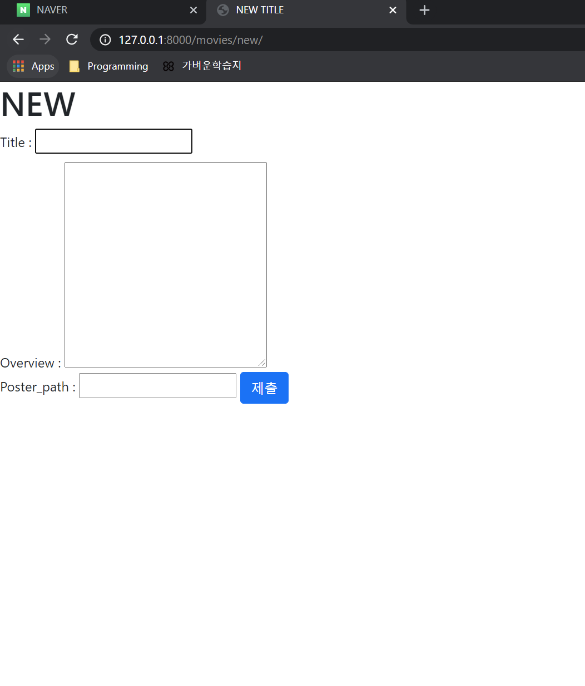
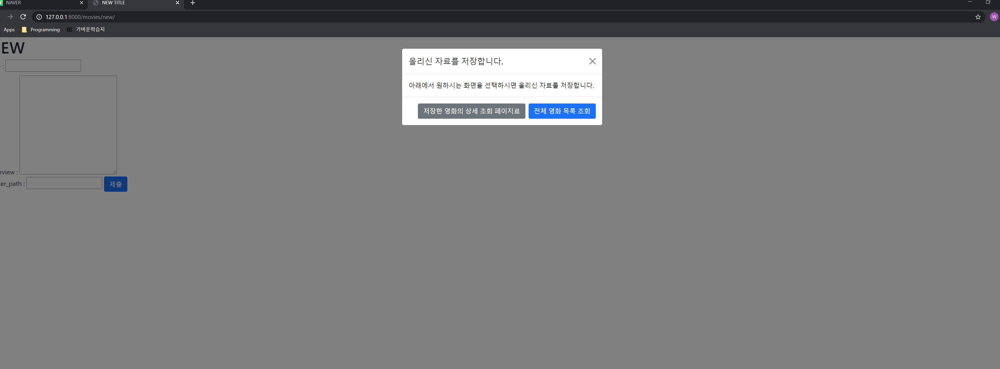
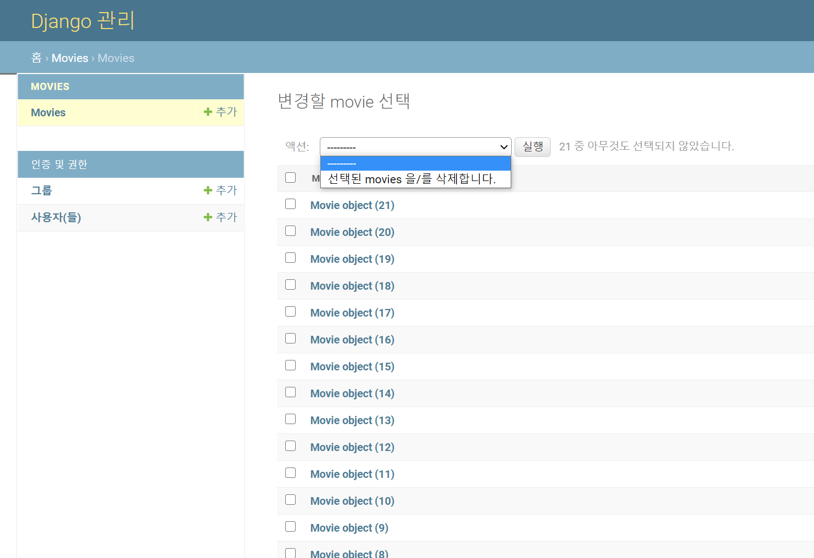
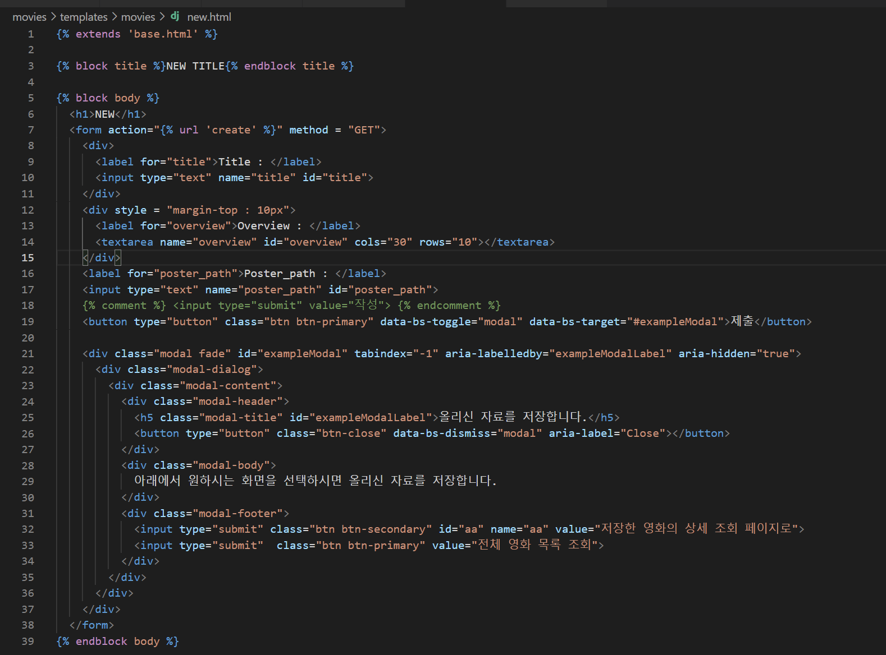
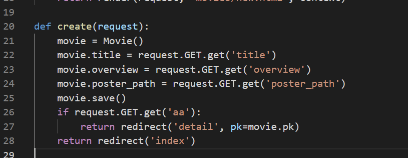

# PJT04

## 참여자
- 정원혁
- 박지훈

## 프로젝트 참가자가 진행해야할 명령어 순서
```python
$ git clone <remote-repo-url>
$ cd pjt04
$ python -m venv venv
$ source venv/Script/activate
$ pip install -r requirements.txt
```


# 정원혁

## PJT 결과물

- index화면




- 상세 보기 창




- 새로 만들기
- 
- 제출시 Modal
- 


- 관리자 페이지에서 삭제
- 


## 겪었던 어려움

1. 모달 연결
   - 

- 모달 코드를 bootstrap에서 가져와서 연결했는데,
- Line19를 input type="submit"으로 하면 Modal이 뜨지 않는 치명적인 문제가 발생했다.
- 온갖  것을 해도 안되어서 포기하려다가, **저장이 전체 영화 목록 조회 혹은 저장한 영화의 상세 조회 페이지로**를 눌렀을 때 되는 문제가 있지만,
- 
- Line32에 input에 id와 name을 주고, 여기 신호를 받으면, detail을 redirect하는, 아닐땐 index를 redirect하는 create 함수를 구성하여서 해결하였다.


## 느낀점

복습을 새벽 3시까지 했는데 장고는 여전히 구성이 어렵다.. BOOTSTRAP과 HTML도 다 까먹어서 카피를 많이 해서 사용했던 점을 반성한다. 꾸준한 복습과 코드의 작성이 많이 필요함을 느꼈다.